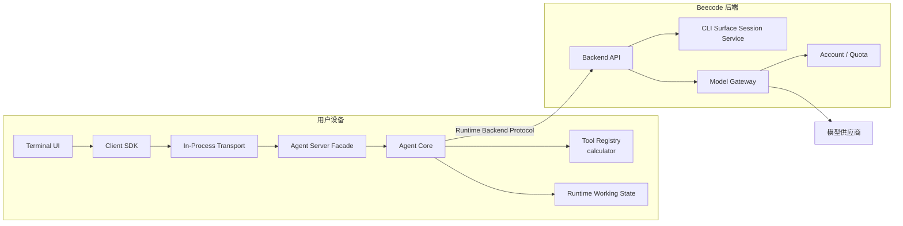
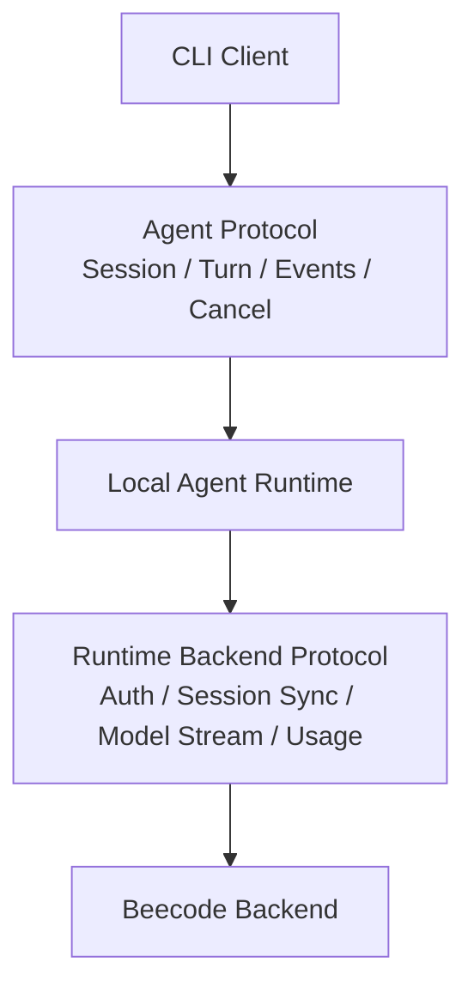
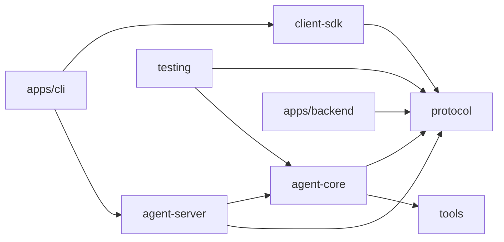
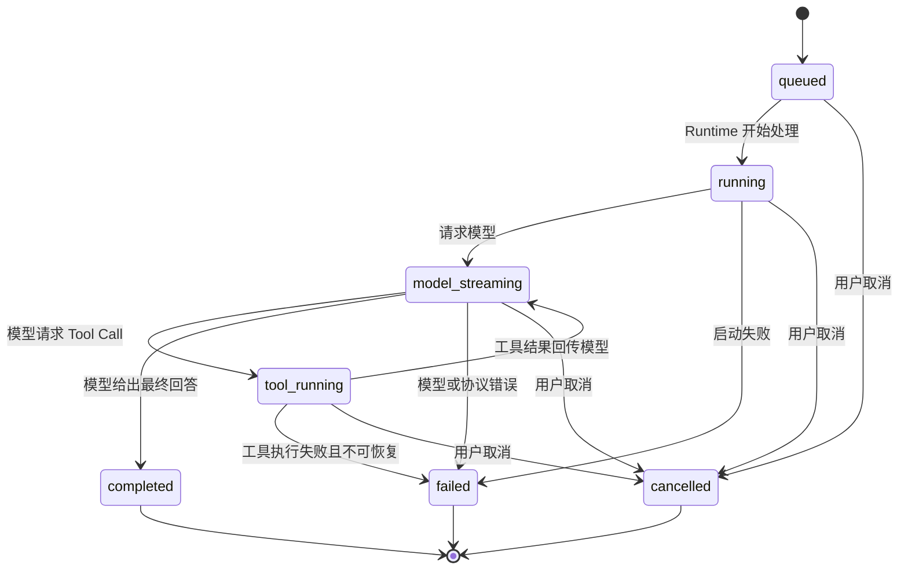
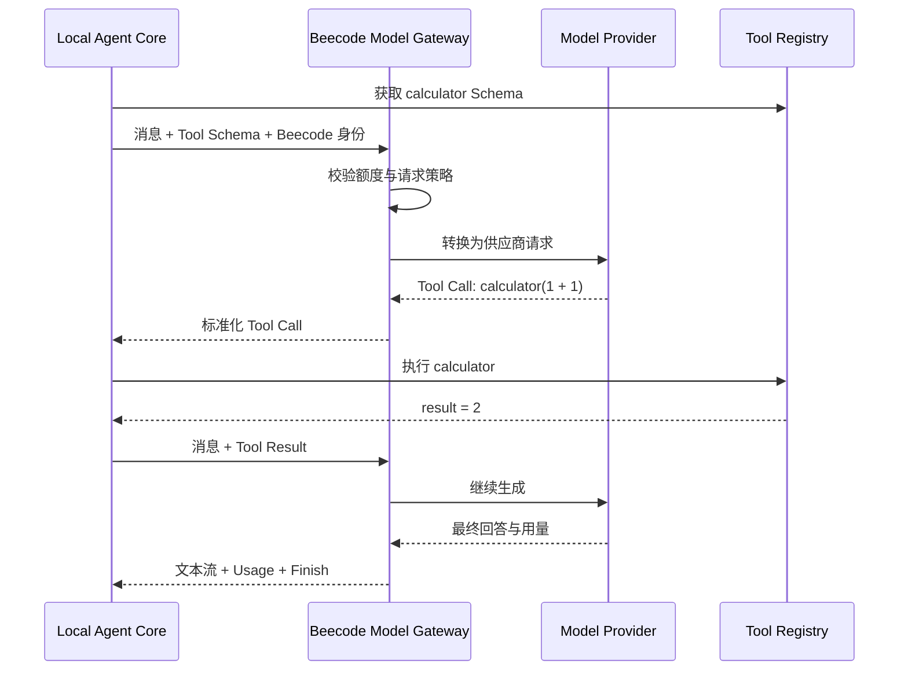

# Beecode 第一阶段 CLI 开发设计

> 状态：Implemented baseline，已扩展只读 Workspace
> 范围：第一阶段仅实现 CLI 产品端
> 更新日期：2026-08-19
> 上游文档：[Beecode 产品规格](../product/beecode-product-spec.md)
> 架构参考：[OpenCode 架构设计参考](../pre/opencode-architecture-reference.md)

## 1. 文档目标

第一阶段只交付 CLI，但实现必须是最终多端架构的第一条可运行切片，而不是把终端输入、模型调用、工具执行和数据存储写在一个脚本中。

本阶段需要验证：

- CLI Client 与本地 Agent Runtime 可以保持稳定边界。
- Agent Runtime 能通过 Beecode Model Gateway 使用统一模型额度。
- Agent Loop 能完成模型生成、Tool Call、工具结果回传和最终回答。
- CLI Session 数据只属于 CLI Surface，并可在同账号的另一台 CLI 设备查看。
- 在线事件采用统一 Agent Protocol；进程重启后重新加载完整 Session。
- 后续增加 Desktop、Web、Android 和 iOS 时，可以复用 Agent Core 和协议，不需要重写执行循环。

## 2. 已确认约束

| 领域 | 已确认结论 |
| --- | --- |
| 产品端 | 最终包含 Web、CLI、Desktop、Android、iOS；本阶段只实现 CLI |
| Runtime | CLI Agent Runtime 运行在用户本机 |
| 模型访问 | Runtime 只能通过 Beecode Model Gateway 调用模型 |
| 模型凭据 | 客户端和本地 Runtime 不持有模型供应商凭据 |
| 额度 | Beecode 统一提供并管理模型额度 |
| 数据边界 | CLI 只能查看 CLI 数据，同账号的不同 CLI 设备可以查看相同历史 |
| 协议 | Client 与 Runtime 使用统一 Agent Protocol 和 Client SDK |
| Transport | CLI 第一阶段使用进程内 Transport，但不绕过协议边界 |
| 流式事件 | 在线更新使用 SSE 语义；断线或重启后重新加载完整 Session |
| WebSocket | 第一阶段不实现；未来仅用于 PTY 等双向持续通信 |
| Tool | 第一阶段实现安全的 `calculator`，不实现文件、Shell 或 Git 工具 |
| 验收输入 | 输入“计算 1+1”，必须产生真实 Tool Call 并最终回答 `2` |

## 3. 第一阶段系统边界

只实现 CLI 仍然需要两个可运行单元：本地 CLI 进程和最小 Beecode 后端。后端是模型访问与同端数据可见性的必要条件，不代表 Agent Loop 被放到后端。



### 3.1 本地 CLI 进程负责

- 接收用户输入并展示流式内容。
- 组合并启动本地 Agent Runtime。
- 维护当前 Turn 的运行、取消和 Tool Call 状态。
- 根据 Runtime 能力注册工具并执行 `calculator`。
- 通过 Beecode 后端读取和保存 CLI Session。
- 将标准化模型请求发送给 Model Gateway。

### 3.2 Beecode 后端负责

- 验证 Beecode 账号或开发访问令牌。
- 强制限定 `surface = cli` 的数据范围。
- 保存可跨 CLI 设备查看的 Session 历史。
- 校验模型额度并记录用量。
- 持有模型供应商凭据并完成模型协议适配。
- 将文本增量、Tool Call、用量和完成原因标准化后流式返回 Runtime。

### 3.3 第一阶段明确不负责

- 后端不运行 CLI Agent Loop，也不执行 CLI 工具。
- Model Gateway 不自行决定调用哪个工具，也不执行工具。
- Terminal UI 不直接修改 Session 或执行工具。
- 本阶段不提供远程操作另一台 CLI 设备的能力。

## 4. 两套协议边界

Beecode 需要区分面向产品客户端的 Agent Protocol，以及 Runtime 访问 Beecode 服务的 Runtime Backend Protocol。



### 4.1 Agent Protocol

Agent Protocol 面向所有未来产品端，第一阶段覆盖：

- 创建、列出、打开 CLI Session。
- 提交用户消息并创建 Turn。
- 订阅 Turn 与 Message 的在线事件。
- 获取完整 Session 快照。
- 取消当前 Turn。
- 查询当前 Runtime 与 Tool 能力。

CLI 使用进程内 Transport 调用这些操作，不需要监听本机端口。Transport 只能改变传输方式，不能改变命令、错误、事件或状态语义。

### 4.2 Runtime Backend Protocol

Runtime Backend Protocol 只服务受信任的 Beecode Runtime，第一阶段覆盖：

- 使用 Beecode 身份访问后端。
- 读取和保存 `surface = cli` 的 Session。
- 提交标准化模型请求与 Tool Schema。
- 接收标准化模型流、Tool Call 和用量信息。
- 查询额度不足、认证失效和模型不可用等产品错误。

模型供应商名称、密钥和供应商私有响应不应泄漏到 Agent Protocol。

## 5. 模块与依赖方向

第一阶段只创建当前需要的应用和包，不预建空的 Desktop、Web 或移动端工程。

```text
beecode-ai/
├── apps/
│   ├── cli/                 # 终端入口、交互和本地 Runtime 组合
│   └── backend/             # 最小账号、CLI Session、Model Gateway
├── packages/
│   ├── protocol/            # Agent 与 Runtime Backend 契约
│   ├── client-sdk/          # Client 调用 Agent Protocol
│   ├── agent-core/          # Turn 状态机与 Agent Loop
│   ├── agent-server/        # Agent Protocol 的应用服务门面
│   ├── tools/               # Tool 契约、Registry、calculator
│   └── testing/             # Fake Model Gateway 与协议测试工具
└── docs/
```



依赖约束：

- CLI 展示层不能直接调用 Agent Core。
- Agent Core 不依赖终端、具体 HTTP 框架、数据库驱动或模型供应商 SDK。
- Tool Registry 不输出终端文本，只返回结构化状态和结果。
- Model Gateway 的供应商适配代码只存在于后端。
- Backend 不导入 CLI 或本地 Tool 实现。
- `shared` 包只有出现真实、无明确归属的复用代码时才创建。

## 6. Agent Core 设计

Agent Core 是第一阶段最重要的稳定边界。它接收一个 Turn、上下文、可用 Tool 集合和 Model Gateway 接口，输出领域事件，不关心事件最终显示在 CLI、Desktop 还是移动端。

### 6.1 Agent Loop 职责

1. 加载 Session 上下文和当前用户消息。
2. 获取 Runtime 当前可用 Tool Schema。
3. 调用 Model Gateway 并消费流式输出。
4. 将文本增量转换为 Message Part 更新。
5. 将模型 Tool Call 转换为 ToolCall 领域对象。
6. 通过 Tool Registry 校验并执行工具。
7. 将工具结果加入模型上下文并进入下一步生成。
8. 在模型给出最终文本、用户取消、发生错误或达到安全限制时停止。
9. 发布结构化事件并保存有业务意义的状态变化。

### 6.2 Turn 状态机



第一阶段每个 Session 同时只允许一个活动 Turn。不同 Session 的并行运行不作为 CLI Demo 的验收要求，但状态模型不能使用全局可变变量绑定单一 Session。

### 6.3 停止与安全限制

Agent Loop 至少包含以下可配置保护：

- 最大模型步骤数。
- 最大单 Turn Token 或费用预算。
- 用户取消信号。
- 相同 Tool Call 连续重复的熔断。
- Model Gateway 请求超时。
- 仅对可重试错误执行有限次数退避重试。

这些限制由 Runtime 应用服务提供，不在 Tool 或 CLI 输出层硬编码。第一阶段可以使用保守默认值，但具体数值属于配置，不属于协议。

## 7. 领域对象与状态

第一阶段实现的最小领域对象如下：

| 对象 | 第一阶段职责 |
| --- | --- |
| Runtime | 标识本地 CLI Runtime 及其能力 |
| Session | 保存 CLI 对话上下文、标题、状态和版本 |
| Turn | 表示一次用户输入到最终回答的执行过程 |
| Message | 表示用户、Assistant 或 Tool 产生的一条逻辑消息 |
| Part | 表示文本、Tool Call 或 Tool Result 等消息内容 |
| ToolCall | 保存工具名、输入、状态、结果或错误 |
| Capability | 描述当前 Runtime 可以安全提供的能力 |
| Usage | 保存本次模型调用的标准化用量 |

第一阶段不实现 Approval 和 Artifact 的完整行为，但 ToolCall 模型不能把“已执行”等同于“已允许”，以便后续在两者之间插入 Approval 状态。

### 7.1 在线事件

第一阶段至少需要以下事件语义：

| 事件 | 用户可观察结果 |
| --- | --- |
| `turn.started` | CLI 显示任务开始 |
| `message.delta` | CLI 增量输出 Assistant 文本 |
| `tool.requested` | CLI 显示模型请求的工具及输入摘要 |
| `tool.started` | CLI 显示工具正在执行 |
| `tool.completed` | CLI 显示工具结果 |
| `tool.failed` | CLI 显示工具错误 |
| `turn.completed` | CLI 显示最终完成状态与用量摘要 |
| `turn.failed` | CLI 显示可操作的失败原因 |
| `turn.cancelled` | CLI 确认任务已取消 |

事件只用于在线展示，不作为持久数据源。CLI 重启时查询完整 Session 快照，不回放历史事件。

## 8. Model Gateway 设计

Agent Loop 运行在本机，Model Gateway 只提供模型能力。一次模型步骤的输入包括会话消息、系统指令、可用 Tool Schema 和请求约束；输出为标准化流式事件。



Model Gateway 必须保持的边界：

- 不执行 Agent Tool。
- 不保存或拥有本地 Runtime 的文件系统权限。
- 不把供应商 API Key 返回给 Runtime。
- 不要求 Agent Core 理解供应商私有事件。
- 额度不足时返回稳定的 Beecode 产品错误。
- 真实模型可能不主动调用简单计算工具，因此第一阶段系统指令需要明确要求算术必须使用 `calculator`。

## 9. Tool Registry 与 calculator

### 9.1 Tool Registry

Tool Registry 统一负责：

- 注册与按名称查询工具。
- 校验工具输入 Schema。
- 根据 `surface` 和 Runtime Capability 生成可用工具集合。
- 执行前再次检查工具是否可用。
- 应用超时、取消和结果大小限制。
- 将执行结果转换为标准 Tool Result。
- 发布 ToolCall 生命周期事件。

第一阶段不需要并行 Tool Call、延迟发现、MCP 或插件，但 Tool Registry 接口不能依赖只有 `calculator` 一个工具的假设。

### 9.2 calculator

`calculator` 是一个五端未来都能使用的无副作用工具：

- 输入为受约束的数学表达式。
- 输出为确定性计算结果或结构化错误。
- 不需要用户审批。
- 不访问网络、文件系统或进程环境。
- 禁止使用 `eval`、`new Function` 或 Shell 执行表达式。
- 使用安全表达式解析器，或仅接受明确支持的运算符和数值类型。

第一阶段的“计算 1+1”必须由模型产生 Tool Call；Runtime 不能识别该句文本后绕过模型直接执行工具。

## 10. Session 保存与同端跨设备

### 10.1 权威边界

- 活动 Turn、Tool Call 与取消状态由当前本地 Runtime 裁决。
- 可跨 CLI 设备查看的 Session 历史由后端 CLI Surface Session Service 持久保存。
- CLI 本地状态用于当前执行和缓存，不是跨设备历史的唯一副本。
- 每个 Session 固定带有 `surface = cli`，后端不允许客户端覆盖为其他 Surface。

### 10.2 第一阶段同步策略

第一阶段不实现 Event Outbox，也不做客户端间实时同步：

1. 创建 Session 时先在后端建立 CLI Session。
2. 用户消息、Tool Result 和最终回答在业务状态形成后保存到后端。
3. 另一台 CLI 设备可以列出并打开同账号的 CLI Session。
4. 另一台设备第一阶段只能查看历史，不能继续原设备正在运行的 Turn。
5. CLI 重启后重新请求完整 Session 快照。
6. 并发写入由 Session 版本检查拒绝，不自动合并两台设备的消息。

如果保存过程中与后端失联，Runtime 必须显式显示同步失败，不能把未同步状态伪装成已跨设备保存。完整的离线队列和冲突合并留到后续阶段。

## 11. CLI 交互设计

第一阶段使用简单的行式交互，不投入完整全屏 TUI。展示层只消费 Client SDK 的快照与事件。

建议的最小命令：

| 命令 | 行为 |
| --- | --- |
| `beecode login` | 建立 Beecode 身份；开发阶段可先使用受控测试令牌 |
| `beecode` | 打开最近 Session 或创建新 Session，进入交互模式 |
| `/new` | 创建新的 CLI Session |
| `/sessions` | 列出当前账号的 CLI Session |
| `/open <id>` | 打开一个 CLI Session 的历史 |
| `/cancel` | 取消当前 Turn |
| `/exit` | 在没有活动 Turn 时退出 |

输入“计算 1+1”时，终端至少展示：

```text
You: 计算 1+1

Agent: 正在处理...
Tool: calculator({ expression: "1 + 1" })
Result: 2
Agent: 1 + 1 = 2
```

实际文本可以调整，但 Tool Call、Tool Result 和最终回答必须是三个可区分的状态，不能只显示最终答案。

## 12. 失败、取消与恢复

| 场景 | 第一阶段行为 |
| --- | --- |
| 未登录或令牌失效 | 停止请求并提示重新登录，不启动 Turn |
| 额度不足 | 显示稳定的额度错误，不尝试直接调用供应商 |
| Model Gateway 暂时失败 | 按策略有限重试，最终标记 Turn 失败 |
| 模型返回未知 Tool | 拒绝执行并将结构化错误返回模型或结束 Turn |
| Tool 输入无效 | 标记 ToolCall 失败，不执行工具主体 |
| calculator 执行失败 | 显示安全错误，不暴露内部堆栈 |
| 用户取消 | 中止模型流和未开始的 Tool，Turn 进入 cancelled |
| CLI 在 Turn 中退出 | 尝试取消并保存最终可确认状态 |
| SSE 或进程内订阅中断 | 重新读取完整 Session，不请求历史事件补发 |
| Session 版本冲突 | 拒绝覆盖并提示重新加载，不自动合并 |

所有错误都需要稳定错误码和可读消息。日志可以包含诊断上下文，但不能记录访问令牌、供应商密钥或未经控制的完整敏感 Prompt。

## 13. 测试策略

### 13.1 最高层验收边界

首要测试从 CLI 进程入口开始，经过 In-Process Transport、Agent Core、Fake Model Gateway 和 Tool Registry，验证用户可观察的完整行为。该测试是第一阶段最重要的测试边界。

### 13.2 必须覆盖

- 输入“计算 1+1”后产生 `calculator` Tool Call、结果 `2` 和最终回答。
- 自动化测试中的 Fake Model Gateway 确定性地产生 Tool Call，而不是依赖真实模型概率。
- 至少一条集成 Smoke Test 经过真实 Beecode Model Gateway 和真实模型。
- Tool 输入校验失败时不会执行工具。
- 达到最大步骤数、预算、超时或重复调用限制时 Agent Loop 能停止。
- `/cancel` 能终止正在进行的模型流并保存 cancelled 状态。
- CLI 重启后可以重新加载完整 Session。
- 同账号第二台 CLI 设备可以查看 Session 历史。
- 非 CLI Surface 请求不能读取 CLI Session。
- 额度不足、认证失败和模型失败映射为稳定产品错误。
- 供应商 API Key 不出现在 CLI 配置、日志、Session 或测试快照中。

### 13.3 测试层次

| 层次 | 重点 |
| --- | --- |
| Agent Core 单元测试 | 状态机、停止条件、Tool Call 循环、取消 |
| Tool 单元测试 | Schema、确定性结果、安全表达式解析 |
| Protocol 契约测试 | 命令、事件、错误和流式模型事件的一致性 |
| Backend 集成测试 | 身份、CLI 数据隔离、额度、Session 保存 |
| CLI 端到端测试 | 真实进程输入输出、重启恢复和命令行为 |
| 真实模型 Smoke Test | Model Gateway 与一个正式模型的最小连通性 |

## 14. 开发顺序

1. 建立 Monorepo、质量检查和测试入口。
2. 定义最小领域对象、Agent Protocol 和 Runtime Backend Protocol。
3. 实现 Fake Model Gateway 和协议契约测试。
4. 实现 Agent Loop、状态机和领域事件。
5. 实现 Tool Registry 与安全 `calculator`。
6. 实现最小 Beecode Backend：身份、CLI Session、额度和 Model Gateway。
7. 实现 Agent Server Facade、In-Process Transport 和 Client SDK。
8. 实现 CLI 行式交互与 Session 命令。
9. 完成跨设备历史、重启恢复和失败场景。
10. 接入一个真实模型并完成第一阶段验收。

协议和 Fake Gateway 应先于真实供应商接入完成，避免把 Agent Core 的测试稳定性绑定到外部模型。

## 15. 第一阶段完成标准

- `beecode` 可以进入交互模式并创建 CLI Session。
- 用户输入“计算 1+1”后，真实链路完成模型 Tool Call、calculator 执行和最终回答。
- CLI 展示文本流、Tool Call、Tool Result 和最终状态。
- Session 关闭并重新打开后内容完整。
- 同账号的另一台 CLI 设备可以查看同一 CLI Session 历史。
- 其他 Surface 无法读取 CLI Session。
- 模型调用只能经过 Beecode Model Gateway，并正确消耗 Beecode 额度。
- CLI 与本地 Runtime 通过 Agent Protocol 边界交互。
- Agent Core、Tool Registry 和协议不依赖终端实现。
- 自动化测试覆盖 Fake Model 完整闭环，真实模型 Smoke Test 通过。

## 16. 技术栈建议稿

以下是与现有架构最匹配的建议，尚未视为最终确认：

| 区域 | 建议 | 理由 |
| --- | --- | --- |
| 语言与本地 Runtime | TypeScript + Node.js LTS | CLI、后端和协议可共享类型与核心代码 |
| 工作区 | pnpm Workspaces + Turborepo | 支持少量应用和包的增量构建 |
| CLI 展示 | Node 标准行式输入输出 | 第一阶段不为全屏 TUI 引入额外复杂度 |
| Schema | 运行时可校验 Schema + OpenAPI | 支持未来生成 TypeScript、Kotlin 和 Swift SDK |
| Backend API | 轻量 TypeScript HTTP 框架 | 与 Agent Core 保持同语言但不耦合框架 |
| Backend 数据 | PostgreSQL | 支持账号、Surface 隔离、版本检查与额度记录 |
| CLI 本地数据 | 第一阶段仅缓存；通过 Repository 接口预留本地持久化 | 避免在跨设备权威数据之外再引入双写复杂度 |
| 模型适配 | 后端 Provider Adapter | 供应商 SDK 与密钥不进入本地 Runtime |
| 测试 | Vitest + CLI 进程级测试 | 覆盖核心逻辑与真实终端行为 |

在技术栈确认前，不应把具体框架、ORM、模型 SDK 或数据库驱动写进领域接口。

## 17. 参考实现取舍

设计过程参考了 AI_SuperAgent 中的 CLI 入口、Agent Loop、Tool Registry、Session Store、Mock Model 和 calculator 实现。

采用的思路：

- Agent Loop 以“模型生成 -> Tool Call -> Tool Result -> 继续生成”为核心循环。
- 对步骤数、Token、重试和重复 Tool Call 设置停止条件。
- Tool 通过统一 Registry 注册并转换为模型可见 Schema。
- 使用确定性 Mock Model 验证 Tool Call 流程。
- Session 需要支持退出后恢复，而不能只存在于内存。

调整后的设计：

- Agent Loop 发布结构化领域事件，不直接调用 `console.log` 或 `process.stdout`。
- Model Provider 从本地进程移到 Beecode Model Gateway。
- Tool Registry 不使用全局可变角色和全局锁绑定所有 Session。
- Session 使用 Repository 和后端 Surface 数据边界，不采用固定目录下的默认 JSONL Session。
- CLI 入口只负责组合与生命周期，不集中初始化所有未来功能。
- calculator 使用安全表达式解析，明确禁止参考实现中的动态代码执行方式。

第一阶段不采用：MCP、Memory、RAG、Plugin、Channel、Cron、Multi-Agent、延迟 Tool Discovery 和复杂命令体系。这些能力只有在进入对应产品阶段后才接入既有边界。

## 18. 待确认事项

开发前仍需由项目确定以下技术选择：

1. 是否采用 TypeScript + Node.js LTS 作为 CLI、Agent Core 和后端的统一语言与 Runtime。
2. 后端具体 HTTP 框架和 Schema 工具。
3. 后端数据访问方案与迁移工具。
4. Model Gateway 第一阶段接入哪个供应商和模型。
5. CLI 第一阶段使用开发令牌，还是直接实现正式设备登录流程。
6. 本地是否第一阶段就增加持久缓存，还是完全以后端 Session 为准。

这些选择不改变 Client/Runtime 边界、分端 Runtime、CLI Surface 数据隔离、Model Gateway 或 Tool Registry 的总体方向。

## 19. 基线后扩展：只读 Workspace

CLI 现支持在启动时通过 `--workspace <directory>` 或 `BEECODE_WORKSPACE` 明确授权一个本地目录。Runtime 注册动态 `read_file`：未配置 Workspace 时不向模型提供 Schema；配置后可列出文件或按 Workspace 相对路径读取受大小限制的 UTF-8 文本。

路径解析以授权目录的 canonical path 为边界，拒绝绝对路径、父级穿越、二进制、超大文件和越界符号链接。Workspace 路径不进入 Backend Session；另一个设备读取同一 CLI Session 历史时不会自动获得该目录权限。
