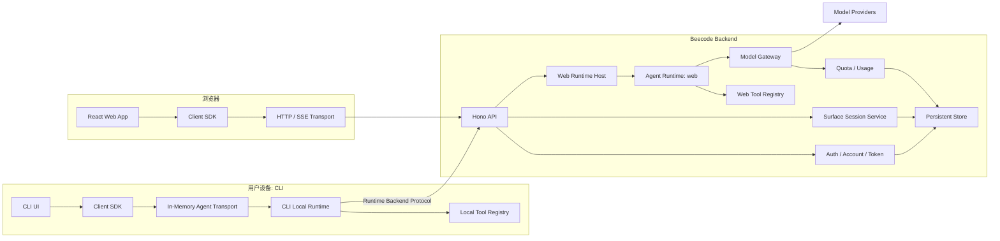
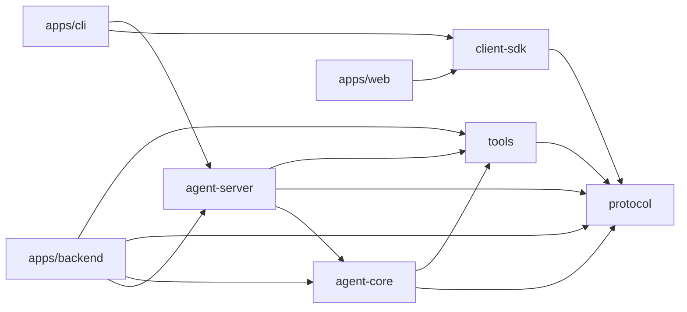
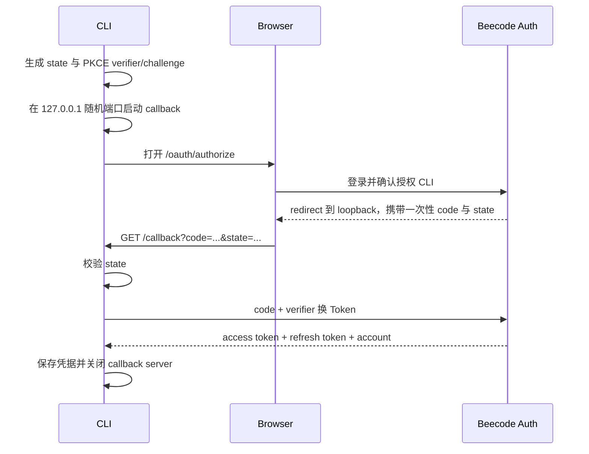

# Beecode 第二阶段 Web 开发设计

> 状态：Implemented development baseline  
> 范围：Web 产品端、后端 Web Runtime、统一账号登录、CLI 浏览器登录  
> 更新日期：2026-08-10  
> 上游文档：[Beecode 产品规格](../product/beecode-product-spec.md)  
> 前置实现：[第一阶段 CLI 开发设计](./phase-1-cli-development-design.md)  
> 架构参考：[OpenCode 架构设计参考](../pre/opencode-architecture-reference.md)

## 1. 文档目标

第二阶段交付 Beecode Web 产品端，并把第一阶段的 CLI 验证架构扩展为可供后续 Desktop、Android 和 iOS 复用的产品协议。

本阶段不是只制作一个聊天页面。需要同时完成以下纵向链路：

```text
浏览器登录
  -> 创建 Web Session
  -> 提交 Turn
  -> 后端 Web Runtime 运行 Agent Loop
  -> Model Gateway 调用模型
  -> calculator Tool Call
  -> SSE 推送实时状态
  -> Session 持久化
  -> 刷新或断线后恢复
```

本阶段还需要把 CLI 的开发令牌登录升级为浏览器授权登录，使 CLI 和 Web 使用同一个 Beecode Account 与额度体系。

本文解决以下问题：

- Web Client、Web Runtime、Backend Service 和 Model Gateway 的职责边界。
- CLI 与 Web 如何复用协议，同时保持 Session 数据按 surface 隔离。
- HTTP、OpenAPI、SSE、快照恢复和取消的具体语义。
- Web Runtime 的生命周期、并发、持久化与异常恢复。
- Web 与 CLI 的统一认证、Token 颁发、刷新和撤销。
- React 工作台的信息架构、状态模型、响应式行为和可访问性。
- 从当前原生 Node HTTP 与 JSON Store 迁移时的兼容策略。
- 测试层次、纵向开发顺序和阶段完成标准。

## 2. 已确认决策

| 领域 | 决策 |
| --- | --- |
| 后端语言与 Runtime | Node.js 20+ 与 TypeScript |
| HTTP 框架 | Hono，仅作为 HTTP 与流式传输适配层 |
| API 风格 | HTTP JSON 命令与查询，SSE 实时事件 |
| API 契约 | Schema First，发布 OpenAPI 3.1，Client SDK 不依赖 Server 实现 |
| Web 前端 | React、Vite、TypeScript |
| CLI Runtime | 继续在用户本机运行 |
| Web Runtime | 运行在 Beecode 后端 |
| 模型访问 | 所有 Runtime 继续通过 Beecode Model Gateway |
| 账号 | CLI 与 Web 共用 Account 和额度 |
| Session 数据 | CLI 与 Web 按 surface 隔离，不跨端列出或打开 |
| CLI 登录 | 浏览器授权、Authorization Code、PKCE、本机 loopback callback |
| Web 登录 | 浏览器会话使用安全 Cookie，外部身份提供商通过适配器接入 |
| 实时更新 | SSE 只承载在线状态，不作为完整持久事件历史 |
| 断线恢复 | 重新读取权威 Session 快照，然后重新订阅 SSE |
| 本阶段工具 | Web 仅开放后端安全工具，至少包含 `calculator` |
| Desktop 与移动端 | 本阶段不创建代码，只确保协议和 API 可继续扩展 |

## 3. 范围

### 3.1 本阶段必须交付

- `surface = web` 的协议、验证、存储和数据隔离。
- Hono 后端组合根及现有 CLI Backend API 的兼容迁移。
- Web 账号登录、浏览器 Session Cookie 和退出。
- CLI 浏览器登录、PKCE Token 交换、刷新、撤销、`whoami` 与 `logout`。
- 后端 Web Runtime、Agent Loop、工具执行、取消和恢复。
- Web Session 列表、创建、打开、归档和重命名。
- Web Turn 提交、流式文本、Tool Call 状态与最终结果。
- Web Client SDK 的 HTTP/SSE Transport。
- React Web 工作台及完整的加载、空状态、运行、错误和断线状态。
- 自动化测试中的 calculator 纵向闭环。
- 至少一条经过真实 Model Gateway 的人工或集成 Smoke Test。

### 3.2 本阶段明确不负责

- Desktop、Android 或 iOS 应用代码。
- Web 访问用户电脑上的文件、Shell、Git、LSP 或本机凭据。
- 云端隔离 Workspace、容器、虚拟机或持久文件系统。
- PTY、交互式终端和 WebSocket。
- CLI Session 与 Web Session 的跨 surface 同步或继续。
- 跨公网远程控制用户本机 CLI Runtime。
- MCP、插件市场、团队协作、共享 Session 和组织权限。
- 完整事件溯源、永久 SSE 事件日志和任意时间点回放。
- 正式计费、订阅套餐、发票和支付系统。
- 多节点 Web Runtime 调度、分布式锁和跨节点事件总线。

## 4. 当前实现评估

第一阶段已经具备可复用基础：

- `packages/protocol` 定义 Session、Turn、Message、Part、ToolCall、AgentEvent 和稳定错误。
- `packages/agent-core` 实现框架无关的 Agent Loop、限制、取消和事件输出。
- `packages/tools` 实现 Tool Registry、surface 筛选和 calculator。
- `packages/agent-server` 通过 Facade 组合 Runtime、工具和 Session 存储。
- `packages/client-sdk` 已有进程内 Transport。
- `apps/backend` 已实现认证、CLI Session、额度、Model Gateway 和 SSE 模型流。
- `apps/cli` 已完成真实进程入口、Session 命令和 calculator 闭环。

进入 Web 阶段前存在以下缺口：

| 缺口 | 当前表现 | 第二阶段目标 |
| --- | --- | --- |
| Surface | 类型和解析器仅允许 `cli` | 协议允许五端，服务端只启用已实现 surface |
| HTTP 层 | 原生 Node `http` 中集中手写路由 | Hono 路由分组、中间件、错误映射与 OpenAPI |
| 身份 | `dev-token` 每次创建新账号 | 稳定 Account、浏览器 Session、CLI 授权与 Token 生命周期 |
| Web Runtime | 后端不运行 Agent Loop | 后端托管 `surface=web` 的 Agent Runtime |
| Agent HTTP Transport | 只有进程内直接方法调用 | HTTP/SSE Transport 与可测试的内存 fetch Transport |
| 持久化 | JSON 全量快照与单 Token Account | 支持认证实体、原子 Turn 写入和生产数据库适配 |
| 实时恢复 | CLI 进程内事件 | Web SSE、活动快照合并、断线恢复与心跳 |
| Web UI | 不存在 | 可用的 Agent 工作台 |

## 5. 总体架构



第二阶段仍然只部署一个 Backend 进程和一个 Web 静态应用。图中的 Auth、Session、Web Runtime 和 Gateway 是逻辑模块，不要求立即拆成微服务。

## 6. 架构原则

### 6.1 Agent Server 是执行权威

- Client 只能提交命令、读取查询和订阅事件。
- Client 不能自行把 Turn 标记为成功、取消或失败。
- Tool Call 的可用性、审批和执行由 Runtime 决定。
- Web Runtime 的活动状态存在于后端，不存在于浏览器。
- 浏览器刷新不能中止一个仍在后端运行的 Turn。

### 6.2 Protocol 先于页面

- API 路径、请求、响应、错误和 SSE 事件先定义 Schema。
- OpenAPI 由同一份协议生成，不单独手写一份文档描述。
- Web UI 只依赖 Client SDK，不导入 Backend、Agent Core 或 Store。
- CLI 的进程内 Transport 与 Web 的 HTTP Transport 保持相同领域语义。

### 6.3 Framework 只存在于边缘

- Hono 负责路由、Cookie、认证上下文、请求限制、CORS、SSE 和错误映射。
- Agent Loop、Session 状态机、额度和 Token 规则不依赖 Hono 类型。
- Route Handler 只做输入转换、调用应用服务和输出转换。
- 业务测试优先针对纯 TypeScript Service，HTTP 测试覆盖公开边界。

### 6.4 Surface 是安全边界

- surface 由路由挂载位置和服务端策略决定。
- 请求体中的 `surface` 不被信任，写入时由服务端覆盖或拒绝。
- 查询 Session 必须同时匹配 `accountId` 和 `surface`。
- 其他账号或其他 surface 的 Session 统一返回 `SESSION_NOT_FOUND`，不泄漏对象存在性。

## 7. 建议仓库结构

```text
apps/
├── backend/
│   └── src/
│       ├── app.ts                    # Hono 应用组合根
│       ├── main.ts                   # Node listener 与进程生命周期
│       ├── middleware/
│       │   ├── auth.ts
│       │   ├── error-handler.ts
│       │   ├── request-id.ts
│       │   └── security.ts
│       ├── routes/
│       │   ├── account.ts
│       │   ├── cli-auth.ts
│       │   ├── cli-sessions.ts
│       │   ├── model-gateway.ts
│       │   ├── oauth.ts
│       │   ├── quota.ts
│       │   └── web-agent.ts
│       ├── auth/
│       │   ├── auth-service.ts
│       │   ├── authorization-code-store.ts
│       │   ├── identity-provider.ts
│       │   ├── token-service.ts
│       │   └── web-session-service.ts
│       ├── runtime/
│       │   ├── web-runtime-host.ts
│       │   └── web-runtime-session.ts
│       ├── session/
│       │   ├── session-repository.ts
│       │   └── session-service.ts
│       └── provider/
│
├── cli/
│   └── src/
│       ├── auth/
│       │   ├── browser-login.ts
│       │   ├── credential-store.ts
│       │   ├── loopback-callback.ts
│       │   └── token-refresh.ts
│       └── ...
│
└── web/
    ├── src/
    │   ├── app/
    │   ├── auth/
    │   ├── components/
    │   ├── features/
    │   │   ├── account/
    │   │   ├── capabilities/
    │   │   ├── sessions/
    │   │   └── turns/
    │   ├── lib/
    │   ├── routes/
    │   ├── styles/
    │   └── main.tsx
    └── tests/

packages/
├── agent-core/
├── agent-server/
├── client-sdk/
├── protocol/
├── testing/
└── tools/
```

本阶段不提前创建 `packages/ui` 或 `packages/app-ui`。只有 Desktop 开始并确认需要复用完整业务 UI 时，再从 `apps/web` 提取稳定组件和平台接口。

## 8. 依赖方向



强制约束：

- `apps/web` 不得依赖 `agent-core`、`agent-server`、`tools` 或 Backend 实现。
- `client-sdk` 不得依赖 Hono、数据库驱动或模型 Provider。
- `protocol` 不得依赖 React、Node HTTP、Hono 或持久化实现。
- Hono 类型不得出现在 Agent Core 和领域 Service 的公开接口中。
- Provider 私有类型不得进入 Agent Protocol 或 Web bundle。

## 9. Protocol 扩展

### 9.1 Surface

协议层定义完整产品枚举：

```ts
export type Surface = "cli" | "web" | "desktop" | "android" | "ios"
```

类型允许五端不代表服务端已经实现五端。Runtime Capability 需要声明当前启用的 surface，未启用 surface 返回稳定错误。

### 9.2 Capability

第二阶段将能力从工具名称列表扩展为可解释结构：

```ts
interface CapabilitySet {
  surface: Surface
  runtimeLocation: "local" | "backend"
  tools: ToolCapability[]
  features: {
    localWorkspace: CapabilityState
    shell: CapabilityState
    git: CapabilityState
    attachments: CapabilityState
  }
  limits: {
    maxTurnSteps: number
    maxInputBytes: number
  }
}

interface CapabilityState {
  available: boolean
  reason?: "surface_policy" | "runtime_missing" | "not_configured" | "not_authorized"
}
```

Web UI 不通过硬编码判断功能是否存在。它读取 Capability，并对不可用能力隐藏入口或展示明确原因。

### 9.3 Turn 提交语义

第一阶段 `submitMessage()` 等待整个 Turn 结束后返回。Web 阶段调整为接受式语义：

1. 服务端校验身份、Session、surface、额度预检和并发状态。
2. 服务端持久化用户 Message 与 `queued` Turn。
3. 服务端返回 `202 Accepted` 和已创建的 Turn。
4. Runtime 在后端继续执行。
5. Client 通过 SSE 观察 Turn 变化。
6. Client 通过快照确认最终持久状态。

CLI 适配层可以继续向 REPL 提供“等待终态”的便利方法，但底层协议统一为提交后返回 Turn。

### 9.4 事件信封

领域事件增加稳定信封：

```ts
interface AgentEventEnvelope<TEvent extends AgentEvent = AgentEvent> {
  eventId: string
  sessionId: string
  turnId?: string
  sequence: number
  occurredAt: string
  event: TEvent
}
```

`sequence` 是当前 Runtime 实例内、当前 Session 的单调递增序号，用于浏览器合并快照与连接期间缓冲事件。它不是永久可恢复的事件游标。

### 9.5 快照

Web Session 快照增加实时合并信息：

```ts
interface SessionSnapshot {
  session: Session
  messages: Message[]
  turns: Turn[]
  live?: {
    sequence: number
    activeTurnId?: string
  }
}
```

持久快照与活动 Runtime 投影由 Web Runtime Host 合并后返回。浏览器不需要自行拼接缺失的 Assistant 前缀。

## 10. HTTP API

所有公开路由需要具有稳定 `operationId`，用于 OpenAPI 和 SDK 生成。响应错误统一使用：

```json
{
  "error": {
    "code": "SESSION_NOT_FOUND",
    "message": "Web session not found",
    "retryable": false
  },
  "requestId": "req_..."
}
```

`requestId` 属于 HTTP 请求诊断信息，不进入可跨 Transport 复用的 `BeecodeErrorShape`。

### 10.1 Auth

| Method | Path | 说明 |
| --- | --- | --- |
| `GET` | `/v1/auth/login/:provider` | 开始浏览器身份提供商登录 |
| `GET` | `/v1/auth/callback/:provider` | 完成身份提供商回调并建立 Browser Session |
| `POST` | `/v1/auth/logout` | 退出当前浏览器会话 |
| `GET` | `/oauth/authorize` | 浏览器确认 CLI 授权请求 |
| `POST` | `/oauth/token` | 授权码或 Refresh Token 换取新 Token |
| `POST` | `/oauth/revoke` | 撤销 CLI Refresh Token 或 token family |

`/oauth/authorize` 只接受已登记的公开客户端 `beecode-cli`，并要求当前浏览器已经登录。CLI 不持有 client secret。

### 10.2 Account 与能力

| Method | Path | 说明 |
| --- | --- | --- |
| `GET` | `/v1/me` | 当前账号和登录状态 |
| `GET` | `/v1/quota` | 额度上限、已使用量和预留量 |
| `GET` | `/v1/web/capabilities` | Web Runtime 当前能力 |

### 10.3 Web Session

| Method | Path | 说明 |
| --- | --- | --- |
| `POST` | `/v1/web/sessions` | 创建 Web Session |
| `GET` | `/v1/web/sessions` | 分页列出 Web Session |
| `GET` | `/v1/web/sessions/:sessionId` | 获取完整快照和活动投影 |
| `PATCH` | `/v1/web/sessions/:sessionId` | 修改标题或归档状态 |

Session 列表从第二阶段开始使用游标分页，避免把无限历史一次性载入浏览器：

```json
{
  "items": [],
  "nextCursor": null
}
```

游标必须是不透明值。Client 不解释其中的时间、ID 或排序字段。

### 10.4 Turn

| Method | Path | 说明 |
| --- | --- | --- |
| `POST` | `/v1/web/sessions/:sessionId/turns` | 提交用户消息并创建 Turn |
| `POST` | `/v1/web/sessions/:sessionId/turns/:turnId/cancel` | 取消活动 Turn |
| `GET` | `/v1/web/sessions/:sessionId/events` | 订阅 Session 实时事件 |

提交请求：

```json
{
  "text": "计算 1+1",
  "idempotencyKey": "client-generated-uuid"
}
```

响应：

```json
{
  "turn": {
    "id": "turn_...",
    "sessionId": "ses_...",
    "index": 1,
    "status": "queued",
    "userMessageId": "msg_..."
  }
}
```

`idempotencyKey` 在相同账号和 Session 内唯一。网络重试不得创建重复用户消息或重复 Turn。

### 10.5 兼容的 CLI Backend API

现有 `/v1/cli/sessions`、`/v1/model/stream` 和额度 API 在迁移期间保持路径和行为兼容。Hono 迁移先通过现有测试，再增加 Web 路由。

长期可以让 CLI Runtime 使用更细粒度的 Session 命令 API，但本阶段不要求一次性删除现有全量快照同步协议。

## 11. SSE 设计

### 11.1 响应头

```text
Content-Type: text/event-stream
Cache-Control: no-cache, no-transform
Connection: keep-alive
X-Accel-Buffering: no
```

反向代理和部署平台必须关闭该路由的响应缓冲。

### 11.2 事件格式

```text
event: agent
id: evt_...
data: {"eventId":"evt_...","sessionId":"ses_...","sequence":12,"occurredAt":"...","event":{"type":"message.delta",...}}

```

连接建立后首先发送 `stream.connected`，并每 15 秒发送心跳注释。心跳不进入领域状态，不触发 UI 消息。

### 11.3 连接与快照竞态

客户端按以下顺序恢复：

1. 打开 SSE 并开始缓冲事件。
2. 收到 `stream.connected` 后请求 Session 快照。
3. 记录快照中的 `live.sequence`。
4. 丢弃缓冲区内 `sequence <= live.sequence` 的事件。
5. 按顺序应用更大的事件。
6. 切换到实时消费。

这样可以避免“先取快照再连接 SSE”之间丢失事件，也不要求建立永久事件回放系统。

### 11.4 断线行为

- 普通网络断开：UI 标记为重新连接，不假定 Turn 已失败。
- 重连成功：重新执行“连接并缓冲 -> 拉取快照 -> 合并”的流程。
- Runtime 已重启：快照将遗留活动 Turn 标记为失败或中断。
- 认证失效：停止自动重连，进入重新登录状态。
- Session 不存在或 surface 不匹配：关闭订阅并导航到安全的 Session 列表状态。

## 12. Web Runtime Host

### 12.1 职责

`WebRuntimeHost` 是后端 Web Agent 执行的应用层入口：

- 按账号与 Session 定位活动 Runtime。
- 创建、提交、取消和查询 Turn。
- 将 Agent Core 事件映射为协议事件。
- 维护活动 Turn 的内存投影和 sequence。
- 将 durable 状态写入 Session Repository。
- 向 SSE 订阅者广播事件。
- 释放完成、超时、取消或长时间无人使用的 Runtime 资源。

### 12.2 Runtime 粒度

第一版不为每个请求创建 Runtime。推荐按活动 Session 建立短生命周期执行上下文：

```text
WebRuntimeHost
  -> Map<sessionId, ActiveSessionRuntime>
```

每个 `ActiveSessionRuntime` 包含：

- Account 与 surface 绑定信息。
- AgentRuntime。
- Tool Registry。
- AbortController。
- 活动消息投影。
- 事件 sequence。
- SSE Subscriber Set。
- 最后活动时间。

完成后的 Session 可从 Map 中释放，历史状态从持久化 Store 读取。

### 12.3 并发规则

- 一个 Session 最多一个非终态 Turn。
- 同一个账号可以同时运行多个不同 Session，但受账号并发上限控制。
- `idempotencyKey` 防止客户端重试产生重复 Turn。
- Turn 的创建和“Session 当前无活动 Turn”检查必须在同一原子操作内完成。
- 取消只能作用于匹配账号、surface、Session 和 Turn 的活动执行。
- 取消请求幂等。已取消 Turn 再次取消返回成功状态，不重新执行任何动作。

### 12.4 持久化时点

| 时点 | 必须持久化 |
| --- | --- |
| 接受用户请求 | 用户 Message、queued Turn、幂等键 |
| Runtime 开始 | running 状态和 startedAt |
| Tool 完成 | ToolCall 与 Tool Result 的 durable 结果 |
| Turn 结束 | Assistant Message、终态、usage、finishedAt |
| Runtime 崩溃恢复 | 将遗留非终态 Turn 标记为失败或中断 |

文本 delta 不要求逐 token 持久化。活动文本由 Runtime 投影提供；每个完整文本段、Tool 结算和 Turn 终态需要 durable 化。

### 12.5 进程重启

Backend 启动时扫描 `queued`、`running`、`model_streaming` 和 `tool_running` Turn。第一版不尝试自动继续模型调用，而是将其转换为：

```text
status = failed
error.code = RUNTIME_INTERRUPTED
retryable = true
```

用户可以基于已保存历史重新提交。不能把未知执行结果标记为完成。

## 13. Session 与持久化

### 13.1 Repository 边界

生产代码通过 Repository 接口访问数据，不让 Route 或 Agent Runtime 直接操作数据库：

```ts
interface SessionRepository {
  create(input: CreateSessionRecord): Promise<Session>
  list(input: ListSessionsQuery): Promise<Page<Session>>
  getOwned(input: OwnedSessionQuery): Promise<SessionSnapshot | undefined>
  acceptTurn(input: AcceptTurnCommand): Promise<AcceptedTurn>
  updateTurn(input: UpdateTurnCommand): Promise<void>
  appendMessages(input: AppendMessagesCommand): Promise<void>
  updateSession(input: UpdateSessionCommand): Promise<Session>
  recoverInterruptedTurns(): Promise<number>
}
```

### 13.2 存储实现

- 单元测试使用 In-Memory Repository。
- 现有 JSON Store 保留用于第一阶段数据迁移和兼容测试。
- Web 的正式部署使用支持事务、唯一约束和并发更新的关系数据库。
- 数据库驱动和迁移工具在实现开始前锁定，不能把数据库模型泄漏到 Protocol。

建议关系实体：

| 实体 | 关键字段 |
| --- | --- |
| `accounts` | id、quotaLimit、quotaUsed、createdAt |
| `external_identities` | accountId、provider、providerSubject |
| `browser_sessions` | accountId、tokenHash、expiresAt、revokedAt |
| `oauth_authorization_codes` | accountId、clientId、codeHash、challenge、redirectUri、expiresAt、usedAt |
| `refresh_tokens` | accountId、clientId、tokenHash、familyId、expiresAt、revokedAt |
| `sessions` | id、accountId、surface、title、status、version、timestamps |
| `turns` | id、sessionId、index、status、idempotencyKey、error、usage、timestamps |
| `messages` | id、sessionId、turnId、role、createdAt |
| `message_parts` | id、messageId、position、type、payload |
| `usage_ledger` | accountId、turnId、providerRequestId、token counts、createdAt |

Token 只保存安全哈希，不保存可直接使用的明文值。Provider API Key 不进入这些业务表。

## 14. 认证设计

### 14.1 浏览器登录

浏览器通过 Beecode Backend 完成身份提供商登录。Backend 建立 Web Browser Session，并下发：

- `HttpOnly`
- `Secure`，生产环境强制
- `SameSite=Lax`
- 明确 Path 与过期时间

生产环境 Web 静态资源与 API 优先部署在同一站点，避免扩大 CORS 与 Cookie 边界。开发环境由 Vite Proxy 转发 API。

浏览器写操作同时执行 Origin 校验。官方 Web Client 还会发送不可由跨站表单构造的
`X-Beecode-CSRF: 1` 请求头，作为受控代理或浏览器扩展重写 Origin 时的显式 CSRF
证明。OAuth 授权确认页使用普通 HTML form，无法携带该请求头，因此由 Backend
渲染并校验绑定 HttpOnly Browser Session 与 OAuth 参数的 consent token；Backend 不为任意跨站
Origin 开放 CORS。跨站请求不能只依赖 Cookie 属性。

### 14.2 CLI 浏览器登录



安全要求：

- Callback 只监听 `127.0.0.1` 或 `::1`，绝不监听 `0.0.0.0`。
- 使用随机可用端口，不使用固定共享端口。
- 必须使用 PKCE S256 和随机 state。
- 授权码短期有效、单次使用并绑定 client、redirect URI 与 challenge。
- Token 不放进浏览器 URL、日志、错误信息或命令输出。
- CLI 等待有明确超时，并支持 Ctrl-C 取消。
- 浏览器无法自动打开时输出完整授权 URL。
- SSH、容器和 headless 环境的 Device Flow 作为后续兼容项，不阻塞本阶段本地浏览器流程。

### 14.3 Token 生命周期

- Access Token 短期有效，仅用于 API Bearer 认证。
- Refresh Token 长期但可撤销，采用轮换策略。
- 刷新时旧 Refresh Token 失效；检测到重用时撤销整个 token family。
- `beecode logout` 撤销 Refresh Token，并清除本地凭据。
- Backend 返回 401 时 Client 最多自动刷新一次，防止无限刷新循环。
- CLI 凭据通过 `CredentialStore` 接口保存，优先接入系统钥匙串。
- 系统钥匙串不可用时，允许使用 `0700` 目录与 `0600` 文件回退，并给出明确说明。

### 14.4 开发登录

`/v1/auth/dev-token` 只在明确的开发或测试模式启用：

- 默认生产配置不注册该路由。
- 非 loopback 环境不能仅依赖静态开发 secret。
- 自动化测试可以直接注入测试账号和 Token，不依赖真实身份提供商。

## 15. Model Gateway 与额度

- Web Runtime 调用 Model Gateway 时携带可信 Account Context，不接受浏览器传入 accountId。
- Runtime 在开始模型调用前进行额度预留。
- 并发 Turn 的预留量计入额度判断。
- Provider usage 事件增量写入 usage ledger，按 providerRequestId 幂等。
- Turn 最终 usage 是展示汇总，不替代计费账本。
- Provider 错误映射为稳定产品错误，不向 Client 返回供应商密钥、内部响应头或堆栈。
- 浏览器只看到 Beecode 模型能力，不需要配置供应商 API Key。

## 16. Tool Capability

Web 第一版注册 `calculator`，并明确声明以下能力不可用：

| 能力 | Web 行为 |
| --- | --- |
| calculator | 可用，由后端 Runtime 执行 |
| 用户电脑文件 | 不可用，原因 `surface_policy` |
| 用户电脑 Shell | 不可用，原因 `surface_policy` |
| 用户电脑 Git | 不可用，原因 `surface_policy` |
| 后端服务型工具 | 后续按 allowlist 增加 |
| 云端 Workspace | 本阶段未实现 |

Runtime 在两个位置强制校验：

1. 模型调用前只暴露当前可用 Tool Schema。
2. Tool 执行前再次检查 surface、注册状态和输入 Schema。

UI 中隐藏不存在的操作入口，但能力详情页仍可以解释平台限制。

## 17. Web 前端架构

### 17.1 技术边界

- React 负责视图与交互。
- Vite 负责开发与构建。
- Client SDK 负责 HTTP、SSE、解析和错误转换。
- Server state cache 负责 Session 列表和快照。
- Session live reducer 负责将 SSE 事件投影到当前页面。
- CSS 变量定义颜色、字体、间距、圆角和层级 Token。
- 图标统一使用一个现有图标库，不手写 SVG。

第三方依赖在引入前必须检查现有 `package.json`，并控制依赖数量。第一版不引入大型全局状态框架，除非实际状态共享证明 React Context 与 reducer 不足。

### 17.2 状态分层

| 状态 | 权威来源 | 前端保存方式 |
| --- | --- | --- |
| Account、quota | Backend | 查询缓存 |
| Session 列表 | Backend | 分页查询缓存 |
| Session 历史 | Backend 快照 | 查询缓存 |
| 活动 Turn 投影 | Web Runtime | 当前 Session reducer |
| SSE 连接状态 | Client | 本地连接状态机 |
| 输入草稿 | Browser | 当前 Session 本地草稿 |
| 侧栏宽度、主题 | Browser | 展示偏好 |

Client 不把 Agent 最终状态写入 localStorage。浏览器缓存丢失后必须能从 Backend 恢复业务状态。

### 17.3 路由

```text
/login
/auth/callback
/app
/app/session/:sessionId
/settings/account
```

登录用户访问 `/login` 时跳转 `/app`。未登录用户访问受保护页面时保留安全的 return target，登录完成后返回原页面。

## 18. Web 产品与视觉设计

Web 第一屏是可工作的 Agent 工作台，不创建营销 Hero。

### 18.1 桌面布局

```text
┌────────────────┬──────────────────────────────────┬──────────────┐
│ Session Sidebar │ Conversation Header              │ Detail Panel │
│                 ├──────────────────────────────────┤              │
│ New Session     │ Messages                         │ Tool input   │
│ Search          │ Tool activity rows               │ Tool output  │
│ Session list    │ Errors / recovery notices        │ Usage        │
│                 │                                  │              │
│ Account         ├──────────────────────────────────┤              │
│ Quota           │ Composer / Stop                  │              │
└────────────────┴──────────────────────────────────┴──────────────┘
```

- 左侧 Session Sidebar 使用稳定宽度，可折叠但不因动态文本改变布局。
- Conversation 保持阅读宽度，同时允许 Tool 输出在需要时扩大。
- Detail Panel 默认关闭，只在用户查看 Tool、错误或用量详情时打开。
- Composer 固定在内容区域底部，不能遮挡最后一条消息。
- 不使用页面 section 套 card，也不把每条消息都做成浮动卡片。

### 18.2 小屏布局

- 小于 768px 时使用严格单栏。
- Session Sidebar 变为抽屉。
- Detail Panel 变为底部 Sheet 或全屏详情页。
- Composer 使用 `dvh` 安全区域，适配移动浏览器地址栏和软键盘。
- Tool Call 标题、状态和操作不能在窄屏重叠。
- 长 URL、工具参数和错误内容允许换行或横向滚动，不撑破页面。

### 18.3 视觉方向

- 产品类型：开发者高频 Agent 工作台。
- 信息密度：中高，优先扫描和重复操作效率。
- 动效：低到中，仅用于状态变化、面板切换和必要反馈。
- 色彩：中性灰阶加一个稳定强调色，避免通用 AI 紫色渐变。
- 圆角：使用一套一致的小半径规则，工具型界面不使用过度胶囊化。
- 阴影：只在浮层、菜单和模态框中表达层级。
- 字体：界面字体与等宽字体各一套，数字、Token 用量和代码内容使用等宽字体。
- 深色模式：使用语义 Token，至少支持系统主题，并验证两种模式的层级与对比度。

项目中的 `design-taste-frontend` skill 主要针对 Landing Page，不直接支配工作台布局。本阶段只采用其中适用于产品 UI 的视觉一致性、状态完整性、响应式、对比度和预检规则。

### 18.4 关键组件

- `AppShell`
- `SessionSidebar`
- `SessionListItem`
- `ConversationHeader`
- `MessageList`
- `UserMessage`
- `AssistantMessage`
- `ToolActivityRow`
- `ToolDetailPanel`
- `TurnStatus`
- `Composer`
- `ConnectionNotice`
- `QuotaIndicator`
- `EmptySession`
- `ErrorBoundary`

Tool Call 使用内联活动行，不使用多层嵌套卡片。默认显示工具名、状态和持续时间，展开后显示输入、输出与错误。

## 19. UI 状态矩阵

| 场景 | 可见行为 | 允许操作 |
| --- | --- | --- |
| 首次加载 | 与最终布局一致的骨架 | 可导航到账号菜单 |
| 无 Session | 简洁空状态和新建入口 | 新建 Session |
| 空 Session | 对话区域等待输入 | 输入并提交 |
| queued | 显示等待状态 | 取消 |
| model_streaming | 增量展示文本 | 取消，禁止重复提交 |
| tool_running | 展示工具名和运行状态 | 查看输入，取消 Turn |
| completed | 展示最终内容和 usage | 继续提问 |
| cancelled | 保留已确认内容并标记取消 | 重新提交 |
| failed | 展示稳定错误和是否可重试 | 重试或继续编辑 |
| 网络断开 | 保留当前内容并显示重连状态 | 允许复制，不允许盲目重复提交 |
| 重连恢复 | 以快照替换临时状态后继续订阅 | 正常操作 |
| 未认证 | 停止请求和重连 | 重新登录 |
| 额度不足 | 显示额度错误，不启动 Turn | 查看额度 |
| 版本冲突 | 丢弃冲突写入并重新加载 | 重新操作 |

文本流不能通过 `aria-live` 逐 token 播报。辅助技术只在完整段落、Tool 状态变化和 Turn 终态时获得通知。

## 20. 错误模型

新增建议错误码：

```text
AUTHORIZATION_PENDING
AUTHORIZATION_DENIED
AUTHORIZATION_EXPIRED
TOKEN_EXPIRED
TOKEN_REVOKED
RUNTIME_INTERRUPTED
TURN_ALREADY_ACTIVE
IDEMPOTENCY_CONFLICT
SURFACE_UNAVAILABLE
STREAM_DISCONNECTED
```

错误分为：

- Domain Error：客户端输入、Session 状态、额度、权限和 Tool 失败。
- Infrastructure Error：数据库、网络、Provider、流式连接和进程中断。
- Authentication Error：浏览器 Session、授权码、Access Token 和 Refresh Token。

HTTP 状态码与产品错误码分别承担职责。Client 不能只通过 HTTP 状态码判断具体产品行为。

## 21. 安全要求

- 所有生产流量使用 HTTPS。
- Web Cookie 设置 HttpOnly、Secure 和明确 SameSite。
- CLI 使用 Authorization Code + PKCE，不使用客户端 secret。
- OAuth redirect URI 精确匹配已登记的 loopback 规则。
- Token、授权码和 Browser Session ID 只存哈希。
- 日志统一脱敏 Authorization、Cookie、Provider Key、Prompt 敏感字段和 Tool 输出。
- Session 查询始终验证 accountId 与 surface。
- SSE 建连前完成认证与 Session ownership 检查。
- SSE 每个事件只包含当前 Session 的数据。
- 请求体、标题、Prompt、Tool 输入和分页大小都有上限。
- 使用 request timeout，但 SSE 与模型流使用独立生命周期配置。
- Login、Token、Turn 提交和 Model Gateway 配置独立限流。
- Hono 的 CORS allowlist 不接受任意 Origin 回显。
- 错误响应不包含堆栈、数据库错误、文件路径或供应商原始响应。
- Web bundle 不包含 Backend secret、Provider key 或开发登录 secret。

## 22. 可观测性

每个请求生成 `requestId`，每个 Turn 保留 `turnId`，每次模型调用保留内部 `providerRequestId`。日志使用结构化字段：

```text
requestId
accountIdHash
surface
sessionId
turnId
operationId
durationMs
status
errorCode
inputTokens
outputTokens
```

不记录完整 Access Token、Refresh Token、Cookie、Provider Key 或未经处理的 Prompt。

最低指标：

- HTTP 请求数、延迟和错误率。
- 当前 SSE 连接数与重连数。
- 当前活动 Turn 数、取消数和失败数。
- Model Gateway 延迟、错误和 Token 用量。
- Tool 执行次数、耗时和失败率。
- Session 持久化冲突与恢复数量。

## 23. 测试策略

测试文件遵循项目规则，全部位于对应 workspace 的 `tests/` 目录，不放在 `src/`。

### 23.1 Protocol 契约测试

- 五种 Surface 的合法解析和未知值拒绝。
- 所有公开请求、响应、分页和错误 Schema。
- AgentEventEnvelope 的判别联合和 sequence。
- OpenAPI operationId 唯一且稳定。
- 生成 Client 与 Server 契约一致。
- CLI 与 Web Capability 的差异。

### 23.2 Auth 测试

- Browser Session 创建、过期、退出和撤销。
- CLI PKCE 成功流程。
- state 不匹配、verifier 错误和 redirect URI 不匹配。
- 授权码过期、重复使用和用户拒绝。
- Access Token 过期后刷新一次。
- Refresh Token 轮换、重用检测和 token family 撤销。
- Loopback 端口被占用、浏览器启动失败、超时和 Ctrl-C。
- Token 不出现在日志、URL 查询和快照。

### 23.3 Backend 集成测试

- Hono 迁移后现有 CLI API 行为不变。
- 同账号两台 Web Client 可以查看同一 Web Session。
- CLI 不能列出或打开 Web Session，Web 不能读取 CLI Session。
- 创建 Turn 先持久化 queued 状态再执行。
- 幂等重试不创建重复 Turn。
- 同 Session 并发提交被拒绝。
- SSE 事件顺序、连接事件、心跳和取消。
- 断线重连后的快照合并不丢失已产生文本。
- Tool Call requested、running、completed、failed 和 cancelled。
- 后端重启将遗留活动 Turn 标记为 interrupted。
- 额度预留避免并发超额。

### 23.4 Web 组件与交互测试

- Session 列表分页、空状态、重命名和归档。
- Message、ToolCall 和错误的所有状态。
- Composer 的 Enter、Shift+Enter、提交锁和停止按钮。
- 网络断开、重连、认证失效和额度不足提示。
- 长文本、长工具参数和窄屏布局。
- 键盘导航、焦点恢复、Dialog/Sheet 和屏幕阅读器标签。

### 23.5 浏览器端到端测试

最高优先级场景：

1. 登录 Web。
2. 创建 Session。
3. 输入“计算 1+1”。
4. 观察 calculator requested 和 running。
5. 观察 Tool Result 为 `2`。
6. 观察最终回答。
7. 刷新页面并确认完整恢复。
8. 在第二个浏览器上下文打开同一 Web Session。
9. 确认 CLI 账号无法通过 CLI surface API 读取该 Web Session。

其他 E2E：取消、Provider 失败、额度不足、SSE 断线、Session 不存在和移动 viewport。

### 23.6 视觉验证

- 使用 Playwright 在桌面和移动 viewport 截图。
- 验证浅色与深色模式。
- 检查 Sidebar、Composer、Tool Detail 和软键盘场景无重叠。
- 检查最长中文、英文错误码、URL 和 JSON 输入不会溢出。
- 运行可访问性检查和 Lighthouse。
- 视觉完成前不能只验证静态成功态。

## 24. 纵向开发顺序

开发采用“同步设计、后端领先半步、按功能纵向实现”。不先写完整后端，也不先制作无真实状态的静态 UI。

### Slice 0：文档与契约基线

- 确认本文。
- 定义 surface、错误、分页、Capability、Turn 提交和事件信封。
- 建立 OpenAPI 输出和契约测试。

完成条件：协议能够描述 Web 全链路，CLI 现有测试仍通过。

### Slice 1：Hono 迁移

- 新建 Hono 组合根。
- 迁移 dev login、quota、CLI Session 和 Model Gateway 路由。
- 建立统一错误处理、requestId、body limit 和日志脱敏。

完成条件：现有 CLI 进程测试与 Backend 测试在新 HTTP 层下通过。

### Slice 2：账号与浏览器登录

- Account、ExternalIdentity、BrowserSession Repository。
- Web 登录、回调、`/v1/me` 和退出。
- Web 登录页和受保护路由。

完成条件：同一浏览器可以登录、刷新恢复和退出。

### Slice 3：CLI 浏览器登录

- loopback callback、PKCE、授权页、Token、刷新和撤销。
- `beecode login`、`logout`、`whoami`。
- 凭据存储抽象与安全回退。

完成条件：CLI 打开浏览器登录后自动返回终端，并可继续使用现有 CLI Agent。

### Slice 4：Web Session

- `surface=web` 存储和所有权检查。
- 创建、列表、快照、重命名和归档 API。
- Web App Shell、Session Sidebar、空状态和加载状态。

完成条件：两台浏览器可以看到同账号 Web Session，CLI 无法读取。

### Slice 5：Web Runtime 最小闭环

- WebRuntimeHost、活动执行上下文和 AgentRuntime 组合。
- Turn 接受式提交、calculator、最终持久化和取消。
- Web UI Composer、消息、Tool Activity 和停止按钮。

完成条件：“计算 1+1”完整产生 Tool Call、结果 `2` 与最终回答。

### Slice 6：SSE 与恢复

- 事件信封、sequence、connected、heartbeat 和订阅清理。
- 活动快照合并、缓冲事件恢复和断线重连。
- 进程重启后的 interrupted Turn 恢复。

完成条件：刷新、短暂断网和 Backend 重启都有明确一致的状态。

### Slice 7：产品完整状态

- 错误、额度、版本冲突、幂等、重复提交和认证失效。
- 响应式布局、深色模式、键盘与可访问性。
- 详情面板、Capability 与 quota 展示。

完成条件：UI 状态矩阵全部有自动化或明确的人工验收路径。

### Slice 8：质量与交付

- 完整 `pnpm check`。
- 浏览器 E2E、视觉截图和 Lighthouse。
- 真实模型 Smoke Test。
- 更新 README、CLI 使用文档和 Web 使用文档。

完成条件：满足第 26 节全部标准。

## 25. 迁移与兼容

### 25.1 CLI 不停摆

- Hono 迁移期间保留现有路径。
- `HttpBackendClient` 和 `HttpModelGateway` 的公开行为不变。
- 新的 CLI 登录完成前保留开发登录测试入口。
- Agent Core 状态机的行为变更需要同时覆盖 CLI 与 Web 契约测试。

### 25.2 JSON 数据迁移

- 读取现有 JSON Store 并写入新的 Repository。
- Account 旧 Token 只能作为一次性迁移凭据或开发凭据，不能自动变成长期生产 Refresh Token。
- Session、Message 和 Turn ID 保持不变。
- 迁移后校验 surface、version、消息归属和 Turn 索引。
- 迁移工具默认只读源文件，成功后不自动删除旧数据。

### 25.3 Protocol 版本

本阶段优先保持加法兼容。若 Turn 提交语义需要不可兼容修改，则明确发布 Agent Protocol v2，并在 Client SDK 中隔离旧接口，不能通过静默改变旧方法时序完成迁移。

## 26. 完成标准

- Web 用户可以完成浏览器登录、退出和刷新恢复。
- CLI 用户执行 `beecode login` 后浏览器打开，授权成功后自动返回 CLI。
- CLI 与 Web 使用同一 Account 和额度。
- Web 可以创建、列出、打开、重命名和归档 Web Session。
- 输入“计算 1+1”经过真实 Agent Tool Call 流程并最终回答 `2`。
- UI 可区分文本、Tool Call、Tool Result、Turn 完成、失败和取消。
- Turn 提交幂等，同 Session 不发生并发执行。
- 浏览器刷新和 SSE 断线后通过权威快照恢复。
- Backend 重启后不存在永久卡住的 running Turn。
- 同账号不同浏览器可以查看相同 Web Session。
- CLI 与 Web Session 严格隔离。
- Web 不获得文件、Shell、Git 等本机能力。
- Provider Key、Token 和 Cookie 不出现在客户端 bundle、日志或 Session。
- OpenAPI、Client SDK 和 Server 契约测试通过。
- 所有测试位于独立 `tests/` 目录。
- `pnpm check`、Web E2E、视觉验证和真实模型 Smoke Test 通过。

## 27. 后续阶段预留

本阶段只预留，不实现：

- Desktop 使用相同 Agent Protocol 连接本地 sidecar Runtime。
- Android 和 iOS 根据 OpenAPI 生成 Kotlin 与 Swift Client。
- Device Authorization Flow 支持 SSH 和无浏览器 CLI 环境。
- 云端 Workspace 为 Web 增加受隔离的文件、Shell 和 Git 能力。
- 分布式 Runtime Lease、队列和跨节点事件总线。
- Durable Session Event Stream 与游标恢复。
- 团队、组织、共享 Session、审计和正式计费。

这些能力应扩展现有 Account、Surface、Session、Runtime、Capability 和 Protocol 边界，不应要求客户端绕过 Server 直接访问 Agent Core。

## 28. 实现前需锁定的工程选项

以下选项不改变本文架构，但应在对应 Slice 开始前确定：

1. 第一种正式浏览器身份提供商。
2. 生产关系数据库与迁移工具。
3. OpenAPI Schema 工具与 Client 生成方案。
4. CLI 系统钥匙串库及 Linux 回退策略。
5. Web 部署域名、Cookie Domain 和同源拓扑。
6. 单账号最大并发 Turn 数和 Runtime 空闲回收时间。
7. Access Token、Refresh Token、授权码和 Browser Session 的具体有效期。

这些选项必须通过配置和稳定接口落地，不能散落为 Route Handler 中的硬编码常量。

## 29. 实现状态（2026-08-10）

Slice 0–8 的本地开发纵向闭环已落地：Hono 组合根、浏览器 Session、CLI OAuth/PKCE、Token 轮换、Web Session Repository、Web Runtime、calculator、SSE 恢复、Client SDK、React 工作台、响应式布局和 Playwright 场景均已有代码与自动化覆盖。

第 28 节中的正式身份提供商、生产关系数据库、系统钥匙串和部署拓扑仍属于环境相关的生产决策。当前实现通过 `IdentityProvider`、`SessionRepository`、`CredentialStore` 和配置对象保留替换边界，并提供 development identity、JSON migration store 与安全文件凭据回退，不能把这些开发实现误配置为生产方案。
