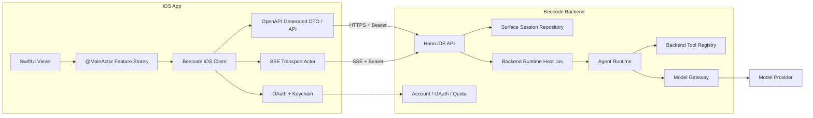
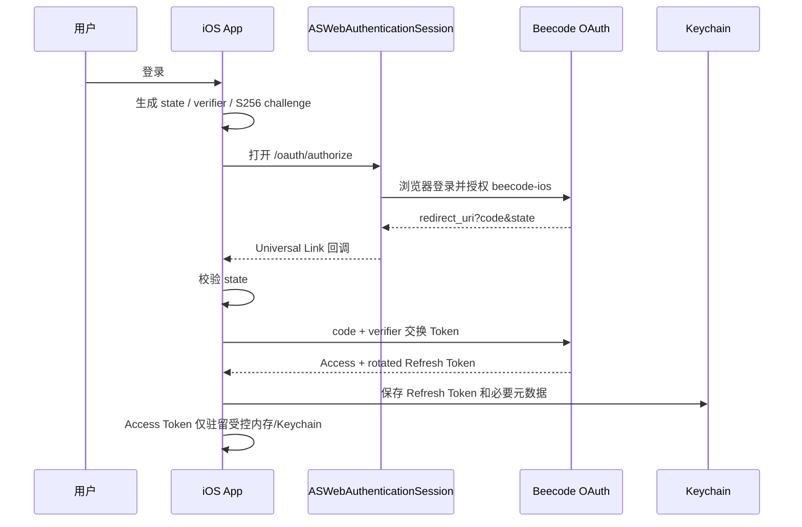
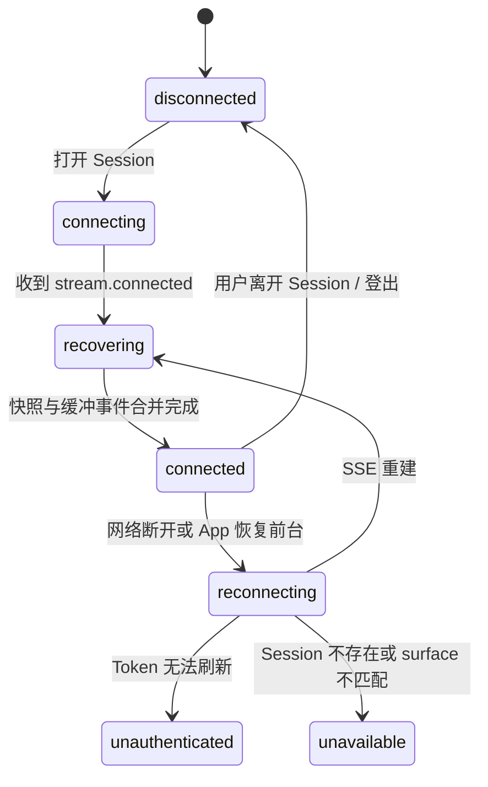

# Beecode 第三阶段 iOS 原生开发设计

> 状态：Slice 0-Slice 3 已实现，Slice 4+ 未开始；真机签名与 Backend 环境待配置  
> 范围：iOS 原生客户端、后端 iOS Runtime、移动端 OAuth、Swift Client 与协议行为测试  
> 更新日期：2026-08-13  
> 上游文档：[Beecode 产品规格](../product/beecode-product-spec.md)  
> 前置实现：[第二阶段 Web 开发设计](./phase-2-web-development-design.md)

## 1. 文档目标

第三阶段交付 Beecode iOS 原生产品端，并把已在 CLI 与 Web 验证的 Agent Protocol 扩展到 `surface = ios`。本阶段不是把 Web 页面包进 WebView，也不是让 App 直接调用模型供应商，而是完成以下纵向链路：

```text
iOS 浏览器授权登录
  -> 创建 iOS Session
  -> 提交 Turn
  -> 后端 iOS Runtime 运行 Agent Loop
  -> Model Gateway 调用模型
  -> calculator Tool Call
  -> SSE 推送实时状态
  -> Session 持久化
  -> App 重启、切后台或断网后通过快照恢复
```

本文锁定以下边界：

- iOS App、Swift Client、Backend iOS API 和后端 Runtime 的职责。
- iOS 与 CLI、Web 的账号复用和 Session surface 隔离。
- OAuth Authorization Code + PKCE、Universal Link 回调、Keychain 和 Token 轮换。
- OpenAPI 生成的 Swift DTO/API 与手写 SSE Transport 的边界。
- SwiftUI 导航、状态所有权、后台生命周期、错误和无障碍行为。
- Swift 6 严格并发下的 actor、取消、重连与状态投影。
- Swift Testing、XCTest UI、Backend 契约与端到端验收策略。

## 2. 当前实现评估

### 2.1 可直接复用的基础

- `packages/protocol` 已定义五种 `Surface`、Session、Turn、Message、Part、ToolCall、Capability、稳定错误和 Agent 事件信封。
- `packages/agent-core` 和 `packages/agent-server` 已实现框架无关 Agent Loop、工具生命周期、取消和限制。
- Backend 已有 Web Runtime、Session Repository、Model Gateway、quota、SSE、OAuth Authorization Code + PKCE 和 Token 轮换。
- OpenAPI 3.1 已发布到 `/openapi.json`，公开对象由协议 Schema 生成。
- Web 已验证连接 SSE 后取快照、按 `sequence` 合并缓冲事件的恢复策略。
- `calculator` 已作为后端安全工具跑通完整 Agent Tool Call。

### 2.2 iOS 开发前的缺口

| 缺口 | 当前表现 | 本阶段目标 |
| --- | --- | --- |
| iOS 工程 | 不存在 Xcode 工程 | 新建 SwiftUI 原生 App 与独立测试目录 |
| iOS API | 只有 `/v1/web/*`，使用浏览器 Cookie | 新增 Bearer 认证的 `/v1/ios/*` |
| iOS Runtime | 只有 `WebRuntimeHost` | 抽取可按 surface 配置的后端 Runtime Host，启用 `ios` |
| OAuth Client | 只注册 `beecode-cli` 和 loopback redirect | 建立 OAuth client registry，注册 `beecode-ios` 和精确 App 回调 URI |
| Swift Client | 只有 TypeScript Client SDK | 从 OpenAPI 生成 Swift DTO/请求，并提供稳定包装层 |
| SSE | Web 使用浏览器 `EventSource` | URLSession `bytes(for:)` + `AsyncThrowingStream` |
| 凭据 | CLI 使用 CredentialStore，Web 使用 Cookie | iOS Access/Refresh Token 存 Keychain，内存中短暂使用 Access Token |
| 生命周期 | 浏览器刷新恢复 | App 前后台、系统暂停网络、进程重启后恢复 |
| 移动体验 | Web 仅有响应式小屏布局 | SwiftUI 原生导航、Sheet、键盘、安全区和 Dynamic Type |

不得用以下临时方案绕过缺口：

- iOS 不能连接 `/v1/web/*` 或复用 Web Cookie 伪装成 Web surface。
- iOS 不能使用 development token 作为正式登录。
- App 不能持有模型供应商 Key，也不能直接访问 Model Gateway 私有接口。
- Client 不能自行把 Turn 或 Tool Call 标为成功、失败或取消。

## 3. 已确认决策

| 领域 | 决策 |
| --- | --- |
| 产品形态 | iPhone/iPad 原生 App，不使用 WebView 承载主体验 |
| UI 框架 | SwiftUI；仅在缺失系统能力时局部桥接 UIKit/AuthenticationServices |
| Runtime | Agent Runtime 位于 Beecode Backend |
| Surface | 服务端固定写入和校验 `ios`，不信任请求体覆盖 |
| 数据边界 | 同账号 iOS 设备共享 iOS Session；不能读取 CLI、Web、Desktop、Android Session |
| 网络 | HTTPS JSON 命令/查询 + SSE 在线事件 |
| 恢复 | SSE 不做永久回放；重连后读取权威 Session 快照并合并新事件 |
| 模型 | 所有模型请求经 Beecode Model Gateway，App 不接触 Provider 凭据 |
| 工具 | 第一版仅开放后端安全工具，至少包含 `calculator` |
| 本机能力 | 不提供用户电脑文件、Shell、Git；App 沙盒文件也不自动视为 Agent Workspace |
| API 契约 | Schema First、OpenAPI 3.1、稳定 `operationId`、生成 Swift Client |
| 认证 | OAuth 2.0 Authorization Code + PKCE，不使用嵌入式 WebView 登录 |
| 凭据存储 | Keychain；不写入 UserDefaults、日志、Crash 元数据或普通文件 |
| 单 Session 并发 | 同一 Session 同时只允许一个活动 Turn |
| 测试布局 | iOS 测试放在 `apps/ios/tests/`，不与生产 Swift 文件混放 |

## 4. 建议工程基线

以下作为第三阶段初始基线，技术评审可以修改，但创建工程前必须锁定并写入 Xcode 配置：

| 项目 | 建议值 | 理由 |
| --- | --- | --- |
| 开发工具 | Xcode 26.0+ | 当前开发机为 Xcode 26.0 |
| Swift | Swift 6.2 | 当前工具链可用，并启用完整并发检查 |
| 最低系统 | iOS/iPadOS 17.0 | 可直接使用 Observation、现代 SwiftUI 与 URLSession async API |
| UI | SwiftUI + Observation | 使用 `@Observable`、`@State`、`@Bindable` |
| 并发 | Strict Concurrency Complete | DTO、事件和 Client 边界均满足 `Sendable` |
| 默认 actor | 不依赖 Xcode 模板隐式默认值 | 显式标注 UI store 为 `@MainActor`，网络 actor 单独隔离 |
| 包管理 | Swift Package Manager | 优先系统框架和生成 Client，不引入 CocoaPods |
| 单元测试 | Swift Testing | 新单元与集成测试使用 `@Test`、`#expect`、`#require` |
| UI 测试 | XCTest/XCUITest | Swift Testing 不支持 UI 自动化 |
| 语言 | 首发至少简体中文和英文 String Catalog | 错误码与 JSON 等技术文本保持可复制 |

新 API 必须按最低系统版本检查可用性。iOS 18/26 专属 API 需要 `#available` 和合理回退；第一版不主动采用 Liquid Glass，除非另行确认视觉方向。

当前环境的 `xcodebuild -version` 和 `swift --version` 可用；CoreSimulatorService 在当前沙箱中不可用不代表本机未安装 runtime。创建工程后应在可访问 Simulator 服务的环境中确认至少一个 iOS 17+ 和当前最新 iOS runtime。

Slice 0 已固定以下 Apple OpenAPI 工具版本，机器可读清单位于 `apps/ios/Config/OpenAPIPackages.lock.json`：

| Package | 固定版本 |
| --- | --- |
| `swift-openapi-generator` | `1.13.0` |
| `swift-openapi-runtime` | `1.12.0` |

Slice 3 的生成包使用这些精确版本。生成包位于 `apps/ios/Packages/BeecodeAPI/`，由 `pnpm ios:openapi` 更新 OpenAPI 输入，再用 SwiftPM 生成 `Types.swift` 与 `Client.swift`。当前 App 的运行时包装层仍使用 `apps/ios/Sources/Networking/TransportModels.swift`，以保持认证、重试和错误映射的稳定边界；生成包尚未作为 Xcode App target 的编译依赖。接入 Xcode 前必须先在可联网环境生成并提交该包的 `Package.resolved`，同时评审生成 diff、Runtime API 和最低 Swift 工具链，不使用浮动分支或宽松版本范围。

## 5. 总体架构



### 5.1 iOS App 负责

- 发起系统浏览器授权并处理 App 回调。
- 安全保存、刷新和撤销 Beecode Token。
- 创建、列表、打开、重命名和归档 iOS Session。
- 提交幂等 Turn、取消活动 Turn、订阅事件并读取快照。
- 将权威快照和在线事件投影为 SwiftUI 可观察状态。
- 展示文本、Tool Call、Tool Result、连接状态、错误、quota 和 capability。
- 响应 App 前后台、网络变化、Dynamic Type、VoiceOver 和设备尺寸。

### 5.2 Backend 负责

- 认证 `beecode-ios` OAuth Token，并将请求绑定到 Account。
- 强制限定 `surface = ios` 的 Session 所有权和查询范围。
- 执行 Agent Loop、Tool、取消、额度预留和最终持久化。
- 发布 `surface = ios` 的 Capability。
- 通过 SSE 发布当前 Session 的在线事件。
- 在 Runtime 重启后把遗留活动 Turn 转为稳定的中断/失败状态。

### 5.3 明确不负责

- App 不运行 Agent Core 或 Tool Registry。
- App 不执行模型请求、calculator 或其他后端工具。
- SSE 不作为持久事件仓库，客户端不要求按事件 ID 永久续传。
- 本阶段不提供 App 沙盒文件给模型，不实现本地 Coding Agent。

## 6. 仓库与 Xcode 工程结构

建议结构：

```text
apps/
└── ios/
    ├── Beecode.xcodeproj/
    ├── Config/
    │   ├── Base.xcconfig
    │   ├── Debug.xcconfig
    │   └── Release.xcconfig
    ├── Sources/
    │   ├── App/
    │   ├── Auth/
    │   ├── Core/
    │   │   ├── API/
    │   │   ├── Models/
    │   │   ├── Networking/
    │   │   └── Security/
    │   ├── Features/
    │   │   ├── Account/
    │   │   ├── Sessions/
    │   │   └── Conversation/
    │   ├── Generated/
    │   └── Resources/
    └── tests/
        ├── Unit/
        ├── Integration/
        ├── Fixtures/
        └── UI/
```

约束：

- `Generated/` 只放可重建的 OpenAPI 产物，不手工修改。
- App View 不直接拼 URL、Authorization Header 或解析 SSE。
- Backend、Agent Core 和 TypeScript Client SDK 不被打包进 iOS App。
- Feature 目录按用户流程组织，不建立没有实际复用价值的层级。
- 测试 target 从 `apps/ios/tests/` 引用文件，生产 target 不编译测试代码。
- API base URL、回调 scheme/associated domain 和日志级别通过 xcconfig/Info 配置，不散落在 Swift 常量中。

第一版保持单 App target、一个单元/集成测试 target 和一个 UI 测试 target。只有生成 Client 或可复用核心出现清晰编译边界时，再提取本地 Swift Package。

## 7. 后端 iOS 前置改造

### 7.1 Runtime Host 泛化

不要复制一份只改字符串的 `IOSRuntimeHost`。把现有 Web Runtime 的业务能力提取为可配置的 Backend Surface Runtime Host：

```text
BackendSurfaceRuntimeHost
  - surface: web | android | ios
  - repository: SessionRepository
  - modelGateway
  - toolPolicy
  - concurrencyLimit
```

Web 与 iOS 使用独立实例和 surface policy，但复用 Agent Core、事件映射、幂等、取消、持久化和资源回收逻辑。路由适配层仍然分开，防止客户端通过请求体切换 surface。

### 7.2 OAuth Client Registry

当前 TokenService 只接受 `beecode-cli` 与 loopback redirect。第三阶段需要显式注册：

```text
client_id: beecode-ios
grant: authorization_code + PKCE S256
redirect_uri: 生产 Universal Link（优先）
fallback: 已登记的自定义 URL Scheme，用于不支持 HTTPS callback 的最低系统版本和开发环境
```

Registry 至少包含 client ID、允许的精确 redirect URI、产品 surface 和 Token policy。不得使用任意前缀、通配 host 或由请求动态登记 redirect URI。

### 7.3 Bearer 认证

`/v1/ios/*`、`/v1/me`、`/v1/quota` 使用 OAuth Access Token 的 Bearer 认证。服务端校验：

- Token 哈希存在且未过期、未撤销。
- Token 的 `clientId` 为已注册移动客户端。
- Account 仍存在。
- 请求路由与客户端允许的 surface 一致。

Refresh Token 只能用于 `/oauth/token`；不能作为 API Bearer Token。开发 token 只保留在明确启用的本地测试路径。

### 7.4 iOS API 路径

新增目标路由：

| Method | Path | 语义 |
| --- | --- | --- |
| `GET` | `/v1/ios/capabilities` | 获取 iOS Runtime Capability |
| `GET` | `/v1/ios/sessions` | 分页列出当前账号 iOS Session |
| `POST` | `/v1/ios/sessions` | 创建 `surface=ios` Session |
| `GET` | `/v1/ios/sessions/{sessionId}` | 获取权威完整快照 |
| `PATCH` | `/v1/ios/sessions/{sessionId}` | 按 `expectedVersion` 更新标题/归档 |
| `POST` | `/v1/ios/sessions/{sessionId}/turns` | 幂等提交并返回 `202` Turn |
| `POST` | `/v1/ios/sessions/{sessionId}/turns/{turnId}/cancel` | 取消或确认已终态 |
| `GET` | `/v1/ios/sessions/{sessionId}/events` | Bearer 认证 SSE |

`/v1/me` 和 `/v1/quota` 保持跨客户端公共路径。所有 iOS operationId 使用稳定的 `getIOSCapabilities`、`listIOSSessions` 等命名；OpenAPI 为 iOS 路由声明 `bearerAuth`。

## 8. OpenAPI 与 Swift Client

### 8.1 生成边界

使用 Apple `swift-openapi-generator` 作为首选评估方案，生成：

- Codable/Sendable DTO。
- 普通 JSON 请求与响应 Client。
- OpenAPI 中的状态码和错误响应类型。

手写稳定包装层 `BeecodeClient`，负责：

- 把生成 API 映射为产品方法。
- 注入 Bearer Token 并处理一次 Token refresh。
- 将生成错误转换为稳定的 `BeecodeClientError`。
- 提供幂等键和取消语义。
- 组合手写 `SessionEventStream`。

SSE 不强行依赖生成器对 `text/event-stream` 的支持。OpenAPI 继续用 `x-beecode-event-schema: AgentEventEnvelope` 表达 payload，Swift 端手写规范兼容的 SSE parser。

### 8.2 生成产物规则

- OpenAPI 文档由 Backend/Protocol 单一来源生成。
- CI 重新生成并检查无 diff，防止契约与 Swift Client 漂移。
- 生成器版本固定；升级必须单独评审生成 diff。
- 生成类型不能泄漏到 SwiftUI View；Feature 依赖包装后的领域接口。
- 所有日期使用 ISO 8601，ID 作为不透明 String，不推断前缀业务逻辑。
- `input`、`output` 等开放 JSON 使用明确的 JSON value 类型，不能用非 `Sendable` 的任意引用对象跨 actor。

## 9. 认证与凭据生命周期

### 9.1 登录流程



登录使用 `ASWebAuthenticationSession`，使用 ephemeral session 与否属于产品登录策略，不能为了绕过 SSO 默认强制开启。创建工程时必须在最低支持的 iOS 17.x runtime 上验证 HTTPS callback API 的可用性；不可用版本使用 OAuth registry 中精确登记的自定义 URL Scheme，不通过宽松 redirect 规则兼容。不得使用 WKWebView 收集账号密码。

### 9.2 Keychain 规则

- 使用 `kSecClassGenericPassword` 和稳定 service/account 名称。
- 默认访问级别建议 `kSecAttrAccessibleAfterFirstUnlockThisDeviceOnly`；若安全评审要求更严格，可改为 `WhenUnlockedThisDeviceOnly` 并接受后台恢复限制。
- Token 不通过 iCloud Keychain 同步，不参与设备备份迁移。
- 更新 Refresh Token 时写入新 Token 后再删除/替换旧值，避免进程中断丢失整族凭据。
- 登出先请求撤销 Refresh Token，再清理本地凭据；服务端不可达时仍清理本地并记录非敏感待确认状态。

### 9.3 刷新并发

用单独 `actor TokenVault` 串行化 Token 读取和刷新。同一时刻只允许一个 refresh 请求；其他遇到 401 的调用等待同一结果。每个请求最多刷新并重放一次，禁止无限 401 循环。

对非幂等请求，仅当请求携带原始 `idempotencyKey` 且服务端支持重放时才自动重试。

## 10. iOS 网络层

### 10.1 普通请求

- 使用注入的 `URLSession`，不在业务对象内直接使用 `URLSession.shared`。
- 所有请求验证 `HTTPURLResponse` 和 2xx 状态后再解码。
- 配置 request/resource timeout；SSE 使用独立长连接策略。
- ATS 生产环境只允许 HTTPS，不启用全局 arbitrary loads。
- 开发连接本机 Backend 使用独立 Debug 配置和最小例外，Release 配置不得继承。
- 网络错误映射为认证、超时、离线、取消、HTTP 产品错误、解码错误和流断开。

### 10.2 SSE Parser

使用 `URLSession.bytes(for:)` 读取 `AsyncBytes.lines`，解析：

- `event: stream.connected`
- `event: agent`
- `id:`
- 多行 `data:` 拼接
- 空行提交事件
- `:` 注释心跳
- LF 与 CRLF
- UTF-8 分段、空 data 和未知字段

Parser 输出 `AsyncThrowingStream<SessionStreamEvent, Error>`，在 consumer 取消、Session 切换、登出或 App 决定暂停连接时取消底层 URLSessionTask。禁止用无限 detached task 持有 View 或 Token。

### 10.3 恢复状态机



每次连接按以下顺序执行：

1. 打开 SSE，开始缓冲 `agent` 事件。
2. 收到 `stream.connected` 后请求 Session 快照。
3. 用快照完整替换当前权威投影，记录 `live.sequence`，缺失时为 `0`。
4. 缓冲事件按 `sequence` 排序，丢弃 `sequence <= snapshot.live.sequence`。
5. 依次应用剩余事件，切换为 connected。
6. 遇到 sequence 倒退、重复时忽略；遇到不可解释的 gap 或解码错误时重新走快照恢复。

退避采用带抖动的有界指数策略。系统离线时等待路径恢复，不做高频重试；认证失败停止 SSE 自动重连并进入登录恢复。

## 11. Swift 并发与状态所有权

### 11.1 隔离边界

| 类型 | 隔离 | 职责 |
| --- | --- | --- |
| `AppStore` / Feature Store | `@MainActor @Observable` | UI 导航、展示状态和用户操作 |
| `TokenVault` | `actor` | Keychain、Access Token、单航班 refresh |
| `APIClient` | `Sendable` 值或 actor | 普通 HTTP 请求与错误映射 |
| `SessionEventStream` | `actor` | SSE task、parser、重连 generation 和取消 |
| 生成 DTO/领域快照 | `Sendable` value | 跨隔离边界传递不可变数据 |

不把整个网络层标为 `@MainActor`。网络、等待、JSON 解码和退避不占用主 actor；只有 UI Store 应用快照/事件时回到主 actor。

### 11.2 Task 生命周期

- SwiftUI View 用 `.task(id: sessionId)` 启动与当前 Session 绑定的加载/订阅，并依赖结构化取消。
- Feature Store 可持有一个明确的 conversation task handle，用于切换 Session 和登出时取消。
- 不使用 `Task.detached`，除非有不可继承 actor 的明确性能理由和测试。
- 重连 generation 防止旧 SSE 或旧快照覆盖新连接状态。
- 长循环和退避前后检查取消；CancellationError 不转成用户可见失败。

## 12. 本地状态模型

后端仍是业务权威。iOS 只保存展示投影、短期缓存和用户偏好：

| 状态 | 权威来源 | iOS 保存方式 |
| --- | --- | --- |
| Account、quota | Backend | 当前内存，进入前台按需刷新 |
| Session 列表 | Backend | 内存分页投影，可选非权威磁盘缓存 |
| Session 历史 | Backend 快照 | 当前会话内存投影 |
| 活动 Turn | Backend Runtime | 快照 + SSE reducer |
| Token | Backend/Auth | Keychain + 受控内存 |
| 输入草稿 | Client | 每 Session 本地草稿，可落 App Storage |
| 主题、字号偏好 | System/Client | 优先跟随系统，不覆盖业务状态 |

第一版不把完整 Agent Session 当作离线数据库维护，不做双向同步和冲突合并。可选磁盘缓存只能用于冷启动占位，必须显示陈旧状态，并在网络恢复后由快照替换。

### 12.1 Session Reducer

Reducer 是纯函数，输入 `SessionSnapshot + AgentEventEnvelope`，输出新快照。行为与 Web 一致：

- `turn.started`：upsert Turn。
- `message.delta`：按 messageId/partId 追加文本并更新 Turn。
- `tool.requested`：创建 ToolCall Part，避免重复插入。
- `tool.started`：更新 ToolCall 为 running。
- `tool.completed` / `tool.failed`：用权威 ToolCall 替换投影。
- Turn 终态：更新状态、usage/error，并清除 activeTurnId。

列表和消息必须使用服务端稳定 ID；不得用数组 index、offset 或可变文本作为 SwiftUI identity。

## 13. SwiftUI 产品结构

### 13.1 导航

```text
App Root
├── Authentication
└── Main
    ├── Sessions
    │   └── Conversation
    │       └── Tool Detail Sheet
    └── Account / Quota / Capabilities
```

- iPhone 使用 `NavigationStack`。
- iPad regular width 使用 `NavigationSplitView` 展示 Session 列表与 Conversation。
- 使用 value-based navigation 和 `.navigationDestination(for:)`。
- 归档、登出等破坏性操作使用原生 confirmation dialog。
- Tool 详情使用 Sheet；内容过长时支持选择和复制。

### 13.2 核心页面与组件

- `AuthenticationView`
- `SessionListView`
- `ConversationView`
- `MessageListView`
- `UserMessageView`
- `AssistantMessageView`
- `ToolActivityView`
- `ToolDetailView`
- `ComposerView`
- `ConnectionNoticeView`
- `AccountView`
- `QuotaView`
- `CapabilityView`

主体验第一屏是可工作的 Session/Conversation，不增加营销 Hero。Message 和 Tool 活动按信息语义分组，不做层层嵌套卡片。

### 13.3 Composer

- 多行文本输入，空白消息不能提交。
- 运行中主操作切换为停止；禁止重复提交同 Session Turn。
- 显示系统键盘安全区，最后一条消息不能被 Composer 遮挡。
- 提交前生成稳定 UUID idempotency key，并保留到请求得到确定结果。
- 网络结果未知时不生成新 key 盲目重发；先用原 key 查询/重试。

### 13.4 可访问性和本地化

- 支持 Dynamic Type、VoiceOver、Increase Contrast、Reduce Motion、深浅色模式和横竖屏。
- 所有点击操作使用 `Button`，系统图标有可读 label。
- 流式 token 不逐字播报；完整段落、Tool 状态和 Turn 终态使用节制的 live announcement。
- Tool input/output、错误码和 Session ID 可选择复制，长文本可换行或横向滚动但不撑破布局。
- String Catalog 至少提供简体中文和英文；服务端 `message` 作为回退，UI 优先按稳定错误码本地化。
- Preview 使用本地 fixture，不访问网络、Keychain 或真实账号。

## 14. UI 状态矩阵

| 场景 | 可见行为 | 允许操作 |
| --- | --- | --- |
| 未登录 | 原生登录入口和隐私说明 | 登录 |
| 登录中 | 系统浏览器授权进行中 | 取消授权 |
| Session 首次加载 | 保持最终布局的骨架 | 返回、账号入口 |
| 无 Session | 原生空状态 | 新建 Session |
| 空 Session | Composer 可用 | 输入并提交 |
| submitting | 消息发送中 | 不重复提交，可返回但提示状态 |
| queued/running | 显示后端已接收/处理中 | 取消 |
| model_streaming | 增量显示回答 | 取消 |
| tool_running | 显示工具名与状态 | 查看输入、取消 Turn |
| completed | 显示最终内容和 usage | 继续提问 |
| cancelled | 保留已确认内容并标记取消 | 继续提问 |
| failed | 显示稳定错误和可重试性 | 按错误策略重试 |
| 离线 | 保留已知内容，显示等待网络 | 浏览/复制，不盲目提交 |
| reconnecting | 显示恢复状态，不假定 Turn 失败 | 取消本地等待、返回 |
| unauthenticated | 停止重连，保护本地内容 | 重新登录 |
| quota exhausted | 显示额度状态 | 查看账号，不提交 |
| version conflict | 重新取快照/列表 | 重做重命名或归档 |

## 15. App 生命周期

### 15.1 进入后台

- iOS 不能保证后台长期维持 SSE；进入后台不把 Turn 标为失败或取消。
- 保存必要草稿和非敏感 UI 状态。
- 允许系统暂停或终止 SSE task；不申请无合理业务依据的后台模式。
- 后端 Runtime 独立继续执行 Turn 并持久化结果。

### 15.2 返回前台

- 检查 Token 可用性和网络路径。
- 对当前 Session 重新建立 SSE，并执行连接后快照恢复。
- 刷新 Session 列表、quota 和 capability 的过期缓存。
- App 被系统终止后重启也走相同权威恢复，不依赖旧 SSE 事件。

### 15.3 深链

认证回调与产品内 Session 深链分开路由。所有深链验证 host、path 和参数；未登录打开 Session 链接时先完成登录，再仅尝试打开 `surface=ios` 且属于当前账号的 Session。

## 16. 错误与重试策略

客户端以稳定错误码决定行为，HTTP 状态只做大类判断：

| 类别 | 示例 | iOS 行为 |
| --- | --- | --- |
| 认证 | `UNAUTHENTICATED`, `TOKEN_EXPIRED`, `TOKEN_REVOKED` | 单次 refresh；失败则登录 |
| 状态冲突 | `TURN_ALREADY_ACTIVE`, `IDEMPOTENCY_CONFLICT` | 取快照，不创建新 Turn |
| 资源 | `SESSION_NOT_FOUND`, `SURFACE_UNAVAILABLE` | 退出当前会话到安全列表 |
| 额度 | quota 错误 | 不重试，显示账号/额度入口 |
| 流 | `STREAM_DISCONNECTED` | 保留内容，退避重连并取快照 |
| Runtime | `RUNTIME_INTERRUPTED` | 展示终态，可继续新 Turn |
| 取消 | CancellationError / cancelled | 不作为错误弹窗 |
| 服务端 | retryable 5xx | 仅安全/幂等请求有界重试 |

错误 UI 不展示堆栈、数据库信息、Token、Provider 原始响应或内部文件路径。

## 17. 安全与隐私

- Release 只连接配置 allowlist 内的 HTTPS Backend。
- OAuth 使用 PKCE S256、随机 state、一次性授权码和精确 redirect URI。
- Universal Link 配置 Associated Domains 和服务端 AASA；自定义 scheme 只作最低系统兼容和开发环境的受控 fallback。
- Token、Authorization Header、Cookie、完整 Prompt 和 Tool 输出默认不进入日志。
- `os.Logger` 使用 privacy 标记；Crash/analytics 只记录 requestId、错误码、surface、时长等非敏感元数据。
- App 不做自定义证书信任绕过。是否做证书 pinning 由独立威胁模型决定，不在第一版临时加入。
- Keychain 错误必须显式处理；不能失败后降级到 UserDefaults。
- 剪贴板复制由用户明确触发，不后台读取剪贴板。
- SSE 建连前服务端完成 Account、surface 和 Session ownership 校验。
- capability 只能影响 UI 展示，Runtime 仍在模型调用前和 Tool 执行前再次强制策略。

## 18. 可观测性

客户端结构化记录：

```text
requestId
surface=ios
operationId
sessionIdHash
turnIdHash
connectionState
retryAttempt
durationMs
httpStatus
errorCode
appLifecycleState
```

不得记录 Token、Authorization Code、verifier、Cookie、Provider Key 或默认记录完整 Prompt/Tool 数据。

最低产品指标：登录成功/失败、Token refresh 成功率、API 延迟与错误、SSE 建连时间、重连次数、快照恢复次数、Turn 完成/取消/失败、Tool 耗时、冷启动到可交互时间。性能结论在真机使用 Instruments 验证；Simulator 上 SwiftUI trace lane 不完整时改用 Time Profiler、Hangs 和 Animation Hitches。

## 19. 测试策略

### 19.1 Protocol 与生成 Client

- OpenAPI 包含完整 iOS 路由、Bearer security 和稳定 operationId。
- Swift 生成 Client 与仓库 OpenAPI 无 diff。
- DTO 能解码五种 Surface、所有 Part、Turn 状态、ToolCall 状态和错误。
- 未知必需判别值产生明确协议错误，不静默映射成成功。
- ISO 8601、开放 JSON、分页 cursor 和 1 MB 输入边界有 fixture。

### 19.2 Swift 单元测试

使用 Swift Testing：

- 纯 Session reducer 的每种 AgentEvent 和重复/乱序 sequence。
- `TokenVault` 单航班 refresh、轮换、撤销、过期和取消。
- SSE parser 的 LF/CRLF、多行 data、心跳、分块 UTF-8、错误事件和取消。
- 重连状态机的 generation、退避、离线等待和认证终止。
- idempotency key 在未知提交结果后的复用。
- 错误码到本地化 UI 行为的映射。

测试 suite 使用 struct，断言使用 `#expect`/`#require`。异步测试不使用固定 sleep 等待；通过可控 Clock、AsyncStream 或 confirmation 同步。

### 19.3 网络集成测试

使用注入 URLSession + `URLProtocol` fixture：

- 2xx、格式错误的 2xx、非 JSON 错误体。
- 一次 401 refresh 后成功，以及 refresh 失败。
- 429/5xx 有界重试、非重试 4xx、超时、离线和取消。
- Bearer Header 注入但不出现在日志。
- SSE 断开后快照覆盖旧投影并应用更高 sequence 事件。

### 19.4 Backend 测试

- `beecode-ios` PKCE 登录、错误 state/verifier/redirect、授权拒绝和过期。
- Access Token expiry、Refresh Token 轮换、重用检测和 family revoke。
- 同账号两台 iOS Client 看见相同 iOS Session。
- iOS 不能读取 Web/CLI Session，Web/CLI 不能读取 iOS Session。
- 请求体伪造 `surface` 被忽略或拒绝。
- iOS capability 只开放 allowlist 后端工具。
- Turn 接受、幂等、并发拒绝、取消、SSE 顺序、心跳和 Runtime 中断恢复。

### 19.5 UI 与端到端测试

XCUITest 最高优先级路径：

1. 使用可控测试身份完成登录。
2. 创建 iOS Session。
3. 输入“计算 1+1”。
4. 观察 calculator requested/running。
5. 观察 Tool Result `2`。
6. 观察最终回答。
7. 将 App 送入后台再返回，确认快照恢复。
8. 重启 App，确认 Session 历史恢复。
9. 第二个模拟设备/客户端看到同一 iOS Session。
10. 验证 Web/CLI API 不能读取该 Session。

额外覆盖：取消、Provider 失败、quota 不足、离线重连、Token 过期、Session 不存在、iPhone SE 尺寸、最大 Dynamic Type、横屏、iPad split view、深色模式和 VoiceOver 标签。

至少保留一条真实 Model Gateway 的人工/集成 Smoke Test。自动化默认使用可控模型替身稳定触发 calculator。

## 20. 纵向开发顺序

### Slice 0：文档与工具链基线

- 评审本文，锁定最低 iOS、Swift/Xcode、bundle ID、Team 和回调域名。
- 创建 Xcode 工程、xcconfig、测试目录和 CI build/test 命令。
- 固定 OpenAPI 生成器版本。

完成条件：空 App 可在 Simulator 构建，Swift Testing 和 UI Test target 可运行。

### Slice 1：协议与 Backend iOS Surface

- 泛化 Backend Surface Runtime Host。
- 增加 `surface=ios` Repository、Capability 和 `/v1/ios/*` OpenAPI/路由。
- 建立 surface 隔离与协议契约测试。

完成条件：Bearer 测试账号可创建/读取 iOS Session，Web/CLI 无法读取。

### Slice 2：移动端认证

- OAuth client registry、`beecode-ios`、精确 redirect URI。
- iOS `ASWebAuthenticationSession`、PKCE、Keychain、refresh/revoke。
- Token 日志脱敏和认证错误状态。

完成条件：App 可登录、重启恢复、刷新 Token 和登出；错误回调不泄漏凭据。

### Slice 3：Swift Client 与 Session Shell

- OpenAPI Swift 生成、包装 Client、错误映射。
- Session 列表、创建、打开、重命名、归档。
- iPhone NavigationStack 与 iPad NavigationSplitView。

完成条件：同账号两台 iOS Client 可查看相同 Session 列表。

当前状态：已完成。后端 Bearer 请求、一次 401 刷新重放、iOS Session DTO 映射、列表/创建/打开/重命名/归档/退出登录、iPhone `NavigationStack` 和 iPad `NavigationSplitView` 均已实现并有 Swift Testing/XCUITest 基线。生成 OpenAPI 包已产出并可重建，但暂未接入 App target，后续接入时不得绕过 `BeecodeClient` 稳定包装层。

### Slice 4：Agent 最小闭环

- Turn 幂等提交、Session reducer、Conversation、Composer 和取消。
- Tool Activity、Tool Detail、最终回答和 usage。

完成条件：“计算 1+1”产生真实 Tool Call、结果 `2` 与最终回答。

### Slice 5：SSE 与生命周期恢复

- AsyncBytes SSE parser、重连 generation、退避和 snapshot merge。
- 前后台、断网、App 重启和 Backend 重启恢复。

完成条件：网络与生命周期中断不制造重复 Turn，不丢失权威结果。

### Slice 6：产品完整状态

- quota、capability、所有错误、空状态、加载、认证失效。
- 本地化、Dynamic Type、VoiceOver、深浅色和 iPad 布局。

完成条件：第 14 节状态矩阵全部有自动化或明确人工验收。

### Slice 7：质量与交付

- Swift Testing、Backend 契约、XCUITest 和真实模型 Smoke。
- Instruments 性能检查、日志隐私审计和 Release 配置检查。
- 更新 README 与新增 `docs/usage/ios.md`。

完成条件：满足第 21 节全部标准。

## 21. 完成标准

- iOS 用户能通过系统浏览器安全登录、刷新凭据和登出。
- iOS 能创建、列出、打开、重命名和归档 `surface=ios` Session。
- 输入“计算 1+1”经过后端 Agent Runtime、真实 calculator Tool Call 并最终回答 `2`。
- App 展示文本流、Tool requested/running/completed/failed、Turn 完成/失败/取消。
- Turn 提交幂等，同 Session 不发生并发执行。
- 断网、切后台、App 重启和 Backend 重启后通过权威快照恢复。
- 同账号 iOS 设备可查看相同历史；CLI、Web、Desktop、Android 无法读取。
- iOS Capability 不开放用户电脑文件、Shell、Git 等不存在的能力。
- Token、PKCE verifier、Provider Key 和敏感内容不出现在日志、普通文件或 UI 测试附件。
- OpenAPI、Swift Client、Backend 路由和领域事件通过契约测试。
- iPhone/iPad、Dynamic Type、VoiceOver、深浅色和键盘场景无布局阻塞。
- 所有测试位于独立测试目录，Debug/Release 配置不泄漏开发例外。
- iOS build、Swift Testing、Backend check、XCUITest 和真实模型 Smoke Test 通过。

## 22. 本阶段不实现

- 用户电脑或 App 沙盒的文件、Shell、Git、LSP 和 PTY。
- 跨 surface Session 查看、同步或继续。
- Durable SSE event replay、事件溯源或离线双向同步。
- 推送通知、Live Activity、Widget、Siri/App Intents。
- 附件、相机、相册、语音输入和后台上传。
- MCP、插件市场、团队共享和组织权限。
- App 内购买、正式订阅和计费界面。
- 完全离线模型推理或 BYOK。

这些能力后续只能扩展现有 Account、Surface、Session、Runtime、Capability 和 Protocol 边界，不能绕过 Backend Runtime 或破坏 surface 隔离。

## 23. 开发前必须锁定的工程选项

以下决策必须在对应 Slice 开始前完成：

1. Apple Developer Team、Bundle ID、App 名称和签名策略。
2. 生产 API base URL、登录 Web 域名、Universal Link 域名和 AASA 部署。
3. 正式身份提供商及其移动端登录政策。
4. 最低 iOS 版本是否确认采用 17.0。
5. OAuth Access/Refresh Token 的最终 TTL 与 Keychain accessible level。
6. Swift OpenAPI Generator 及 runtime/transport 的固定版本。
7. Backend Surface Runtime Host 的命名、并发上限和空闲回收策略。
8. Debug 真机如何访问本地 Backend，以及 Release ATS/域名 allowlist。
9. CI 使用的 Xcode 版本、Simulator runtime 和签名/无签名构建方式。
10. 首发语言、隐私清单、数据收集声明和日志/Crash 平台。

这些选项通过 xcconfig、Backend config、OAuth registry 和稳定接口落地，不能散落为 View、Route Handler 或生成代码中的硬编码常量。

## 24. 实现状态

截至 2026-08-13：

- 产品层的 iOS surface、后端 Runtime、数据隔离、工具边界和 SSE 恢复原则已在上游规格中确认。
- Phase 2 已提供可复用的协议、OpenAPI、OAuth/PKCE、Web Runtime、Session Repository、Model Gateway 和 calculator 纵向闭环。
- Slice 0 已创建 `apps/ios/Beecode.xcodeproj`、共享 `Beecode` Scheme、Debug/Release xcconfig、SwiftUI App 壳、英文/简体中文 String Catalog、Swift Testing Target 和 XCUITest Target。
- Slice 1 已完成 `/v1/ios/*`、`surface=ios` Runtime/Repository、能力 allowlist、OpenAPI 路由和 surface 隔离测试。
- Slice 2 已完成 `beecode-ios` OAuth client、精确回调 URI、ASWebAuthenticationSession、PKCE S256、Keychain、Token refresh/revoke 和认证测试。
- Slice 3 已完成注入式 URLSession Transport、稳定 `BeecodeClient`、Session shell、iPhone/iPad 导航和会话操作。生成 OpenAPI 包已产出，但暂未加入 App target；它是可重建的独立契约产物。
- Debug ATS 仅允许本地网络，Release 保持严格 ATS。默认 Debug API 地址为 Simulator 可用的 `http://127.0.0.1:8787`；真机必须改成同一局域网可达的 Backend 地址。
- 已在 iOS 17.2 和 iOS 26.0 Simulator 验证工程构建与测试。真机体验还需要 Apple Developer Team、正式 Bundle ID/签名、可达 Backend、准确 `publicBaseUrl` 和登记过的 OAuth redirect URI。

### 24.1 第三阶段验收边界

完成 Slice 3 后可以在 Simulator 或已配置签名的真机上验收：登录界面、凭据恢复/登出、iOS Session 列表、创建、打开、重命名、归档和 iPhone/iPad 导航布局。真正的 Conversation、Turn、Tool Call、SSE reducer、前后台恢复和断网重连属于 Slice 4-Slice 5，当前不应以“计算 1+1”作为本阶段已完成能力。

真机验收前必须完成 [iOS 真机开发说明](../usage/ios.md) 中的环境配置；尤其不能把 `127.0.0.1` 作为真机 Backend 地址。
