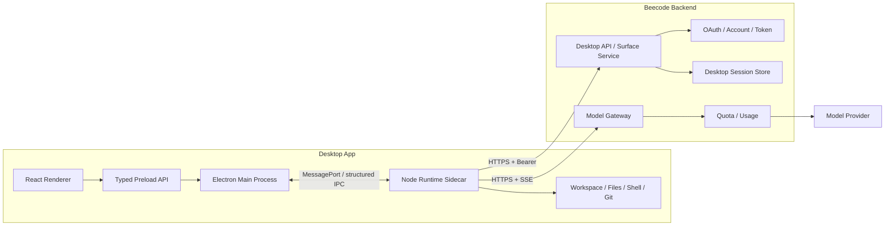
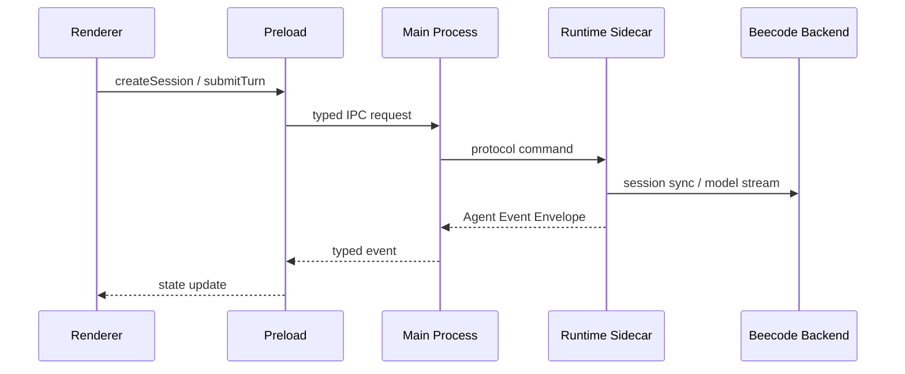
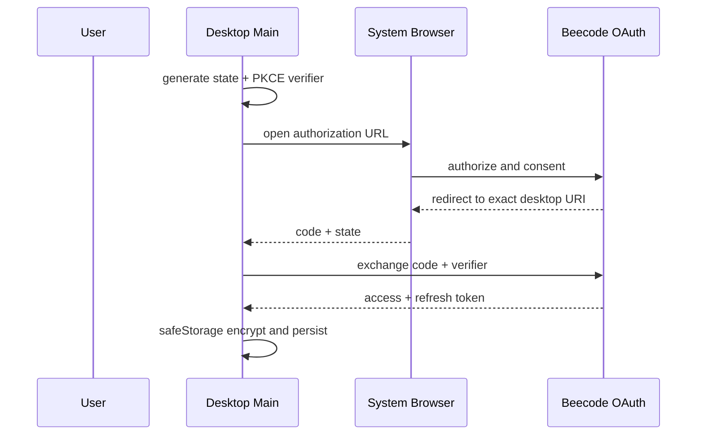

# Beecode 第四阶段 Desktop 跨平台开发设计

> 状态：Slice 4 in progress，只读 Workspace 已实现
> 范围：Desktop 产品端、Electron 桌面壳、本地 Runtime Sidecar、Desktop surface、桌面端 OAuth 与发布链路
> 更新日期：2026-08-19
> 上游文档：[Beecode 产品规格](../product/beecode-product-spec.md)
> 前置文档：[第三阶段 iOS 原生开发设计](./phase-3-ios-development-design.md)

## 1. 文档目标

第四阶段交付 Beecode Desktop 产品端，并把产品规格中已经确认的本地执行平面落地为可发布的跨平台桌面应用。本阶段不是把 Web 页面包进桌面窗口，也不是让渲染层直接获得文件系统或 Shell 权限，而是建立以下纵向链路：

```text
系统浏览器 OAuth 授权
  -> Desktop App 接收精确 deep link 回调
  -> 启动受控 Runtime Sidecar
  -> 创建 Desktop Session
  -> 提交 Turn
  -> 本机 Agent Runtime 运行 Agent Loop
  -> 本机 Tool Registry 执行 calculator / workspace 工具
  -> Runtime 通过 Beecode Model Gateway 调用模型
  -> IPC 推送 Agent Event
  -> Desktop Session 快照同步到 Backend
  -> App 重启或 Runtime 重启后恢复
```

本文锁定以下边界：

- Electron 主进程、Preload、React Renderer 和 Runtime Sidecar 的职责。
- Desktop Client 如何复用 Agent Protocol、Client SDK 和现有 TypeScript Runtime。
- Desktop `surface` 的认证、Session 隔离、Capability 与 Backend API。
- Renderer 与主进程、主进程与 Sidecar 的 IPC 语义。
- 本机 Workspace、文件、Shell、Git 和未来 Approval 的安全边界。
- OAuth Authorization Code + PKCE、精确 Desktop 回调、Token 保存与刷新。
- App、Sidecar、Backend 之间的启动、退出、崩溃、取消和恢复行为。
- macOS、Windows、Linux 的打包、签名、更新与测试策略。

本文不改变共享 Agent Protocol 的领域语义。Desktop 只能新增兼容的 Transport、surface 路由和能力声明，不能另行定义 Session、Turn、Message、Tool Call 或错误状态。

## 2. 问题与目标

### 2.1 用户问题

Desktop 用户需要一个比浏览器更适合长期 Coding Agent 工作的产品端：

- 可以选择本机 Workspace，并让 Agent 访问经过授权的文件、Shell 和 Git。
- 运行中的任务不应依赖窗口是否打开，界面崩溃或重载不能直接改变 Runtime 的执行结果。
- 可以看到流式回答、Tool Call、Tool Result、失败、取消和恢复状态。
- 同一个账号的其他 Desktop 设备可以看到 Desktop Session 历史，但不能读取 CLI、Web、iOS 或 Android Session。
- 登录、Token、自动更新和本机权限需要符合桌面平台的安全预期。

### 2.2 产品目标

- 复用现有 `Agent Core`、`Agent Server`、`Tool Registry`、`Client SDK` 和 `Protocol`，不为 Desktop 重写 Agent Loop。
- 让 Renderer 只负责产品 UI，不直接持有 Node.js、文件系统、Shell、Git 或模型访问权限。
- 让 Runtime Sidecar 独立于窗口生命周期运行，并成为当前 Turn、本机工具和 Workspace 状态的权威方。
- 让 Desktop Session 通过 Backend 以 `surface = desktop` 隔离保存，并支持同端跨设备查看。
- 让 Desktop 首个版本完成真实的登录、Session、流式 Agent、工具调用、取消和恢复闭环。
- 让后续加入 Approval、Artifact、PTY、MCP 和本地 Coding 工具时，不改变 Client/Runtime/Backend 的稳定边界。

### 2.3 非目标

- 不把 Web 页面通过远程 URL 直接加载进 Electron 并开启 Node 权限。
- 不让 Renderer 直接调用 `fs`、`child_process`、Shell 或模型供应商 API。
- 不把 Desktop Session 与 CLI、Web、iOS 或 Android Session 合并。
- 不在 Desktop App 中保存模型供应商密钥。
- 不在第一条纵向切片中实现 PTY、完整终端模拟器、MCP、插件市场、团队协作或远程控制另一台设备。
- 不因为 Desktop 引入新的 Agent Core 或另一套 Tool Schema。

## 3. 当前实现评估

### 3.1 可直接复用的基础

- `packages/protocol` 已定义 `desktop` surface、Session、Turn、Message、Part、ToolCall、Capability、稳定错误和 Agent Event Envelope。
- `packages/agent-core` 已提供框架无关的 Agent Loop、步骤限制、Token 限制、取消、重试和 Tool Call 生命周期。
- `packages/agent-server` 已通过 Facade 组合 Runtime、Tool Registry、Session Backend 和 Agent Protocol。
- `packages/tools` 已提供按 surface 过滤、输入校验、执行超时、取消和结果大小限制。
- `packages/client-sdk` 已提供 `AgentProtocolService` 和 Transport 抽象，Desktop 可以实现 IPC Transport 而不绕过协议边界。
- `apps/cli` 已证明本地 TypeScript Runtime 可以通过 Runtime Backend Protocol 访问 Session Store 和 Model Gateway。
- `apps/web` 已提供 React、Vite、TypeScript、SSE 恢复、消息投影和 Playwright 测试先例。
- Backend 已具备 OAuth Authorization Code + PKCE、Token 轮换、Model Gateway、Session Repository、Quota 和 surface 校验基础。

### 3.2 Desktop 开发前的缺口

| 缺口 | 当前表现 | 第四阶段目标 |
| --- | --- | --- |
| Desktop 工程 | 不存在 Electron App | 创建 Electron + React/Vite/TypeScript 工程 |
| Desktop surface API | 协议已允许，Backend 未启用 | 增加 Desktop Session、Capability 和运行时所需路由 |
| OAuth Client | 已注册 CLI、iOS | 注册 `beecode-desktop` 与精确回调规则 |
| Desktop Transport | 只有 In-Process 和 Web HTTP/SSE | 增加 Renderer 可用的 Desktop IPC Transport |
| Runtime Host | CLI 在单进程内组合 | Desktop 使用独立 Node Runtime Sidecar |
| 本机能力 | 仅有 calculator | 按 Capability 和用户授权逐步开放 Workspace、Shell、Git |
| Renderer 安全边界 | Web 无 Node 权限 | Preload + `contextBridge` + 最小类型化 IPC |
| 发布 | 没有桌面安装包 | Forge 打包、代码签名、更新和平台 CI |
| 桌面测试 | 没有 Electron 测试 | 单元、IPC、Runtime、Electron E2E 和打包 Smoke |

## 4. 已确认技术决策

| 领域 | 决策 |
| --- | --- |
| 桌面壳 | Electron，使用当期稳定版本并在 lockfile 中固定 |
| 打包工具 | Electron Forge，优先采用官方 `vite-typescript` 模板 |
| Renderer | React、Vite、TypeScript，复用 Web 的设计和会话交互模型 |
| 主进程 | Node.js 20+、TypeScript，负责窗口、生命周期、IPC、系统集成和更新 |
| Runtime | Node.js 20+、TypeScript，作为独立 Runtime Sidecar 运行 |
| Runtime 复用 | 复用 Agent Core、Agent Server、Tools、Protocol 和 Runtime Backend Client |
| Renderer 到主进程 | Preload 暴露的最小类型化 API；Renderer 不导入 Electron 主进程模块 |
| 主进程到 Runtime | Electron `utilityProcess` + `MessagePort`，事件和命令均采用结构化消息 |
| Client Transport | 新增 Desktop IPC Transport，实现与其他端一致的 Agent Protocol 语义 |
| Runtime 到 Backend | HTTPS JSON、Model Gateway SSE 和 Desktop Runtime Backend Protocol |
| Session 数据 | Backend 保存 `surface = desktop` 的权威历史；Runtime 保存当前执行和本机 Workspace 状态 |
| 本机执行 | Tool 只能由 Runtime 执行；Renderer 不获得文件、Shell、Git 权限 |
| 认证 | 系统浏览器 OAuth Authorization Code + PKCE，不使用嵌入式登录页收集密码 |
| Desktop 回调 | 使用精确注册的自定义 URI Scheme；协议、host、path 和 state 均严格校验 |
| Token 保存 | 主进程使用 Electron `safeStorage` 异步 API；Linux 不可用安全存储时必须明确降级策略 |
| 在线事件 | IPC 传输 Agent Event Envelope；事件不是持久历史，断线后重新读取快照 |
| 本地持久化 | 仅保存窗口偏好、Workspace 选择和加密后的 Token；Agent 历史以 Backend 为权威 |
| 自动更新 | macOS/Windows 走签名更新；Linux 优先使用发行版包管理或明确的独立更新方案 |
| 测试 | Vitest + Playwright Electron；测试文件统一放在 Desktop 独立测试目录 |
| UI 复用 | 逐步抽取真正复用的会话组件到共享 UI 包，Desktop 不直接依赖 Web App 根入口 |

选择 Electron 的原因是当前本地 Runtime、工具和后端客户端均为 Node/TypeScript。Tauri 2 作为后续体积和启动性能优化的备选，不作为本阶段主实现；如果改用 Tauri，需要新增 Rust 宿主、Node sidecar、跨架构二进制和额外 IPC 构建链路。

首个正式支持矩阵锁定为：

| 平台 | 首发架构 | 最低支持范围 | 说明 |
| --- | --- | --- | --- |
| macOS | Apple Silicon (`arm64`) | macOS 13 及以上 | Intel/Universal 不进入首条闭环 |
| Windows | `x64` | Windows 11 | 不为已结束主流支持的 Windows 10 承诺发布验收 |
| Linux | `x64` | Ubuntu 24.04 LTS | 作为首发验证基线，其他发行版先标记为未验证 |

Electron、Node 和 Chromium 的精确版本在 Slice 2 创建工程时由 lockfile 固定；如果当期 Electron 的官方最低支持高于本表，以更高版本为准并在同一变更中更新本表。首条纵向闭环先在开发宿主平台通过，Slice 5 才要求三个首发目标全部完成打包、签名或已知限制验收。

## 5. 总体架构



### 5.1 Renderer

Renderer 是一个只加载本地打包资源的 React 应用，职责包括：

- Session 列表、Conversation、Composer、Tool Call、Capability 和设置页。
- 将用户动作转为 Client SDK 命令。
- 将快照和 Agent Event 投影为 UI 状态。
- 展示连接、Runtime、Workspace、权限和更新状态。
- 处理键盘、窗口尺寸、主题、可访问性和本地临时输入。

Renderer 不负责：

- 访问 `electron`、Node.js、文件系统或进程 API。
- 读取或写入 Token。
- 判断 Turn 是否成功、取消或失败。
- 直接请求 Model Gateway 或 Desktop Backend。
- 根据界面隐藏结果推断 Tool 是否可用。

### 5.2 Preload

Preload 运行在隔离上下文，只暴露 Desktop 产品需要的窄接口：

- 获取 Desktop Client 初始状态。
- 调用 Session、Turn、Capability、Workspace 和设置命令。
- 订阅结构化 Agent Event、Runtime 状态和 App 生命周期事件。
- 发起登录、登出、刷新 Token 和打开外部系统浏览器。

Preload 不暴露完整 `ipcRenderer`，不暴露任意 channel，不把 Node 全局对象挂到 `window`。每个命令必须有固定名称、输入 Schema、返回结构和错误映射。

### 5.3 Electron Main Process

主进程负责所有桌面系统集成：

- 单实例锁、窗口创建、窗口状态和应用退出。
- 创建和管理 Runtime Sidecar。
- 建立 Renderer 与 Sidecar 之间的 IPC 桥接。
- 系统托盘、菜单、通知、全局快捷键和外部链接。
- OAuth deep link、单次 state、Token 读取和刷新协调。
- `safeStorage`、本地偏好和受控日志。
- 自动更新、退出前保存和 Runtime 关闭。

主进程不能代替 Runtime 成为 Agent 执行层。主进程只协调系统能力和进程生命周期，避免把长期运行的 Agent Loop、工具执行和窗口逻辑绑定在一起。

### 5.4 Runtime Sidecar

Runtime Sidecar 是本地执行权威：

- 组合 `AgentRuntime`、`AgentServerFacade`、Tool Registry 和 Desktop Runtime Backend Client。
- 管理 Workspace、文件、Shell、Git 和未来 Approval 的权限上下文。
- 通过 Model Gateway 发起模型流，不接触 Provider 私有凭据。
- 保存当前活动 Turn、取消控制器、事件序号和临时执行状态。
- 将 Agent Protocol 命令和 Agent Event Envelope 通过 MessagePort 发送给主进程。
- 将权威 Session 快照按版本同步到 Backend。

Sidecar 不加载 UI，不读写 Renderer DOM，不依赖窗口是否存在。窗口关闭时，Sidecar 可以继续运行；用户明确退出 App 或系统关机时，主进程必须先通知 Sidecar 进入关闭流程。

## 6. 进程模型与 IPC

### 6.1 进程关系



### 6.2 IPC 命令语义

Desktop IPC Transport 必须实现与 `AgentProtocolService` 相同的命令集合：

- 创建、列出和更新 Desktop Session。
- 获取完整 Session Snapshot。
- 提交带幂等键的 Turn。
- 取消指定 Session 的指定 Turn。
- 获取当前 Runtime Capability。
- 订阅 Agent Event Envelope。

IPC 只改变传输方式，不改变命令、错误、事件、顺序、取消和恢复语义。所有跨进程数据都必须经过协议解析器或等价的边界校验，不能直接传递未验证的任意对象。

### 6.3 IPC 拓扑与消息信封

Renderer 不直接获得 Runtime `MessagePort`。Main 持有 `MessageChannelMain` 的宿主端，通过固定的 `ipcMain.handle` 命令和单一只读推送通道连接 Preload；Preload 再通过 `contextBridge` 暴露按方法命名的 API。这样 Main 可以绑定当前 `webContents`、拒绝未知来源，并在 Renderer 重载时保留 Sidecar。

Main 与 Sidecar 之间的每一帧必须属于以下四种信封之一：

```ts
type DesktopIpcFrame =
  | {
      protocolVersion: 1
      kind: "control"
      control:
        | "runtime.hello"
        | "runtime.initialize"
        | "runtime.ready"
        | "auth.update"
        | "runtime.shutdown"
        | "runtime.shutdown.ack"
      payload: unknown
    }
  | {
      protocolVersion: 1
      kind: "request"
      requestId: string
      method: DesktopIpcMethod
      payload: unknown
    }
  | {
      protocolVersion: 1
      kind: "response"
      requestId: string
      result: { ok: true; value: unknown } | { ok: false; error: BeecodeErrorShape }
    }
  | {
      protocolVersion: 1
      kind: "event"
      event: "agent.event" | "runtime.status" | "auth.required"
      payload: unknown
    }
```

约束如下：

- `protocolVersion` 是 Desktop IPC 版本，不等同于 App 版本或 OpenAPI 版本。首版固定为整数 `1`。
- `control` 只用于握手、凭据轮换和生命周期，不承载 Agent Protocol 命令；`runtime.bootstrap` 是转移 port 前唯一允许经过 Utility Process 父通道的消息。
- `requestId` 由调用侧生成，在当前 Runtime 实例内唯一；Response 必须精确关联一个未完成 Request，重复或未知 Response 被拒绝且不能改变 UI 状态。
- `method` 是编译期和运行时共同维护的固定枚举；不支持任意 channel、模块名、文件路径、命令名或动态调用。
- 每个 `payload`、返回值和事件都使用 `packages/protocol` 的现有 Schema 或 Desktop IPC 专用 Schema 解析。类型声明不能替代接收侧验证。
- 单帧序列化后上限为 1 MiB。超限、不可结构化克隆、未知字段、未知 `kind`/`method` 或错误协议版本都在接收侧拒绝。
- `agent.event` 的 payload 原样保留 `AgentEventEnvelope` 的 `eventId`、`sessionId`、`turnId`、`sequence` 和 `occurredAt`；IPC 信封不再发明第二套事件序号。
- Main 只向创建该请求的非销毁 `webContents` 返回结果。窗口重载或销毁时取消其未完成请求订阅，但不取消 Runtime 中已开始的 Turn。

### 6.4 Runtime handshake

握手只使用 Main 与 Sidecar 的控制面，Renderer 在完成前只看到 `starting`/`handshaking` 状态：

1. `app.whenReady()` 后，Main 生成一次性的 `startupId`，创建 `MessageChannelMain`，再用 `utilityProcess.fork()` 启动已打包的固定 Sidecar 入口。Token 不放入 argv 或环境变量。
2. Main 通过 Utility Process 的父通道发送 `runtime.bootstrap`，携带 `startupId`、App 版本、受支持 IPC 版本 `[1]` 和转移的 port。发送后 Main 不再使用父通道承载 Agent 命令。
3. Sidecar 在 3 秒内从转移的 port 返回 `runtime.hello`，回显 `startupId`，并携带 Sidecar 版本、它支持的 IPC 版本和本次生成的 `runtimeId`。Main 验证 `startupId` 且选择双方最高的共同版本。
4. Main 发送 `runtime.initialize`，只包含选定版本、规范化 Backend base URL、当前认证状态和短期 Access Token；Refresh Token 永不进入 Sidecar。该消息和后续 `auth.update` 必须从日志字段中整体删除。
5. Sidecar 初始化协议解析器、Desktop Backend Client、Agent Facade 和首条切片允许的 Tool Registry 后，在 10 秒总启动期限内发送一次 `runtime.ready`，携带 `runtimeId` 和有效 `CapabilitySet`。
6. Main 收到并验证 `runtime.ready` 后将传输状态切换为 `ready`，再通过 Sidecar 拉取选中 Session 的权威快照；只有快照返回并投影到 Renderer 后，产品状态才进入可提交。

没有共同协议版本是不可重试的 `SURFACE_UNAVAILABLE`，当前 App 生命周期内不自动重启；hello/ready 超时、port 提前关闭或进程提前退出是可重试的 `SURFACE_UNAVAILABLE`。`runtime.ready` 前到达的 Agent 命令必须失败，不能排队到未知 Runtime 实例上执行。

### 6.5 Supervisor、重启与关闭

Runtime Supervisor 使用以下显式状态机：

```text
stopped -> starting -> handshaking -> ready -> stopping -> stopped
              |             |          |
              +-------------+----------+-> reconnecting -> starting
                                           |
                                           +-> unavailable
```

- Sidecar 异常退出或 port 关闭后，Main 立即拒绝新命令并发布 `reconnecting`。当前在线 Turn 只标记为状态未知，不能在 Renderer 中本地改为 failed/completed。
- 自动重启延迟为 250 ms、1 s、4 s、10 s，之后保持 10 s 上限；60 秒内连续失败 5 次后进入 `unavailable`，等待用户重试或 App 重启。Sidecar 连续 `ready` 60 秒后清零失败计数。
- 每次重启生成新的 `startupId` 和 `runtimeId`。旧 Runtime 的 Response、Event 和 Token 更新全部丢弃；新 Runtime 必须先读取 Backend 快照，再恢复可提交状态。
- Main 保存最近一次 `runtimeId` 作为非敏感生命周期元数据。Sidecar 崩溃后，新 Sidecar 只有在携带该 `replacesRuntimeId` 且 Backend 记录的活动 Turn owner 精确匹配时，才能把旧非终态 Turn 转为 `failed / RUNTIME_INTERRUPTED`；不能接管或重写另一台设备拥有的活动 Turn。
- 关闭窗口不等于退出 App，Sidecar 可以继续执行。用户明确退出、安装更新或系统结束 App 时，Main 先停止接收命令并发送 `runtime.shutdown`；Sidecar 取消活动 Turn、尽力同步终态并返回 `runtime.shutdown.ack`。
- graceful shutdown 总期限为 5 秒。超时后 Main 可以终止 Utility Process，但必须记录不含用户内容、绝对路径或 Token 的结构化原因；下次启动以 Backend 快照恢复，不伪造上次 Turn 的终态。
- 登出先让 Sidecar 丢弃 Access Token 并确认，再由 Main 撤销 Token family 和删除加密凭据。Access Token 刷新由 Main 执行，通过 `auth.update` 原子替换 Sidecar 内存值。

### 6.6 错误映射

Desktop IPC 不新增与共享语义重复的产品错误码：

| 情况 | 稳定错误码 | retryable | 行为 |
| --- | --- | ---: | --- |
| Renderer 输入、未知 method、无效 IPC frame | `INVALID_REQUEST` | false | 拒绝单个请求；重复恶意/损坏帧可关闭连接 |
| 无共同 IPC 版本 | `SURFACE_UNAVAILABLE` | false | 停止自动重启并要求升级 App |
| handshake 超时、Sidecar 未 ready、port 关闭 | `SURFACE_UNAVAILABLE` | true | 禁止新 Turn，交给 Supervisor 重启 |
| 活动 Runtime 在 Turn 中断开 | `RUNTIME_INTERRUPTED` | true | UI 进入未知/恢复态，重新读取快照 |
| 在线事件订阅断开 | `STREAM_DISCONNECTED` | true | 丢弃事件投影并重新读取快照后订阅 |
| Backend 不可达或快照同步失败 | `SYNC_FAILED` | true | 不把未同步状态显示为已持久化 |
| 快照乐观锁冲突 | `SESSION_VERSION_CONFLICT` | false | 停止覆盖，读取最新快照再决定下一步 |
| 未分类 Sidecar 内部错误 | `INTERNAL` | false | 返回清洗后的消息，不透出 stack、路径或敏感值 |

### 6.7 为什么第一版使用 IPC

第一版默认使用 MessagePort，而不是给 Sidecar 暴露本机 HTTP 端口：

- 不需要管理随机端口、loopback Token 和本地端口抢占。
- Renderer 与 Runtime 的权限边界更明确。
- 直接符合 Electron 的 Utility Process 模型。
- 可以通过同一套 Transport 接口替换为未来的本地 HTTP/SSE，而不改变领域协议。

如果未来需要独立调试、外部 Runtime、CLI 与 Desktop 共享本机服务或跨语言宿主，再增加 Local HTTP/SSE Transport。该方案必须绑定 `127.0.0.1`、使用每次启动随机 Token、限制 Origin 和校验进程生命周期，不能无认证监听本机端口。

## 7. Desktop Surface 与 Backend 契约

### 7.1 Surface 隔离

Desktop 使用独立 `surface = desktop`：

- Backend 根据 Desktop OAuth client 和 Desktop 路由固定 surface。
- 请求体不能覆盖或伪造 surface。
- Session 查询必须同时匹配 `accountId` 和 `desktop`。
- 其他账号或其他 surface 的 Session 统一返回 `SESSION_NOT_FOUND`，不泄漏对象存在性。
- 同账号不同 Desktop 设备共享 Desktop Session 历史。
- Desktop 不能读取 CLI、Web、Android 或 iOS Session。

### 7.2 Backend API

Desktop API 采用与 Web/iOS 一致的 Schema First 原则，路径和 OpenAPI `operationId` 在 Slice 1 固定为：

| 方法与路径 | operationId | 请求 | 成功响应 | 语义 |
| --- | --- | --- | --- | --- |
| `GET /v1/desktop/capabilities` | `getDesktopCapabilities` | 无 | `200 DesktopSurfacePolicy` | 返回服务端允许的 Desktop 工具/功能上限和限制 |
| `GET /v1/desktop/sessions` | `listDesktopSessions` | `cursor?`, `limit?` | `200 Page<Session>` | 分页列出当前账号 Desktop Session |
| `POST /v1/desktop/sessions` | `createDesktopSession` | `CreateSessionRequest` | `201 Session` | 服务端固定 `accountId` 和 `surface = desktop` |
| `GET /v1/desktop/sessions/{sessionId}` | `getDesktopSession` | 路径 ID | `200 SessionSnapshot` | 获取权威完整快照 |
| `PATCH /v1/desktop/sessions/{sessionId}` | `updateDesktopSession` | `UpdateSessionRequest` | `200 Session` | 按 `expectedVersion` 修改标题或归档状态 |
| `PUT /v1/desktop/sessions/{sessionId}/snapshot` | `replaceDesktopSessionSnapshot` | `ReplaceDesktopSessionSnapshotRequest` | `200 Session` | Sidecar 按版本替换 Runtime 投影并取得新版本 |
| `GET /v1/me` | `getCurrentAccount` | 无 | `200 AccountSummary` | 复用账号接口 |
| `GET /v1/quota` | `getQuota` | 无 | `200 QuotaSnapshot` | 复用额度接口 |
| `POST /v1/model/stream` | `streamModel` | `ModelRequest` | `200 text/event-stream` | Desktop Sidecar 复用标准 Model Gateway 流 |

所有 `/v1/desktop/*` 路由都声明 `bearerAuth`，并只接受 `clientId = beecode-desktop` 的有效 Access Token。Desktop Token 可以访问 `/v1/me`、`/v1/quota` 和 `/v1/model/stream`，但不能访问 `/v1/cli/*`、`/v1/ios/*` 或用 Cookie 伪装 Web；CLI、iOS、Browser Token 同样不能访问 Desktop 路由。

`DesktopSurfacePolicy` 属于 Runtime Backend Protocol，不直接作为 Renderer 的最终 Capability。首版字段固定为 `surface: "desktop"`、`allowedTools: string[]`、`allowedFeatures`（`localWorkspace`、`shell`、`git`、`attachments` 布尔值）和 `limits`（`maxTurnSteps`、`maxInputBytes`、`maxSnapshotBytes`）。Sidecar 将它与本机 Tool Registry、Runtime 状态和用户授权取交集，再通过 Agent Protocol 返回现有 `CapabilitySet`；Main 和 Renderer 都不能把服务端未允许的能力改为可用。

Slice 1 在 Backend 中创建独立的 `desktopSessions` 服务装配，但复用按 surface 参数化的 `StoreSessionRepository`，不复制 CLI 的直接 Store 路由，也不创建 `BackendSurfaceRuntimeHost`。Repository 扩展原子的 snapshot replace/owner 校验能力；Desktop route 只负责认证上下文、Schema 解析和响应映射。现有 Model Gateway 的 Bearer client allowlist 增加 `beecode-desktop`，但 Provider 选择、额度和 SSE 语义不分叉。

Desktop 的活动 Turn 由本机 Runtime 执行。第一版不让 Backend 代替本机 Runtime 接管 Desktop Turn，因此 Desktop Turn 提交和在线事件通过本地 IPC 完成；Backend 接收持久化快照和用量事实。未来实现远程继续时，才增加明确的 Desktop Runtime ownership 和远程控制协议。

### 7.3 Snapshot 写入约束

`ReplaceDesktopSessionSnapshotRequest` 只包含 `expectedVersion`、`runtimeId`、可选 `replacesRuntimeId`、`messages` 和 `turns`。它不接受 Session 的 `id`、`accountId`、`surface`、`version`、`createdAt` 或 `updatedAt`，这些字段始终由路径、认证上下文和 Backend 记录决定。标题和归档状态只能通过 `PATCH` 修改。

Backend 在一次原子写入中执行：

1. 按 `accountId + surface = desktop + sessionId` 读取记录；任一不匹配都返回 `404 SESSION_NOT_FOUND`。
2. 比较 `expectedVersion`；不一致返回 `409 SESSION_VERSION_CONFLICT`，且不写入任何部分。
3. 验证所有 Message/Turn 属于路径 Session，Message 引用的 Turn 存在，Turn index 不重复，Tool Result 引用已存在 Tool Call，输入不超过 `maxSnapshotBytes`。
4. 验证历史单调性：既有 Message/Turn 不能删除或换 ID，终态 Turn 和已完成 Tool Result 不可改写，Turn/ToolCall 只能沿共享状态机前进，并且一个 Session 最多有一个非终态 Turn。
5. Backend 在私有记录中保存非终态 Turn 的 owner `runtimeId`。只有 owner 可以推进该 Turn；新 Runtime 只能在 `replacesRuntimeId` 精确匹配旧 owner 时将其收敛为 `failed / RUNTIME_INTERRUPTED`，不能借此接管执行或修改其他终态。
6. 通过全部检查后原子替换 `messages` 和 `turns`，由 Backend 将 Session `version` 加一并更新时间。Runtime ID 不进入公开 Session Snapshot，也不作为切换账号或 surface 的权限依据。

正常错误映射固定为：Schema/引用错误 `400 INVALID_REQUEST`，无效或错误 client Token `401 UNAUTHENTICATED`，所有权或 surface 不匹配 `404 SESSION_NOT_FOUND`，版本冲突 `409 SESSION_VERSION_CONFLICT`，Body 超限 `413 INVALID_REQUEST`，未清洗内部失败 `500 INTERNAL`。错误响应不得泄漏对象是否属于其他账号或 surface。

### 7.4 Runtime Backend Protocol

Sidecar 继续使用 Runtime Backend Protocol：

- 使用 Desktop OAuth Bearer Token 访问 Desktop Session Store。
- 使用同一 Model Gateway 发送标准化 Model Request 和接收 SSE Model Stream。
- Backend 根据认证 client、账号、surface 和 Workspace/Runtime 标识进行授权。
- Provider 名称、密钥和私有响应不进入 Desktop IPC 或 Agent Protocol。

如果 Runtime 使用从 Desktop App 继承的 Access Token，Token 只在 Sidecar 内存中短暂使用；主进程负责刷新，刷新后的 Token 通过受控 IPC 发送给 Sidecar，不写入日志。

## 8. 认证与凭据

### 8.1 OAuth Client

新增 `beecode-desktop` OAuth client registration，至少包含：

- client ID：`beecode-desktop`。
- 产品 surface：`desktop`。
- 显示名称、授权页标题和最小权限说明。
- 精确允许的 Desktop redirect URI。
- Access Token、Refresh Token 和授权码 TTL 策略。

Desktop 不复用 CLI 的 loopback redirect 规则，也不接受任意自定义 URI。生产回调使用固定 Scheme、host 和 path；开发环境可以使用同一格式的本地注册值，但仍需通过 OAuth registry 精确匹配。

### 8.2 登录流程



必须校验：

- `state` 一次性匹配并在成功或失败后立即失效。
- Authorization Code 只允许使用一次，并绑定 client、redirect URI 和 PKCE challenge。
- 回调 Scheme、host、path 和查询参数格式严格匹配。
- 登录失败、用户拒绝、过期、撤销和网络错误均映射为稳定错误。
- 不使用嵌入式 WebView 采集账号密码。

### 8.3 Token 存储

- Access Token 和 Refresh Token 只由主进程管理。
- 优先使用 `safeStorage` 异步 API 加密后存放在 App 私有数据目录。
- 主进程启动时检测安全存储可用性；Linux 返回不安全 fallback 时，不静默宣称凭据已安全保存，应提示用户并允许关闭持久化登录。
- Token 不进入 Renderer 状态、Session Snapshot、错误消息、日志、Crash 元数据或更新 URL。
- Provider 凭据永远只存在 Backend。

## 9. Runtime、Workspace 与工具能力

### 9.1 Runtime Capability

Capability 由 Runtime 实际状态和 Desktop 策略共同决定：

| 能力 | 初始状态 | 说明 |
| --- | --- | --- |
| `calculator` | 可用 | 用于第一条纵向闭环 |
| `localWorkspace` | 由用户选择后可用 | 未选择 Workspace 时为 `not_configured` |
| 文件读取/写入 | 首版按 allowlist 开放 | 只能访问用户明确选择的 Workspace |
| Shell | 首版可配置 | 必须有命令 allowlist、工作目录和取消机制 |
| Git | 首版可配置 | 命令和 Workspace 必须绑定，结果结构化返回 |
| attachments | 首版可选 | 不得绕过 Workspace 权限 |

工具显示、模型 Tool Schema 和执行前校验均由 Runtime 控制。Renderer 不能仅凭按钮状态判断能力；不可用原因必须区分 `surface_policy`、`runtime_missing`、`not_configured` 和 `not_authorized`。

### 9.2 Workspace 绑定

- Workspace 是 Runtime 资源，不是 Session 历史的一部分。
- Session 可以记录 Workspace 标识或展示名称，但不能把完整本机路径同步到不必要的 Backend 数据中。
- 同端另一台 Desktop 设备查看历史时，不自动获得原设备的文件和进程状态。
- 更换设备后必须重新选择并授权 Workspace，才能继续本地执行。
- Workspace 变更期间不能启动新的本地 Tool；活动 Turn 按 Runtime 取消策略处理。

### 9.3 权限与审批

第一版可以只实现 calculator 和只读 Workspace 工具，但 Tool 模型必须为后续 Approval 保留独立状态：

```text
requested -> approval_required -> approved -> running -> completed
                         \-> rejected
```

Renderer 可以展示 Approval，但最终允许/拒绝结果由 Runtime 记录并执行。任何 IPC 命令都不能直接调用任意 Shell 字符串或绕过 Tool Registry。

## 10. 状态、恢复与故障处理

### 10.1 权威状态

| 状态 | 权威方 |
| --- | --- |
| 当前 Turn 的运行、取消和终态 | Runtime Sidecar |
| Tool Call 可用性、审批和执行 | Runtime Sidecar |
| 本机 Workspace、文件和进程 | Runtime Sidecar |
| 可跨设备查看的 Session 历史 | Backend Desktop Session Store |
| Token 和账户认证 | Backend + Main Process 安全存储 |
| 窗口尺寸、主题和临时输入 | Renderer / Main Process |

### 10.2 快照恢复

1. App 启动并完成 OAuth Token 检查。
2. Main 启动 Sidecar，完成协议握手。
3. Sidecar 从 Backend 拉取 Desktop Session 列表和选定 Session 快照。
4. 如果快照包含当前 App 上一个 `runtimeId` 拥有的非终态 Turn，新 Sidecar 使用 `replacesRuntimeId` 将其原子收敛为 `failed / RUNTIME_INTERRUPTED` 后再读取新版本；其他设备拥有的非终态 Turn 只展示，不接管。
5. Renderer 先渲染权威快照，再订阅 IPC Agent Event。
6. 事件按 `sequence` 去重；快照不是事件回放，不能重复追加历史消息。
7. Sidecar 重启、IPC 断开或 App 窗口重新打开时，重复第 3 步，不恢复本地内存中的假状态。

### 10.3 断线与网络错误

- Renderer 与 Sidecar IPC 断开：进入 `runtime_reconnecting`，禁止提交新的 Turn。
- Sidecar 与 Backend 断线：保留当前 Runtime 状态，标记同步暂停；超过策略时间后停止启动依赖 Backend 的新 Turn。
- Model Gateway 断线：按 Agent Core 的 retry policy 处理，最终状态由 Runtime 决定。
- Snapshot 保存冲突：Runtime 重新读取权威快照，合并可安全保留的本地事实，不能覆盖其他设备的新版本。
- Token 过期：Main 负责刷新；刷新失败进入 `unauthenticated`，Runtime 不继续调用 Backend。

### 10.4 退出、崩溃和更新

- 用户关闭窗口默认只隐藏或退出 UI，不自动取消活动 Turn，除非用户选择“退出并停止运行”。
- 用户选择退出 App 时，Main 先向 Sidecar 发送 graceful shutdown；Sidecar 取消或完成可中断 Tool，并保存当前终态。
- Sidecar 崩溃时，Main 记录非敏感退出原因，尝试有限次数重启；重启后从 Backend 恢复快照。
- 更新安装前必须先处理活动 Turn：默认提示用户，不能静默杀死正在执行的本机工具。
- 更新、退出和系统休眠不会把本地执行状态伪装成 completed。

## 11. 安全模型

### 11.1 Renderer 安全

- Renderer 只加载本地打包资源。
- 禁止 `nodeIntegration`。
- 启用 `contextIsolation` 和 Renderer sandbox。
- 设置严格 Content Security Policy。
- 限制导航、窗口创建、外部链接和下载。
- 禁止向远程内容暴露任何 Desktop API。
- 所有 IPC 输入在 Main 或 Sidecar 边界重新解析，不信任 Renderer 类型声明。

### 11.2 Sidecar 安全

- Sidecar 只接受来自当前 Main 的 MessagePort 消息。
- Tool Registry 在执行前再次检查 surface、Capability、Workspace 和输入 Schema。
- Shell 命令不接受未经策略验证的任意拼接；工作目录、环境变量和超时明确配置。
- Tool 输出限制大小，避免把文件或命令结果无限写入 Session 和模型上下文。
- 日志只记录 requestId、sessionId、turnId、tool name、错误码和耗时等非敏感元数据。
- 用户内容、Token、本机绝对路径和命令输出按 privacy 规则处理。

### 11.3 Backend 安全

- Backend 固定认证 client 和 `desktop` surface。
- Session 查询同时检查 Account ownership 和 surface。
- Model Gateway 继续是唯一模型供应商访问边界。
- 普通 Desktop Client 路由不接受 Turn 终态或 Tool 成功标记；只有 Sidecar snapshot 路由可按 owner、版本和单调状态转换规则同步 Runtime 事实。
- 所有跨账号、跨 surface、过期 Token、伪造回调和重复授权码场景必须有负向测试。

## 12. UI 与交互边界

### 12.1 初始信息架构

- 主窗口：Workspace/Session 侧栏 + Conversation 主区 + Runtime/连接状态。
- Composer：输入、提交、取消、重试和当前 Workspace 状态。
- Tool Call：请求、审批、运行、结果、失败和取消的结构化展示。
- Workspace 设置：选择目录、授权范围、当前能力和撤销授权。
- Account 设置：登录状态、额度、登出和更新状态。
- Tray：显示 App 状态、打开窗口、暂停/恢复可用后台任务和退出。

### 12.2 状态要求

至少覆盖：

- 未登录、登录中、登录失败、Token 过期。
- Runtime 启动中、可用、重连中、崩溃、版本不兼容。
- Session 加载中、空、加载失败、无权限、被归档。
- Turn 排队、运行、流式输出、Tool Call、完成、失败、取消。
- Workspace 未配置、授权中、可用、被拒绝、路径失效。
- Backend 断线、Model Gateway 不可用、Quota 不足、快照冲突。

UI 只展示权威状态，不通过本地按钮点击直接改变 Turn/ToolCall 终态。

## 13. 工程结构与依赖方向

建议新增一个独立 Desktop 应用边界，内部划分为 Main、Preload、Renderer、Runtime 和 Tests 五个逻辑区域。实际文件组织应保持测试与生产代码分离，且不让 Renderer 依赖 Backend、Agent Core 或 Store。

依赖方向固定为：

```text
Renderer -> Desktop Client SDK / UI
Preload -> Typed IPC Contract
Main -> Electron APIs / Auth / Runtime Supervisor
Runtime -> Agent Server -> Agent Core + Tools + Protocol
Runtime -> Runtime Backend Client -> Backend
Backend -> Desktop Surface Service / Session Store / Model Gateway
```

禁止以下依赖：

- Renderer -> `@beecode/agent-core`。
- Renderer -> Backend route、数据库 Store 或 Provider SDK。
- Main -> 直接执行 Tool 或修改 Session 业务终态。
- Runtime -> React、DOM 或 Electron Renderer API。
- Desktop -> 复用 Web Cookie 伪装为 Web surface。

共享 UI 只在存在两个真实消费者并且可以保持平台无关时抽取；不为了预留而建立空的通用层。

## 14. 发布、签名与更新

### 14.1 构建产物

至少支持：

- macOS：Apple Silicon，后续根据用户分布决定是否提供 Intel 或 Universal。
- Windows：x64，后续根据用户分布决定是否提供 ARM64。
- Linux：x64，优先提供 AppImage 或发行版包，并明确更新责任。

每个架构必须使用独立构建任务，不能在开发机上假设跨平台二进制可复用。

### 14.2 签名

- macOS 必须完成 Developer ID 签名和 notarization。
- Windows 安装包和可执行文件使用稳定的代码签名证书。
- 发布 CI 不把签名私钥、OAuth secret、Provider key 或更新私钥写入仓库。
- 发布前校验安装包、Sidecar、权限 manifest、版本号和更新元数据一致。

### 14.3 更新

- macOS/Windows 使用 Electron autoUpdater 或 Forge 对应的签名发布链路。
- Linux 不假设 Electron 内建自动更新可用，优先交给发行版包管理器；独立更新服务必须另立设计。
- 更新检查、下载、安装和回滚都必须有用户可见状态。
- 更新安装前等待或终止 Sidecar 必须有明确的活动 Turn 策略。

## 15. 测试与验收

### 15.1 单元与协议测试

测试外部行为，不测试 Electron 实现细节。至少覆盖：

- Desktop surface、Session、Capability 和错误 Schema。
- Desktop IPC 命令/事件解析、requestId、sequence 去重和未知消息拒绝。
- Desktop Transport 与 AgentProtocolService 的语义一致性。
- Runtime Supervisor 的启动、握手、重启、退出和版本不兼容。
- OAuth state、PKCE、精确 redirect、授权码重复使用和 Token 刷新。
- Workspace allowlist、Tool 输入校验、执行超时、取消和结果大小限制。
- Session snapshot 保存、版本冲突和恢复。

Slice 0/1 的协议与 Backend 自动化测试文件按生产边界放在 `packages/protocol/tests/` 和 `apps/backend/tests/`，至少包含以下矩阵：

| 测试面 | 必须证明的行为 |
| --- | --- |
| OpenAPI | 上述 Desktop path、唯一 operationId、`bearerAuth`、请求/响应 Schema 和稳定错误响应全部发布 |
| OAuth registration | `beecode-desktop` 只接受精确 `ai.beecode.desktop://oauth/callback`；Scheme/host/path/case/query 基线的近似值均拒绝 |
| PKCE 与 Token | S256、一次性 code、state、redirect/client 绑定、Refresh Token 轮换、旧 Token 撤销和跨 client refresh 拒绝 |
| 路由认证 | Desktop Token 可访问 Desktop/Account/Quota/Model Gateway；CLI、iOS、Browser、过期和撤销 Token 不能访问 Desktop |
| surface 固定 | `CreateSessionRequest` 按现有 Schema 剥离伪造的 `surface`/`accountId`，响应仍为服务端生成值；Snapshot 专用 Schema 拒绝任何服务端字段和未知字段 |
| 账号隔离 | 账号 A 的 Desktop Token 读取/更新账号 B 的 Desktop Session 得到相同的 `404 SESSION_NOT_FOUND` |
| 跨 surface 隔离 | 同账号 Desktop 不能读取 CLI/Web/iOS Session，各端也不能通过自己的路由读取 Desktop Session |
| Snapshot 完整性 | 跨 Session Message/Turn、悬空 Turn/ToolCall 引用、重复 Turn index、历史删除/改写、非法状态回退、超限 Body 被原子拒绝 |
| 乐观并发 | 正确 `expectedVersion` 只递增一次；旧版本返回 `409`，不发生部分覆盖 |
| Runtime owner | owner 可以推进自己的非终态 Turn；其他 `runtimeId` 被拒绝；精确 `replacesRuntimeId` 只能收敛为 `failed / RUNTIME_INTERRUPTED` |
| 恢复 | queued/running/terminal 投影可保存；新 Runtime 读取快照后不依赖旧 IPC 事件恢复，也不接管其他设备的活动 Turn |
| Capability policy | Backend 只发布 Desktop policy；Sidecar 只能收窄并生成 `surface = desktop`、`runtimeLocation = local` 的最终 Capability |

OAuth 精确回调的开发默认值为 `ai.beecode.desktop://oauth/callback`，并通过 `BEECODE_DESKTOP_OAUTH_REDIRECT_URI` 或 Backend 配置文件覆盖；覆盖值仍必须是无 fragment 的完整自定义 URI，并由 registry 做字符串级精确匹配。

### 15.2 集成测试

- Main 与 Runtime Sidecar 的真实 MessagePort 通信。
- Runtime 使用 Fake Model Gateway 运行 calculator Tool Call。
- Runtime 通过内存或测试 Backend 完成 Desktop Session 创建、保存和恢复。
- Token 过期后 Main 刷新，Sidecar 恢复请求。
- Sidecar 被杀死后重启并重新加载权威快照。

### 15.3 Electron E2E

至少跑通以下用户场景：

1. 启动 App，打开系统浏览器，完成 OAuth 回调并进入工作区。
2. 创建 Desktop Session。
3. 输入“计算 1+1”，观察真实 calculator Tool Call、工具结果和最终回答。
4. 在模型流或工具执行期间取消 Turn，并确认最终状态为 cancelled。
5. 关闭窗口后重新打开，确认 Sidecar 和 Session 状态仍可恢复。
6. 杀死 Sidecar，确认 UI 显示 Runtime 不可用并在重启后恢复。
7. 伪造 Web/CLI/其他账号 Session 请求，确认不能读取 Desktop 数据。
8. 打开失效 deep link、错误 state、错误 code 和过期 Token，确认安全失败。
9. 选择 Workspace，验证未授权路径和越界文件访问被 Runtime 拒绝。
10. 退出、更新或系统休眠期间，确认活动 Turn 不被伪装为成功。

### 15.4 发布 Smoke

每个支持的 OS/架构至少验证：

- 安装、首次启动、卸载和重新安装。
- 单实例、托盘、外部链接、deep link 和窗口恢复。
- 签名/公证状态和安全存储可用性。
- Sidecar 能被正确打包、启动、升级和退出。
- 更新下载、安装、重启和失败回滚路径。

## 16. 实施顺序

### Slice 0：文档与工程边界

- 锁定本阶段技术决策和最小支持 OS/架构。
- 创建 Desktop 本地规则文件和测试目录约束。
- 定义 Desktop IPC 消息、Runtime handshake 和错误映射。

### Slice 1：Desktop surface 与 OAuth

- 注册 `beecode-desktop`。
- 增加 Desktop Session Repository、路由、OpenAPI 和 surface 隔离测试。
- 完成 Desktop Token 刷新、撤销和精确 deep link 校验。

### Slice 2：Electron 壳与 Runtime Supervisor

- 创建 Electron Forge 工程。
- 实现 Main、Preload、Renderer 最小窗口。
- 启动 Utility Process，完成 Runtime handshake、MessagePort 和退出/重启。

### Slice 3：Desktop Client 与首条 Agent 闭环

- 实现 Desktop IPC Transport。
- 接入 Session 列表、创建 Session、快照和事件投影。
- 通过本地 Runtime 跑通 calculator、取消和快照保存。

### Slice 4：Workspace 与本机工具

- 已增加系统目录选择、动态 Capability 和只读 `read_file`。
- `read_file` 可列出文件或读取 Workspace 相对路径的受限 UTF-8 文本。
- 文件写入、Shell 和 Git 仍待后续独立子切片。
- 增加 Tool 超时、取消、Approval 预留和审计事件。

### Slice 5：发布与平台体验

- Forge makers、签名、公证、更新和 CI matrix。
- 托盘、全局快捷键、窗口恢复、通知和单实例。
- 完成每个平台的安装、更新和 E2E Smoke。

每个 Slice 都必须保持至少一个真实客户端闭环，不以孤立的 API、静态 UI 或只通过单元测试的 Sidecar 作为完成标准。

## 17. 阶段完成标准

第四阶段完成必须同时满足：

- Desktop App 可以在目标 OS 安装、启动、登录和退出。
- Renderer、Main、Runtime Sidecar 和 Backend 的职责边界经过测试验证。
- Desktop 使用独立 `surface`，不能读取其他端 Session。
- Agent Runtime 位于本机 Sidecar，模型访问仍经过 Beecode Model Gateway。
- 文件、Shell、Git 只由 Runtime 按 Capability 和权限执行。
- calculator、流式事件、取消、错误和快照恢复完整跑通。
- App、Sidecar、Token、Workspace 和更新失败都有明确用户可见状态。
- macOS/Windows/Linux 的构建、签名或已知限制写入发布文档。
- 不把 Token、用户内容、Provider 凭据或绝对路径写入日志和发布产物。
- 共享协议、OpenAPI、Backend、Client SDK、Desktop 测试和使用文档没有语义漂移。

## 18. 参考资料

- [Electron Process Model](https://www.electronjs.org/docs/latest/tutorial/process-model)
- [Electron Security](https://www.electronjs.org/docs/latest/tutorial/security)
- [Electron Application Packaging](https://www.electronjs.org/docs/latest/tutorial/application-distribution)
- [Electron Forge](https://www.electronforge.io/)
- [Electron safeStorage](https://www.electronjs.org/docs/latest/api/safe-storage)
- [Electron autoUpdater](https://www.electronjs.org/docs/latest/api/auto-updater)
- [Tauri Architecture](https://v2.tauri.app/concept/architecture/)
- [Tauri Node.js Sidecar](https://v2.tauri.app/learn/sidecar-nodejs/)
