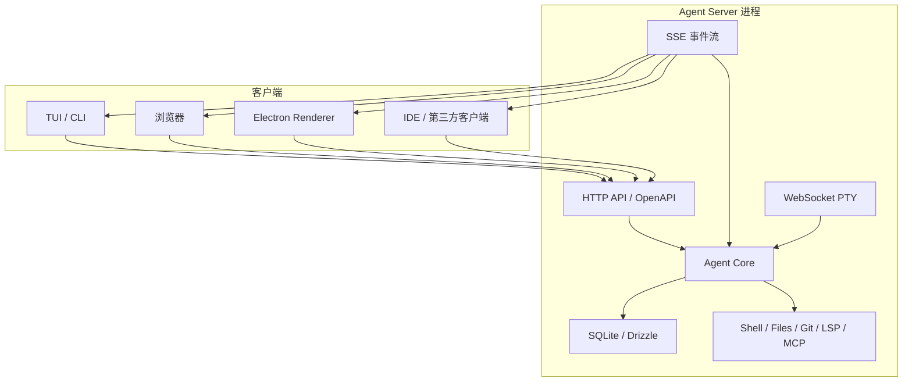
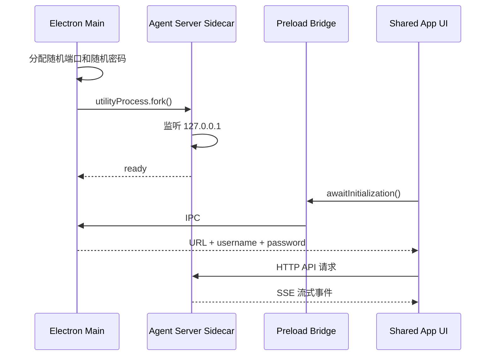
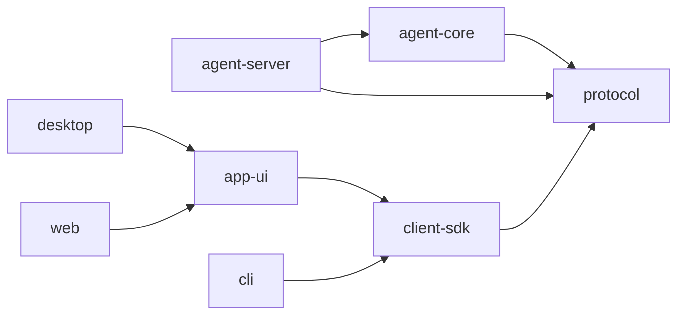

# OpenCode 架构设计参考

> 用途：为 Beecode 的 Web、桌面端、CLI、移动端接入和本地 Agent Runtime 设计提供开源实现参考。
>
> 调研时间：2026-08-05
> 上游仓库：[anomalyco/opencode](https://github.com/anomalyco/opencode)
> 对照版本：[`2f17fc9613771af3de3b5a2715b836037d80c4b1`](https://github.com/anomalyco/opencode/tree/2f17fc9613771af3de3b5a2715b836037d80c4b1)（`dev` 分支）

## 1. 结论

OpenCode 的关键不是“同时做了 CLI、Web 和 Electron”，而是先把 Agent 做成一个可独立运行的 Server，再让所有界面成为 Client：

- Agent Core 负责模型调用、会话、工具、权限、文件系统和持久化。
- Server 将 Core 封装成稳定的 HTTP API 和事件流。
- TUI、Web、Desktop、IDE 和第三方程序通过同一套协议访问 Server。
- Web 和 Desktop 复用同一套 SolidJS 产品 UI，只替换平台能力适配器。
- Desktop 不把 Agent 逻辑塞进 Renderer，而是启动独立 sidecar Server。
- 本地单进程场景仍保持 Client/Server 边界，但可以使用内部 `fetch`，不必真的监听端口。

这套设计最值得 Beecode 借鉴的地方是：**协议边界稳定，运行位置可替换，界面与执行权限分离。**

## 2. 仓库身份与范围

当前 OpenCode 是 MIT 开源项目，主仓库是 [`anomalyco/opencode`](https://github.com/anomalyco/opencode)。不要与已经归档的旧 Go 项目 `opencode-ai/opencode` 混淆；旧项目后来以 Crush 的名称继续发展。

OpenCode 是 Bun Workspaces 管理的 TypeScript Monorepo，根配置见 [`package.json`](https://github.com/anomalyco/opencode/blob/dev/package.json)。当前仓库处于架构拆分期：

- `packages/opencode` 仍是当前完整程序和主要组合入口。
- `packages/core`、`protocol`、`server`、`client`、`cli`、`sdk-next` 是正在形成的新分层。
- 因此仓库中同时存在旧组合层和新拆分层，参考时应理解职责，不应原样复制所有包。

## 3. 总体架构



这里的 Server 既可以位于当前进程的 Worker 中，也可以是桌面端 sidecar、WSL 进程、远程主机或未来的云端 Worker。Client 只需要知道 Server 地址、认证信息和协议版本。

## 4. 主要包的职责

| 包 | 职责 | Beecode 对应建议 |
| --- | --- | --- |
| `packages/core` | Agent、Session、模型、工具、权限、数据库、项目等核心领域 | `packages/agent-core` |
| `packages/protocol` | API 契约、Schema、错误和路由分组 | `packages/protocol` |
| `packages/server` | HTTP 路由、认证、中间件和协议实现 | `apps/agent-server` 或 `packages/server` |
| `packages/client` | 根据协议生成的类型安全客户端 | `packages/client-sdk` |
| `packages/sdk` / `sdk-next` | 启动 Server、嵌入 Core、对外编程接口 | 后续按需增加 |
| `packages/tui` | 终端界面 | `apps/cli` |
| `packages/app` | Web 与 Desktop 共用的产品 UI | `packages/app-ui` |
| `packages/desktop` | Electron Main、Preload、Renderer 和打包 | `apps/desktop` |
| `packages/ui` | 通用视觉组件 | `packages/ui` |
| `packages/session-ui` | 会话、消息和工具状态等领域 UI | 可先合并进 `app-ui` |
| `packages/plugin` | 插件契约和扩展点 | 第一阶段不必独立 |
| `packages/web` | 官网和文档站，不是 Agent Web 客户端 | 不要与 `apps/web` 混淆 |

上游对新分层规定了明确依赖方向：Schema 位于底层，Core 和 Protocol 位于中间，Server 实现协议；Client 可以依赖 Schema 和 Protocol，但不能依赖 Core 和 Server。规则见 [`AGENTS.md`](https://github.com/anomalyco/opencode/blob/dev/AGENTS.md)。

## 5. 五种运行形态

### 5.1 默认 TUI

执行：

```bash
opencode
```

默认 TUI 会创建 Worker，在 Worker 中加载 Server。TUI 使用自定义 `fetch` 调用内部 Server，并用内部事件适配器订阅事件。此时逻辑上仍是 Client/Server，但不需要占用 TCP 端口。

这样既保留协议边界，又降低单机 CLI 的启动成本和认证复杂度。实现可参考 [`tui.ts`](https://github.com/anomalyco/opencode/blob/dev/packages/opencode/src/cli/cmd/tui.ts)。

### 5.2 Headless Server

执行：

```bash
opencode serve --hostname 127.0.0.1 --port 4096
```

该模式只运行 Agent Server，不启动 UI，适用于：

- 自定义客户端或自动化程序调用。
- IDE 插件接入。
- 另一终端通过 `opencode attach` 连接。
- 在 WSL、开发机或远程服务器中运行执行器。

Server 发布 OpenAPI 3.1 描述，默认地址为 `/doc`。官方接口说明见 [Server 文档](https://opencode.ai/docs/server/)。

### 5.3 Web

执行：

```bash
opencode web
```

该命令启动本地 Server，随后打开浏览器。浏览器中的 `packages/app` 通过 HTTP SDK 和 SSE 连接 Server。Web 入口默认连接当前 Origin；在官方托管页面环境下会默认尝试本机 `localhost:4096`。

Web 与 Server 可以同时被 TUI 使用：

```bash
opencode web --port 4096
opencode attach http://localhost:4096
```

两者会看到相同 Session 和执行状态。Web 入口见 [`entry.tsx`](https://github.com/anomalyco/opencode/blob/dev/packages/app/src/entry.tsx)。

### 5.4 Electron Desktop

Desktop 的启动过程如下：



关键实现：

- Electron Main 启动和监管 sidecar：[`server.ts`](https://github.com/anomalyco/opencode/blob/dev/packages/desktop/src/main/server.ts)
- Sidecar 加载 Agent Server：[`sidecar.ts`](https://github.com/anomalyco/opencode/blob/dev/packages/desktop/src/main/sidecar.ts)
- Renderer 复用公共 UI：[`renderer/index.tsx`](https://github.com/anomalyco/opencode/blob/dev/packages/desktop/src/renderer/index.tsx)
- Electron 构建时把 Node Server 产物打入应用：[`electron.vite.config.ts`](https://github.com/anomalyco/opencode/blob/dev/packages/desktop/electron.vite.config.ts)

sidecar 崩溃、重启和退出可以独立处理，不需要让 Renderer 获得文件系统或 Shell 权限。

### 5.5 Attach 与远程连接

执行：

```bash
opencode attach http://10.20.30.40:4096
```

TUI 可以连接已有 Server。Desktop 也抽象了多种 Server Connection：

- 本机 sidecar。
- Windows 下的 WSL sidecar。
- 普通 HTTP Server。
- 通过 SSH 暴露的 Server。

这里的远程连接是 **Client 直接访问 Agent Server**，不是 Claude Remote Control 那种“本机主动连接云端中继”的模式。

## 6. Web 与 Desktop 如何共用 UI

OpenCode 没有维护两套业务页面。`packages/app` 导出共享的 `AppInterface`，Web 和 Desktop 分别提供 `Platform`：

```tsx
<PlatformProvider value={platform}>
  <AppBaseProviders>
    <AppInterface />
  </AppBaseProviders>
</PlatformProvider>
```

平台适配器负责隔离差异：

| 能力 | Web | Desktop |
| --- | --- | --- |
| 文件选择 | 浏览器 File API | 系统文件选择窗口 |
| 持久化 | `localStorage` | Electron Store / IPC |
| 通知 | Web Notification | 原生通知 |
| 打开文件 | 受浏览器限制 | 调用本机应用 |
| 自动更新 | 无 | Electron Updater |
| 窗口控制 | 浏览器能力 | Electron Main IPC |
| Agent 调用 | HTTP SDK | HTTP SDK |

因此共享的不是零散组件，而是完整业务 UI；只有操作系统能力通过 `Platform` 接口注入。

## 7. Server 协议设计

OpenCode 的通信层可以归纳为：

| 协议 | 用途 |
| --- | --- |
| HTTP JSON | Session、消息、模型、工具、权限、文件和配置操作 |
| OpenAPI 3.1 | 生成客户端、类型和接口文档 |
| SSE | Agent 输出、工具进度、权限询问、文件变化等事件 |
| WebSocket | PTY 和交互式终端 |
| Basic Auth | 本地或远程 Server 的基础认证 |

SDK 根据 OpenAPI 生成，UI 不直接依赖 Server 内部模块。客户端还会通过目录参数或 `x-opencode-directory` 指定操作哪个项目，使同一 Server 可以管理多个目录。

事件流实现包含：

- 连接成功事件。
- 10 秒心跳。
- 按项目目录过滤。
- Server 实例销毁事件。
- 客户端断线重连。
- 高频增量事件合并。
- 按约 16ms 一帧批量更新 UI，避免逐 token 重绘。

参考 [`event.ts`](https://github.com/anomalyco/opencode/blob/dev/packages/opencode/src/server/routes/instance/httpapi/handlers/event.ts) 和 [`server-sdk.tsx`](https://github.com/anomalyco/opencode/blob/dev/packages/app/src/context/server-sdk.tsx)。

## 8. Core 与持久化

Agent Server 是权威状态持有者。当前新 Core 使用 SQLite、Drizzle 和事件投影，主要领域包括：

- Project、Workspace 和工作目录。
- Session、Message、Part 和输入队列。
- 模型提供商与凭据。
- Agent、Prompt 和上下文。
- Tool、Permission 和 Question。
- Shell、PTY、文件、Git、LSP、MCP。
- 事件日志及其投影状态。

UI 只保存窗口布局、主题、最近 Server、最近项目等展示状态。这样多个 Client 可以同时连接同一 Server，而不会各自维护一份冲突的 Agent 状态。

数据库相关实现见 [`packages/core/src/database`](https://github.com/anomalyco/opencode/tree/dev/packages/core/src/database)，Session 实现见 [`packages/core/src/session`](https://github.com/anomalyco/opencode/tree/dev/packages/core/src/session)。

## 9. 安全边界

OpenCode 在本地桌面模式采用了几项正确的默认值：

- sidecar 默认只监听 `127.0.0.1`。
- 每次启动生成随机密码。
- Renderer 通过受控 Preload API 获取初始化信息。
- 文件、Shell 和凭据保留在 Agent Server 进程中。
- Renderer 不直接获得完整 Node 环境。

但用于跨网络时仍需补齐安全层：

- `0.0.0.0 + Basic Auth + HTTP` 不应直接暴露公网。
- 局域网试用至少设置 `OPENCODE_SERVER_PASSWORD`。
- 跨公网应使用 Tailscale、WireGuard、SSH Tunnel 或 HTTPS 反向代理。
- 产品化移动端接入应使用设备注册、短期令牌、会话级权限和服务端吊销。
- 远程客户端只负责发指令；文件与 Shell 权限必须始终由执行器所在设备控制。

## 10. OpenCode 与云端中继架构的区别

OpenCode 当前公开的主要远程方式：

```text
Web / 手机 / TUI
        |
        | 直接 HTTP/SSE
        v
用户电脑上的 Agent Server
```

Claude Remote Control 一类产品更接近：

```text
Web / 手机
    |
    v
云端 Control API / Relay
    ^
    | 本机主动建立出站 TLS 连接
    |
本地 Agent Runtime
```

前者实现简单，适合本地、局域网、VPN 和开发者工具；后者更适合普通用户跨公网用手机控制电脑，但需要额外解决账号、设备在线状态、消息中继、事件存储和重连。

## 11. Beecode 建议采用的精简结构

不建议复制 OpenCode 当前几十个包的规模。个人开发第一阶段可以压缩为：

```text
beecode-ai/
├── apps/
│   ├── agent-server/       # 本地 Agent Runtime + HTTP/SSE/WS
│   ├── cli/                # CLI/TUI 客户端
│   ├── desktop/            # Electron Main/Preload/Renderer
│   └── web/                # 浏览器入口
│
├── packages/
│   ├── agent-core/         # 模型循环、Session、工具、权限
│   ├── protocol/           # OpenAPI、事件和领域 DTO
│   ├── client-sdk/         # 从 OpenAPI 生成的 TS 客户端
│   ├── app-ui/             # Web/Desktop 共用完整业务 UI
│   ├── platform/           # Web/Desktop 平台接口
│   ├── tools/              # Shell、文件、Git、MCP
│   ├── persistence/        # SQLite 和迁移
│   └── shared/             # 少量无领域归属的通用代码
│
├── package.json
├── pnpm-workspace.yaml
└── turbo.json
```

建议的依赖方向：



约束：

- `app-ui` 不得导入 Electron、Node 文件系统或 Agent Core。
- `client-sdk` 不得导入 Server 实现。
- `agent-core` 不关心当前调用者是 CLI、Web 还是手机。
- 平台差异通过接口注入，不在业务组件中到处判断 `isElectron`。
- 原生 Android/iOS 未来根据同一 OpenAPI 生成 Kotlin/Swift Client。

## 12. 建议的开发顺序

### 阶段 1：本地 Agent 与协议

- 实现 `agent-core`。
- 实现 Session、消息、工具、权限和 SQLite。
- 定义 OpenAPI 与 SSE 事件。
- 做最小 CLI 验证完整 Agent 闭环。

### 阶段 2：Desktop

- Electron Main 启动 sidecar。
- Renderer 只通过 SDK 调用 sidecar。
- 建立 Platform Adapter。
- 支持文件选择、系统通知、自动更新和日志导出。

### 阶段 3：Web 直连

- 复用 `app-ui`。
- 支持连接 localhost、局域网或 VPN 内 Server。
- 实现 Server 列表、健康检查、断线恢复和版本兼容检查。

### 阶段 4：手机远程控制

- 增加 `control-api` 和 Relay。
- 本机 Agent 主动建立出站 TLS 连接。
- 手机只访问云端 Control API，不直接暴露本机端口。
- 增加设备绑定、短期令牌、推送通知和审计日志。

### 阶段 5：云端 Agent

- 增加隔离容器或 VM Worker。
- 让云端 Worker 实现与本地 Agent 相同的协议。
- Web 和手机可以在本机执行与云端执行之间切换。

## 13. 值得借鉴与不应照搬的部分

### 值得借鉴

- Agent Server 是唯一权威执行器。
- 所有客户端共用协议与生成 SDK。
- Web/Desktop 共用完整业务 UI。
- Electron 使用独立 sidecar，而不是让 Renderer 直接执行工具。
- 同一客户端可以管理本机、WSL、SSH 和远程 Server。
- 高频 Agent 事件经过合并后再更新 UI。
- 本地单进程可以使用内部 transport，外部客户端才启用网络 transport。

### 不应直接照搬

- OpenCode 当前处于新旧架构迁移期，不应复制重复包层次。
- Effect 体系学习和调试成本较高，个人项目没有明确收益时不必采用。
- Bun 可以用于开发，但 Electron、原生依赖和跨平台发布需要单独验证；Beecode 初期使用 Node.js LTS、pnpm 和 Turborepo 风险更低。
- 插件、企业版、云 Console、多套 SDK 可以等核心产品成立后再拆分。
- OpenCode 的直连远程方式不等于安全、易用的公网手机遥控方案。

## 14. Beecode 第一版建议

第一版建议只实现三个可部署单元：

```text
beecode-agent-server   本地执行器
beecode-desktop        Electron 客户端并管理 sidecar
beecode-web            可连接 Agent Server 的浏览器客户端
```

CLI 暂时可以作为 `agent-server` 的命令入口，而不必一开始拆成独立发布物。手机端先通过 Web 验证远程交互流程，再决定是否投入 Kotlin 和 Swift 原生客户端。

最先需要稳定的不是页面框架，而是以下协议对象：

```text
Device
Project
Session
Turn
Message
Event
ToolCall
Approval
Artifact
```

只要这些对象、事件顺序、重连语义和权限边界稳定，Web、Electron、CLI、Android 和 iOS 都可以在不复制 Agent 逻辑的前提下持续演进。

## 15. 后续设计决策

正式创建代码仓库前，需要单独确定：

1. 第一版 Web 只连接本机/局域网，还是立即支持公网 Relay。
2. Agent Server 使用 Node.js 还是 Bun 作为发布 Runtime。
3. 桌面端使用 Electron，还是为了安装体积选择 Tauri。
4. UI 使用 React 还是 SolidJS；个人项目更建议依据现有熟练度，而不是照搬 OpenCode。
5. Agent 循环是自研、基于通用 AI SDK，还是通过适配层接入 AgentScope。
6. Session 采用普通关系模型，还是从第一版就引入完整事件溯源。
7. 原生移动端只做控制客户端，还是也需要离线本地 Agent 能力。

这些决策不会改变本文的核心边界：**Agent Core、Server Protocol、Client SDK、共享 App UI、平台容器应彼此独立。**
