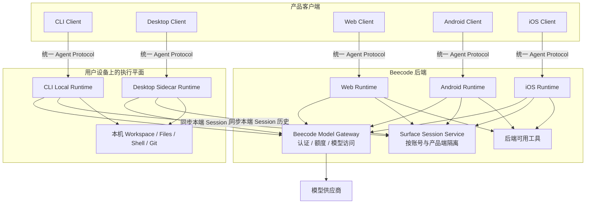
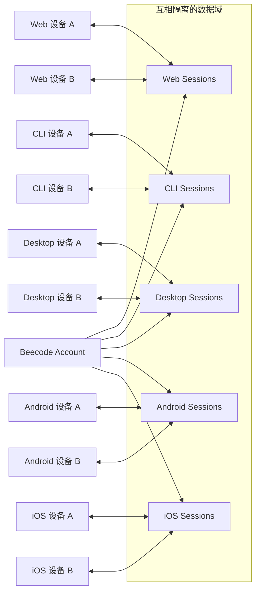
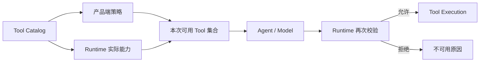
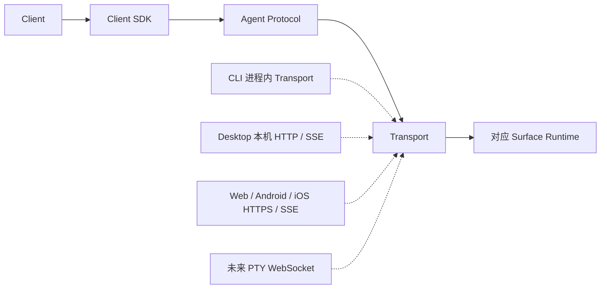
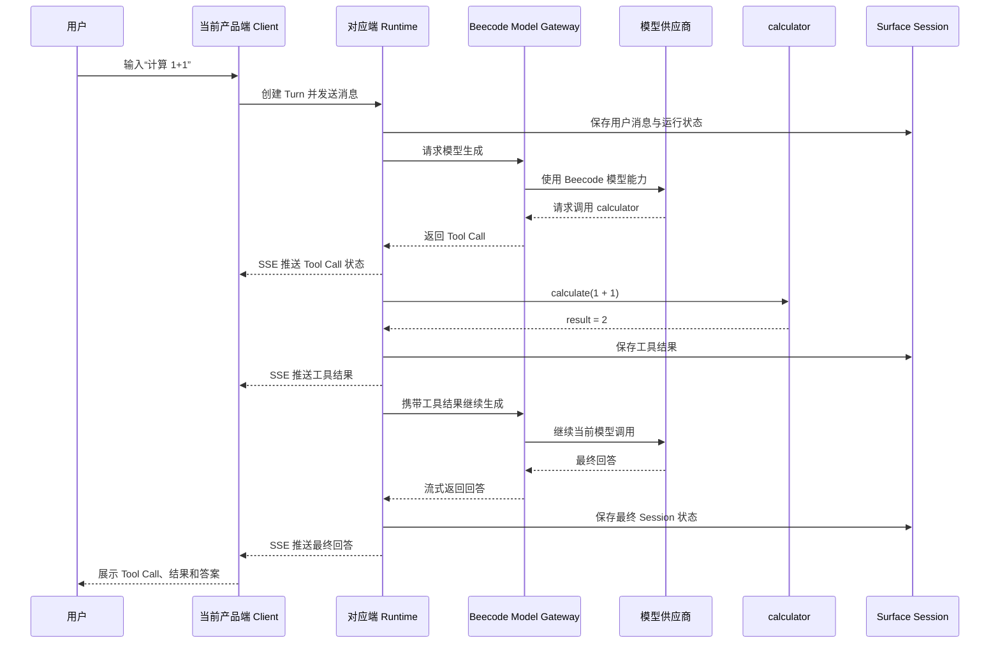
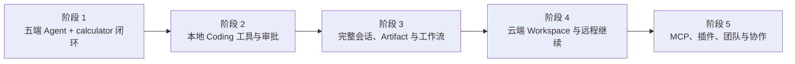

# Beecode 产品规格

> 状态：Draft
> 阶段：多端架构验证
> 更新日期：2026-08-19
> 架构参考：[OpenCode 架构设计参考](../pre/opencode-architecture-reference.md)

## Problem Statement

Beecode 希望成为一款与 Claude Code、Codex 同类的 Agent 产品，并同时提供 Web、CLI、桌面端、Android 和 iOS 五种产品端。产品未来需要承载更完整的会话、模型、工具、权限和工作区能力，因此第一阶段不能采用验证后即废弃的临时架构。

当前首先需要解决的不是完整的 Coding Agent 功能，而是验证一套可持续演进的多端产品边界：五端能够复用相同的 Agent 概念和协议，同时保持各端数据隔离、执行环境隔离以及工具能力差异。验证结果应能直接成为后续产品开发的基础。

## Solution

Beecode 采用分端 Runtime 架构：CLI 和桌面端在用户本机运行 Agent Runtime；Web、Android 和 iOS 使用 Beecode 后端 Runtime。所有 Runtime 复用统一的 Agent Core、Agent Protocol 和 Client SDK，并统一通过 Beecode Model Gateway 使用模型能力，客户端不接触模型提供商凭据。

产品数据以 Web、CLI、Desktop、Android、iOS 五个 `surface` 分区。同一个账号在同一种产品端的不同设备上可以看到相同数据，不同产品端之间不能查看彼此的 Session。一个正在执行的本地任务仍与具体 Runtime 和 Workspace 绑定，本机文件与 Shell 环境不会因为会话可见而自动迁移。

不同产品端根据自身运行环境获得不同的工具能力。CLI 和桌面端可以使用经过权限控制的本机文件、Shell、Git 等能力；Web 只在用户通过浏览器显式授权目录后，按 Tool Call 读取指定相对路径，不批量上传目录，也不能访问任意本机路径或长期持有本机权限；移动端不提供依赖用户本机环境的工具。与本机无关的工具可以在五端统一提供。

### 产品目标

- 建立一套可以长期承载 Coding Agent 能力的产品架构，而不是为多端演示创建五套临时实现。
- 让五端拥有一致的 Session、Turn、Message、Tool Call 和权限语义，同时保留符合各平台习惯的交互方式。
- 让 Runtime 的部署位置可以变化，但不改变 Client 使用 Agent 的基本方式。
- 让本机工具、后端工具和未来云端 Workspace 工具通过统一能力模型接入。
- 让模型供应商、额度与调用策略集中在 Beecode 后端，客户端只面向 Beecode 产品能力。
- 从第一阶段开始验证真实模型、真实 Tool Call、流式状态和数据恢复的完整链路。

### 目标产品架构

这张图表达的是逻辑职责，而不是要求后端第一阶段拆成多个独立服务。长期稳定的边界是 Client、Runtime、Surface Session、Tool Capability 和 Model Gateway；它们第一阶段可以精简部署，后续再按负载和安全需要拆分。

### 各端运行形态

| 产品端 | Runtime 位置 | 持久数据范围 | 环境能力 | 产品形态 |
| --- | --- | --- | --- | --- |
| CLI | 用户本机 | 仅 CLI 数据，同端跨设备可见 | 可访问受控的本机开发环境 | 面向终端工作流 |
| Desktop | 用户本机 sidecar | 仅 Desktop 数据，同端跨设备可见 | 可访问受控的本机开发环境 | 桌面图形产品 |
| Web | Beecode 后端 | 仅 Web 数据，同端跨设备可见 | 不访问用户电脑的本机环境 | 浏览器产品 |
| Android | Beecode 后端 | 仅 Android 数据，同端跨设备可见 | 不访问用户电脑的本机环境 | Android 原生产品 |
| iOS | Beecode 后端 | 仅 iOS 数据，同端跨设备可见 | 不访问用户电脑的本机环境 | iOS 原生产品 |

分端 Runtime 不等于五套 Agent Core。各端共享相同的领域语义和 Agent Protocol，只在 Runtime 宿主、可用工具、数据分区和客户端体验上存在差异。

### 数据边界与同端可见性

数据隔离以产品端为边界，而不是以单台设备为边界。相同账号的同端设备能够查看相同 Session 历史，但不能跨产品端查询。CLI 或 Desktop Session 中的本机执行上下文仍绑定产生该 Turn 的 Runtime 和 Workspace；“看到历史”不代表另一台设备自动拥有原设备的文件和 Shell。

第一阶段只要求同端跨设备查看 Session 历史。未来可以在现有边界上增加两种继续方式：为 Session 绑定新设备上的 Workspace 后继续，或者在原 Runtime 在线时远程继续原任务。

### 权威状态与恢复

| 状态 | 权威方 | 说明 |
| --- | --- | --- |
| 当前 Turn 的运行与取消 | 执行该 Turn 的 Runtime | 客户端不能自行改变执行结果 |
| Tool Call 与 Approval | 执行该 Tool 的 Runtime | 工具执行前由 Runtime 校验能力与权限 |
| 本机文件和进程状态 | 本地 Runtime | 不通过 Session 同步迁移到其他设备 |
| 可跨设备查看的 Session 历史 | 对应 Surface 数据域 | 仅对相同账号、相同产品端可见 |
| 主题、窗口布局和临时输入 | Client | 不作为 Agent 的权威业务状态 |

Client 在线时通过 SSE 接收增量变化。SSE 不是持久事件历史；连接断开后，Client 重新请求完整 Session，并使用返回的最新状态替换旧缓存。这样第一阶段不需要事件回放系统，同时保留明确的恢复行为。

### Tool 能力模型

工具不能只按客户端界面隐藏。Runtime 在模型调用前生成当前真正可用的 Tool 集合，并在执行前再次验证。产品端不支持、环境缺失、用户未授权和暂时不可用应表现为不同原因。

| 能力类别 | CLI | Desktop | Web | Android | iOS |
| --- | --- | --- | --- | --- | --- |
| 与本机无关的安全工具，如 `calculator` | 可用 | 可用 | 可用 | 可用 | 可用 |
| 用户电脑的文件、Shell、Git | 按能力与权限开放 | 按能力与权限开放 | 仅浏览器显式授权的目录句柄，按需只读；无 Shell/Git | 不可用 | 不可用 |
| 后端服务型工具 | 可扩展 | 可扩展 | 可扩展 | 可扩展 | 可扩展 |
| 未来云端 Workspace 工具 | 可扩展 | 可扩展 | 可扩展 | 可扩展 | 可扩展 |

### 核心产品对象

| 对象 | 产品含义 |
| --- | --- |
| Account | Beecode 用户身份、模型额度和同端跨设备访问边界 |
| Surface | Web、CLI、Desktop、Android、iOS 中的一种产品数据域 |
| Device | 登录某个产品端的具体设备或安装实例 |
| Runtime | 执行 Agent 循环、工具和权限判断的运行实例 |
| Workspace | 当前 Runtime 可以操作的工作环境；本地或未来的云端 Workspace |
| Session | 一项持续的 Agent 任务及其上下文，固定属于一个 Surface |
| Turn | 用户的一次输入及 Agent 对该输入的完整处理过程 |
| Message / Part | 用户、模型和工具产生的可展示内容及流式片段 |
| ToolCall | Agent 请求工具、工具执行和结果返回的完整记录 |
| Approval | 对敏感工具操作的允许或拒绝结果 |
| Artifact | Agent 产生并可供用户查看的文件、差异或其他结果 |
| Capability | Runtime 当前能够安全提供的环境能力 |

### Client 与 Runtime 通信

五端面对相同的命令、查询、错误和事件语义。CLI 可以使用进程内 Transport，Desktop 可以连接本机 sidecar，Web 和移动端连接后端 Runtime，但 Client 产品层不直接依赖 Agent Core 的内部实现。

第一阶段交付一个建立在目标架构上的最小纵向闭环，而不是完整产品。五端分别支持登录、创建 Session、发送请求、查看流式响应、观察 Tool Call，并在重新打开后恢复该端 Session。核心验收场景为输入“计算 1+1”，由模型发起 `calculator` 工具调用，Runtime 执行工具并将结果返回模型，最终输出答案。

### 第一阶段核心时序

该时序必须走真实 Agent Tool Call 流程，不能在 Client 或 Runtime 中针对“1+1”硬编码最终答案。自动化测试可以使用可控模型替身稳定触发工具，集成验收至少经过一次真实 Model Gateway 调用。

第一阶段成功标准：

- 五端均能完成同一套 Agent 交互闭环。
- 同端跨设备可以查看相同的 Session 数据。
- 不同端的数据保持隔离。
- 模型请求全部经过 Beecode Model Gateway，并受统一额度控制。
- Tool Call 的请求、执行、结果和最终回答对用户可见。
- 客户端断线或重启后，通过重新加载完整 Session 恢复状态。
- Web 和移动端不会获得未声明的本机环境能力。
- 第一阶段形成的 Agent Core、协议和 Runtime 边界可以继续承载后续功能。

### 长期产品能力演进

阶段演进只增加能力，不改变五端数据域、Client/Runtime 边界、统一 Agent Protocol、Runtime Tool 校验和 Model Gateway 这些核心原则。

## User Stories

1. 作为 Beecode 用户，我希望可以使用 Web、CLI、Desktop、Android 和 iOS，以便根据当前设备选择合适的产品端。
2. 作为 Beecode 用户，我希望每个产品端分别保存 Session，以便不同使用场景保持清晰隔离。
3. 作为 Beecode 用户，我希望在同一种产品端的另一台设备登录后看到相同数据，以便更换设备不会丢失历史。
4. 作为 Beecode 用户，我希望 Web 数据不能被 CLI、Desktop、Android 或 iOS 查看，以便不同产品端不会混合工作上下文。
5. 作为 Beecode 用户，我希望可以创建 Session，以便开始一项独立的 Agent 任务。
6. 作为 Beecode 用户，我希望可以重新打开已有 Session，以便查看历史请求、回答和工具活动。
7. 作为 Beecode 用户，我希望可以发送自然语言请求，以便让 Agent 完成任务。
8. 作为 Beecode 用户，我希望实时看到生成中的回答，以便了解 Agent 正在取得进展。
9. 作为 Beecode 用户，我希望刷新、重启或临时断线后恢复 Session，以便客户端瞬时状态不会导致数据丢失。
10. 作为 Beecode 用户，我希望看到 Agent 何时请求了工具，以便区分工具执行与普通文本生成。
11. 作为 Beecode 用户，我希望看到 Tool Call 的等待、运行、完成、失败或取消状态，以便理解当前执行进度。
12. 作为 Beecode 用户，我希望在 Agent 最终回答前看到工具结果，以便追溯结果来自哪次操作。
13. 作为 Beecode 用户，我希望不可用工具显示明确原因，以便平台限制不会表现为产品故障。
14. 作为 CLI 用户，我希望 Agent Runtime 运行在本机，以便未来使用终端和本地开发环境。
15. 作为 Desktop 用户，我希望 Agent Runtime 独立于界面运行，以便 UI 不直接持有文件系统和进程权限。
16. 作为 Web 用户，我希望不安装本地 Runtime 也能使用 Agent，以便直接从浏览器访问产品。
17. 作为 Android 用户，我希望获得原生移动体验，以便产品符合 Android 的交互和平台习惯。
18. 作为 iOS 用户，我希望获得原生移动体验，以便产品符合 iOS 的交互和平台习惯。
19. 作为 Web 或移动端用户，我希望依赖本机环境的工具保持不可用，以便 Agent 不会暗示自己拥有实际不存在的访问权限。
20. 作为 CLI 或 Desktop 用户，我希望本机工具根据当前 Runtime 能力判断是否可用，以便 Agent 只获得真正可以执行的工具。
21. 作为 CLI 或 Desktop 用户，我希望敏感操作必须经过 Runtime 权限检查，以便客户端不能绕过执行控制。
22. 作为 Beecode 用户，我希望所有模型使用都经过 Beecode，以便不必在每台设备配置第三方模型凭据。
23. 作为 Beecode 用户，我希望 Beecode 提供并记录我的模型额度，以便各产品端使用统一的额度体系。
24. 作为 Beecode 用户，我希望模型或工具失败得到明确展示，以便区分执行失败和回答尚未完成。
25. 作为 Beecode 用户，我希望多个 Session 彼此独立，以便无关任务不会污染上下文。
26. 作为 Beecode 用户，我希望运行中的任务有明确的取消操作，以便停止错误或不再需要的工作。
27. 作为 Beecode 用户，我希望执行期间提交的消息保持稳定顺序，以便 Agent 按可预期的上下文处理请求。
28. 作为 Beecode 用户，我希望五端保持一致的 Agent 核心行为，以便平台选择不会改变基本语义。
29. 作为 Beecode 用户，我希望各端拥有符合平台习惯的 UI，同时保持一致的 Agent 行为，以便兼顾原生体验和产品一致性。
30. 作为产品负责人，我希望新模型和工具通过稳定的产品契约接入，以便客户端不需要因每个供应商或能力而重新设计。
31. 作为产品负责人，我希望未来的终端、MCP、插件、云端工作区和协作能力扩展现有边界，以便初始架构持续有效。
32. 作为产品负责人，我希望第一阶段的计算器场景经过真实 Agent 与 Tool Call 流程，以便 Demo 验证架构而不是硬编码界面回答。

## Implementation Decisions

- 产品包含 Web、CLI、Desktop、Android 和 iOS 五个一等产品端。
- Session 数据按产品端分区；同端跨设备可见，不同端之间不可见。
- CLI 和 Desktop 使用本地 Agent Runtime；Web、Android 和 iOS 使用后端 Agent Runtime。
- 即使 Session 历史可以在另一台同端设备查看，本地 Runtime 的执行仍然绑定原 Runtime 和 Workspace。
- 所有 Runtime 共享相同的 Agent 领域概念、协议语义和客户端契约。
- 即使 Client 与 Runtime 位于同一进程或同一设备，两者仍保持清晰边界。
- 所有 Runtime 的模型请求都经过 Beecode Model Gateway。Beecode 提供模型能力并管理用户额度，模型供应商凭据不分发给客户端。
- Runtime 根据产品端限制和实际环境能力，共同决定向模型提供哪些工具。
- 工具可用性由 Runtime 强制执行，不能只依赖 UI 展示。
- HTTP 请求响应和 SSE 事件流构成基础通信方式；双向终端通信留到后续阶段。
- SSE 只作为在线更新通道，不作为持久事件历史。断线后客户端重新加载完整 Session，并以返回状态为准。
- Web 和 Desktop 可以复用完整业务 UI，平台特有能力通过平台边界隔离。
- Android 和 iOS 采用原生应用，只共享协议定义和生成的 SDK 契约，不共享 UI 实现。
- Desktop 使用独立的 sidecar Runtime，不在 Renderer 中放置 Agent 执行能力。
- 第一阶段的 `calculator` 工具在五端均可使用，执行确定性计算且不需要审批。
- 第一阶段验收中的算术请求必须使用 `calculator`，保证 Tool Call 流程稳定且可观察。
- 架构允许未来从另一 Runtime 继续同端 Session，或远程连接原 Runtime；第一阶段只要求查看历史。

## Testing Decisions

- 主要验收边界是完整的 Client-to-Runtime Agent 流程。每个产品端输入“计算 1+1”，观察 `calculator` Tool Call，取得结果 `2`，并展示模型最终回答。
- 测试只验证外部可观察行为，不绑定内部类、数据库布局、框架行为或私有辅助函数。
- CLI、Desktop、Web、Android 和 iOS 都需要通过相同的协议行为测试。
- 自动化验收使用可控的模型替身，确保稳定触发 `calculator` Tool Call；同时至少保留一条经过 Beecode Model Gateway 调用真实模型的人工或集成测试路径。
- 刷新和重启测试验证客户端从完整 Runtime 快照重建 Session，而不依赖断线期间遗漏的 SSE 事件。
- 数据隔离测试验证一个产品端创建的 Session 不能被其他产品端列出或打开。
- 同端测试验证同一账号登录的两台设备可以看到相同 Session 历史。
- 能力测试验证依赖本机环境的工具只在 Runtime 支持时可用，并拒绝客户端伪造的工具调用。
- Tool 生命周期测试验证等待、运行、完成、失败和取消状态在各端含义一致。
- 契约测试验证所有 Client SDK 对协议对象、错误和事件含义的理解一致。
- 仓库当前没有实现和既有测试套件，第一阶段的端到端场景将建立首个高层测试边界。

## Out of Scope

- 包含正式文件编辑、Shell、Git、LSP 或仓库索引的完整 Coding 工作流。
- 跨产品端的 Session 可见性或同步。
- 在设备之间自动迁移本地 Workspace。
- 从另一台设备通过原设备继续执行任务。
- 云端 Workspace 和隔离的云端开发环境。
- 交互式终端和 PTY。
- 持久 SSE 事件重放或完整事件溯源。
- MCP Server、第三方插件和公开扩展 API。
- 团队 Workspace、共享 Session、协同编辑和组织权限。
- 用户管理的模型供应商凭据或 BYOK 配置。
- 多供应商路由、自动模型降级和正式计费流程。
- 完全离线的模型推理。
- 超出 Runtime 安全边界验证需要的生产级工具权限策略。

## Further Notes

- 本规格借鉴 OpenCode 的稳定协议边界、可替换 Runtime 位置以及 UI 与执行权限分离原则，但不复制其包数量，也不假设所有客户端连接同一个 Runtime。
- Beecode 的差异在于按产品端隔离数据、将 Web 和移动端 Runtime 部署在后端、通过 Beecode Model Gateway 处理所有模型请求，并采用原生 Android 和 iOS 客户端。
- 第一阶段实现行为保持精简，但代表长期产品边界。尚未实现的未来能力应扩展这些边界，而不是通过临时产品行为模拟。
- 框架选择、存储引擎、包结构、部署拓扑和 API 字段定义将在后续开发与架构文档中说明。
